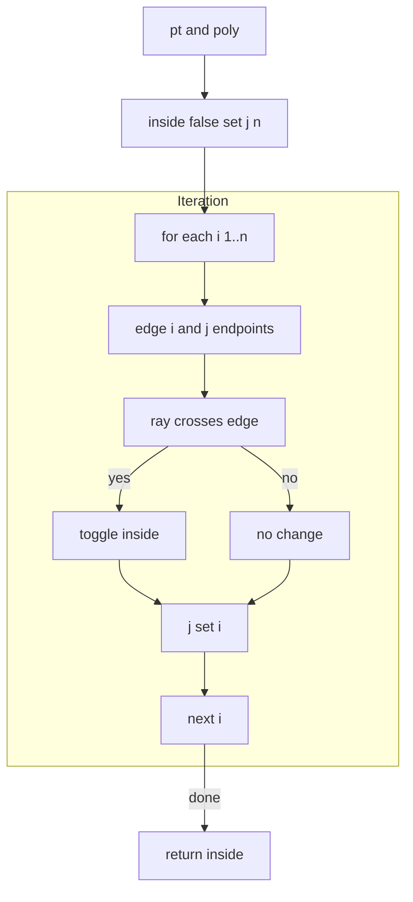
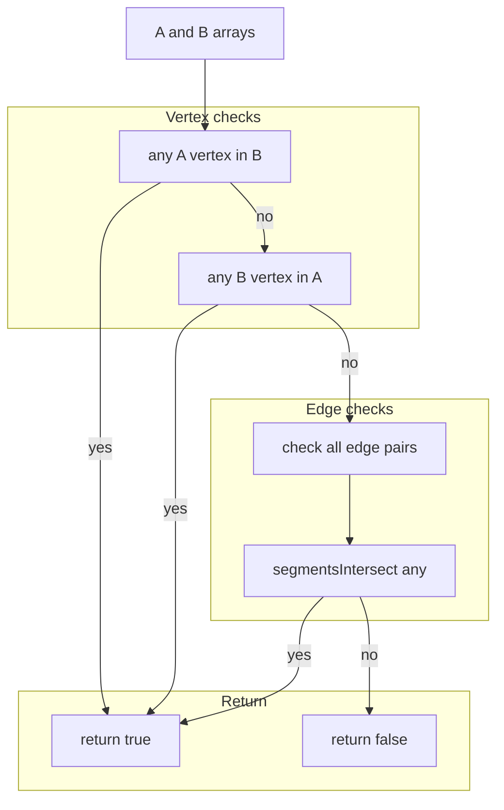
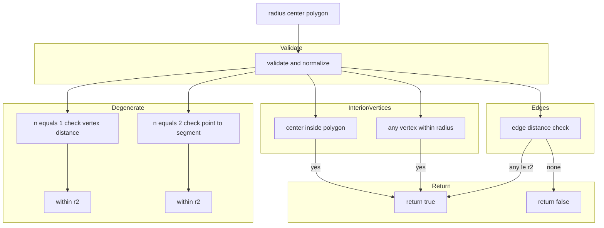
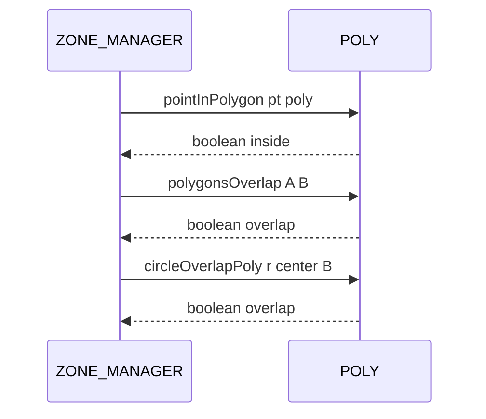

# POLY point in polygon and overlap

Ray casting point-in-polygon, polygon overlap, and circle vs polygon overlap checks.

# Source anchors
- [AETHR.POLY:pointInPolygon()](https://github.com/Gh0st352/AETHR/blob/main/dev/POLY.lua#L66)
- [AETHR.POLY:polygonsOverlap()](https://github.com/Gh0st352/AETHR/blob/main/dev/POLY.lua#L92)
- [AETHR.POLY:circleOverlapPoly()](https://github.com/Gh0st352/AETHR/blob/main/dev/POLY.lua#L120)
- Helpers referenced: [AETHR.POLY:normalizePoint()](https://github.com/Gh0st352/AETHR/blob/main/dev/POLY.lua#L236), [AETHR.POLY:segmentsIntersect()](https://github.com/Gh0st352/AETHR/blob/main/dev/POLY.lua#L44), [AETHR.POLY:pointToSegmentSquared()](https://github.com/Gh0st352/AETHR/blob/main/dev/POLY.lua#L1148)

# Overview
- pointInPolygon uses horizontal ray casting toggling an inside flag on each edge crossing
- polygonsOverlap checks either polygon having a vertex inside the other, else any edge pair intersection
- circleOverlapPoly handles single vertex, segment, interior center, vertex within radius, and edge proximity via point to segment distance

# pointInPolygon flow

# polygonsOverlap flow

# circleOverlapPoly flow

# Sequence usage

# Implementation notes
- pointInPolygon supports points using y or z as vertical coordinate; y is preferred when present
- polygonsOverlap uses [AETHR.POLY:segmentsIntersect()](https://github.com/Gh0st352/AETHR/blob/main/dev/POLY.lua#L44) for edge checks after vertex tests
- circleOverlapPoly
  - Uses [AETHR.POLY:normalizePoint()](https://github.com/Gh0st352/AETHR/blob/main/dev/POLY.lua#L236) for consistent xy handling
  - Distance to edges uses [AETHR.POLY:pointToSegmentSquared()](https://github.com/Gh0st352/AETHR/blob/main/dev/POLY.lua#L1148)
  - Early returns for degenerate polygons with n equals 1 and n equals 2

# Validation checklist
- pointInPolygon: [dev/POLY.lua](https://github.com/Gh0st352/AETHR/blob/main/dev/POLY.lua#L66)
- polygonsOverlap: [dev/POLY.lua](https://github.com/Gh0st352/AETHR/blob/main/dev/POLY.lua#L92)
- circleOverlapPoly: [dev/POLY.lua](https://github.com/Gh0st352/AETHR/blob/main/dev/POLY.lua#L120)

# Related docs
- Intersections and orientation: [docs/poly/intersections_and_orientation.md](./intersections_and_orientation.md)
- Distance and offset helpers: [docs/poly/distance_projection_and_offset.md](./distance_projection_and_offset.md)

# Conventions
- Mermaid fenced blocks use GitHub Mermaid parser
- Subgraph labels use double quotes per [docs/_mermaid/README.md](../_mermaid/README.md)
- Labels inside brackets avoid double quotes and parentheses
- Links use relative paths for repository portability