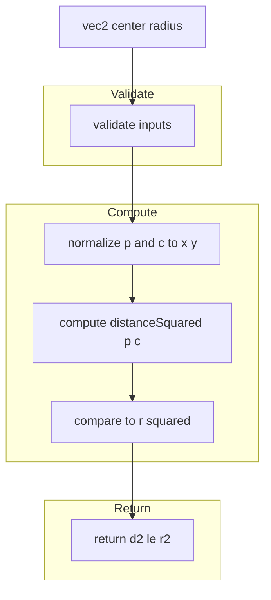
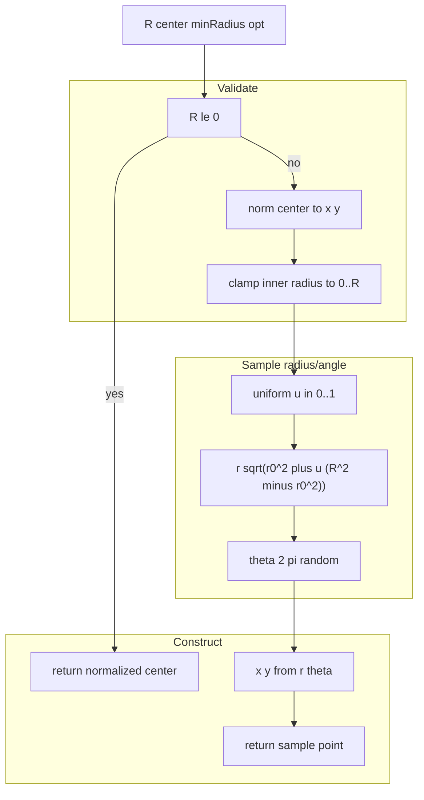
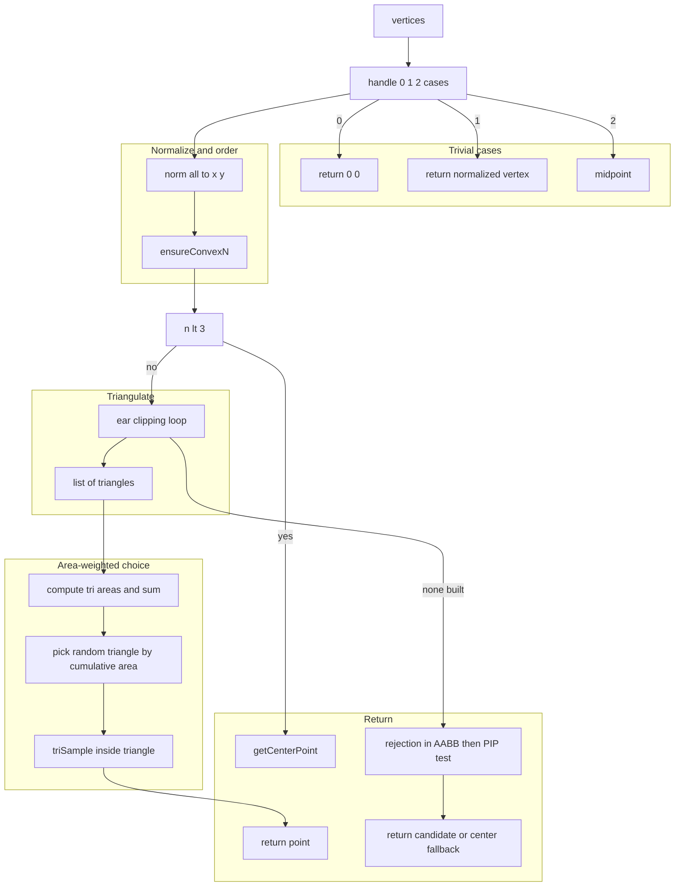
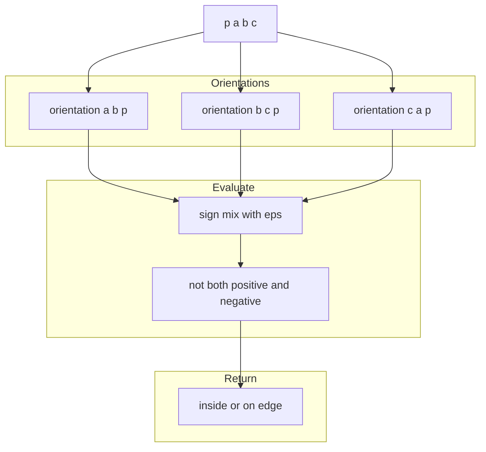
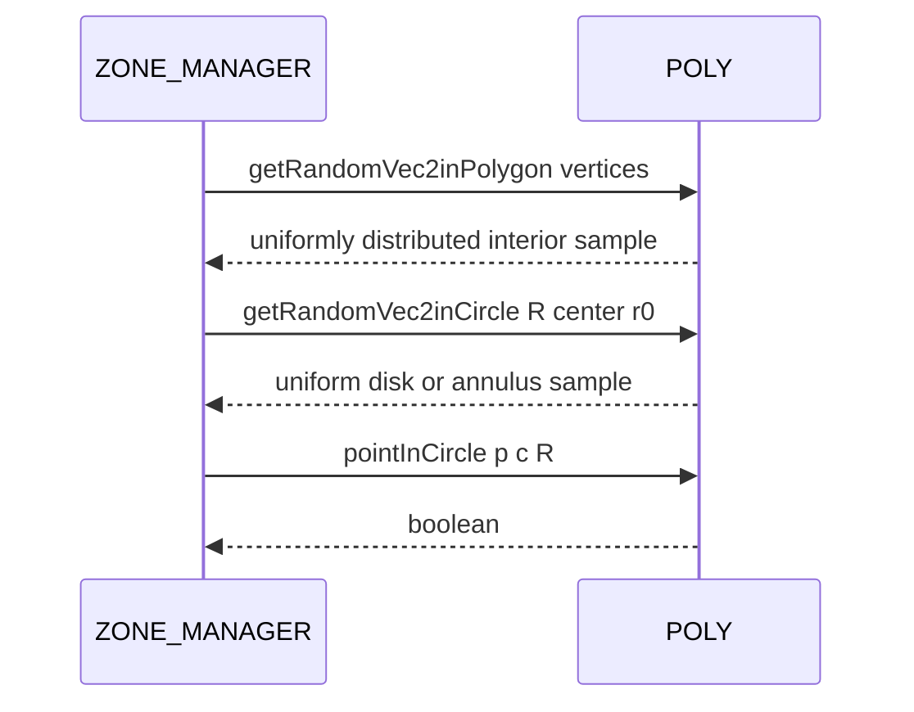

# POLY random points and sampling

Point in circle tests, uniform sampling in a circle and polygon, and triangle utilities for area-weighted sampling.

# Source anchors
- [AETHR.POLY:pointInCircle()](../../dev/POLY.lua:248)
- [AETHR.POLY:getRandomVec2inCircle()](../../dev/POLY.lua:276)
- [AETHR.POLY:triSample()](../../dev/POLY.lua:308)
- [AETHR.POLY:triAreaAbs()](../../dev/POLY.lua:320)
- [AETHR.POLY:pointInTriangle()](../../dev/POLY.lua:329)
- [AETHR.POLY:getRandomVec2inPolygon()](../../dev/POLY.lua:343)
- Helpers: [AETHR.POLY:normalizePoint()](../../dev/POLY.lua:236), [AETHR.MATH:distanceSquared()](../../dev/MATH_.lua:58)

# Overview
- pointInCircle checks membership using squared distance to avoid sqrt
- getRandomVec2inCircle returns uniform samples in a disk or annulus via r^2 uniform then sqrt
- getRandomVec2inPolygon uses convexity fixing with ensureConvexN, then ear clipping to triangulate, then area-weighted triangle selection, then barycentric sampling via triSample; includes robust fallbacks
- pointInTriangle tests using sign of orientation relative to triangle edges with an epsilon

# pointInCircle flow

# getRandomVec2inCircle flow

# Ear clipping and area-weighted sampling in polygon

# pointInTriangle flow

# Sequence usage

# Implementation notes
- getRandomVec2inPolygon
  - Normalizes coordinates to x y and attempts to fix ordering with [AETHR.POLY:ensureConvexN()](../../dev/POLY.lua:863)
  - Triangulation via ear clipping uses convexity and interior point checks with [AETHR.POLY:pointInTriangle()](../../dev/POLY.lua:329)
  - Triangle selection is proportional to area using a single random in summed area space; sampling within a triangle uses [AETHR.POLY:triSample()](../../dev/POLY.lua:308)
  - If triangulation fails or total area is zero, uses AABB rejection or centers as fallbacks via [AETHR.POLY:getCenterPoint()](../../dev/POLY.lua:1779)
- Stability
  - pointInTriangle uses a small epsilon to be robust to nearly colinear edges
  - Barycentric sampling triSample reflects across diagonal when u plus v greater than 1 to keep uniform

# Validation checklist
- pointInCircle: [dev/POLY.lua](../../dev/POLY.lua:248)
- getRandomVec2inCircle: [dev/POLY.lua](../../dev/POLY.lua:276)
- triSample: [dev/POLY.lua](../../dev/POLY.lua:308)
- triAreaAbs: [dev/POLY.lua](../../dev/POLY.lua:320)
- pointInTriangle: [dev/POLY.lua](../../dev/POLY.lua:329)
- getRandomVec2inPolygon: [dev/POLY.lua](../../dev/POLY.lua:343)

# Related docs
- Intersections and orientation: [docs/poly/intersections_and_orientation.md](./intersections_and_orientation.md)
- Bounds and divisions: [docs/poly/bounds_and_divisions.md](./bounds_and_divisions.md)

# Conventions
- Mermaid fenced blocks use GitHub Mermaid parser
- Subgraph labels use double quotes per [docs/_mermaid/README.md](../_mermaid/README.md)
- Labels inside brackets avoid double quotes and parentheses
- Links use relative paths for repository portability