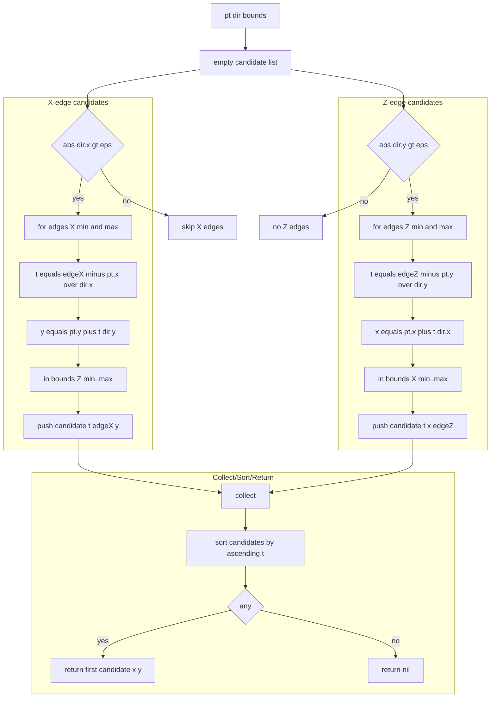
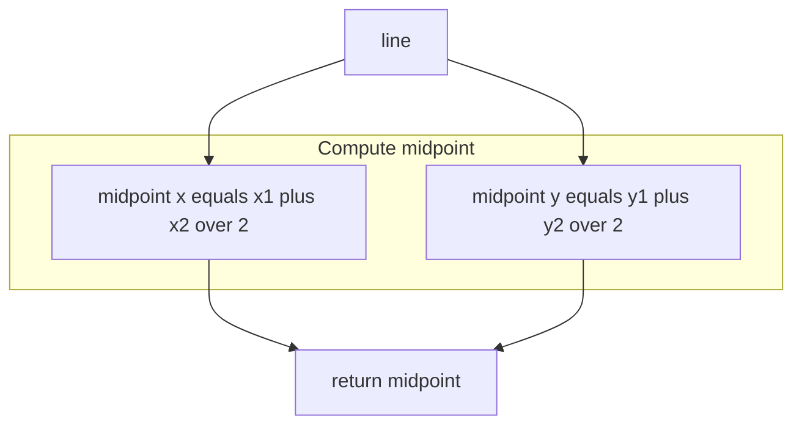
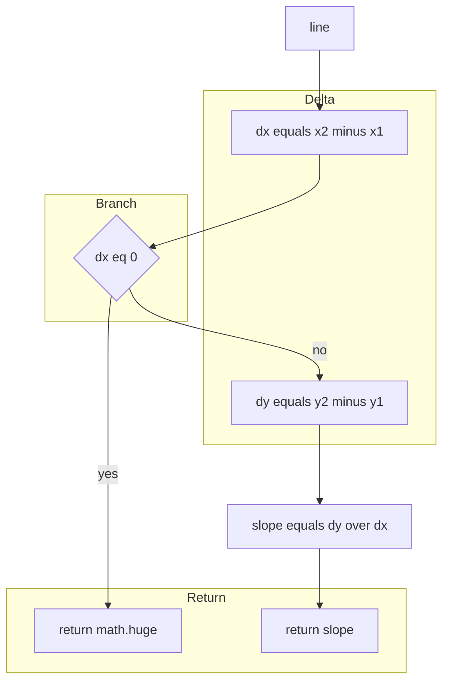

# POLY rays midpoints and slopes

Ray intersection against axis aligned bounds, segment midpoints, and line slopes.

# Source anchors
- [AETHR.POLY:intersectRayToBounds()](https://github.com/Gh0st352/AETHR/blob/main/dev/POLY.lua#L1491)
- [AETHR.POLY:getMidpoint()](https://github.com/Gh0st352/AETHR/blob/main/dev/POLY.lua#L1171)
- [AETHR.POLY:calculateLineSlope()](https://github.com/Gh0st352/AETHR/blob/main/dev/POLY.lua#L1188)

# Overview
- intersectRayToBounds computes the nearest positive intersection between a ray pt plus t dir and AABB bounds in XZ space using epsilon guards
- getMidpoint returns the average of segment endpoints
- calculateLineSlope returns dy over dx with vertical line handling returning math.huge

# intersectRayToBounds flow

# Midpoint and slope flows

### Slope

# Sequence usage

# Implementation notes
- intersectRayToBounds
  - Epsilon eps equals 1e minus 12 avoids near parallel division; only positive t considered
  - X edge tests ensure the resulting y lies within Z bounds range; Z edge tests mirror this
  - Chooses the lowest positive t among all valid candidates
- calculateLineSlope returns math.huge for vertical lines to preserve consistency with geometric helpers requiring a numeric sentinel
- getMidpoint is a simple arithmetic average and is used by utilities and visual features

# Validation checklist
- intersectRayToBounds: [dev/POLY.lua](https://github.com/Gh0st352/AETHR/blob/main/dev/POLY.lua#L1491)
- getMidpoint: [dev/POLY.lua](https://github.com/Gh0st352/AETHR/blob/main/dev/POLY.lua#L1171)
- calculateLineSlope: [dev/POLY.lua](https://github.com/Gh0st352/AETHR/blob/main/dev/POLY.lua#L1188)

# Related docs
- Distance and offset: [docs/poly/distance_projection_and_offset.md](./distance_projection_and_offset.md)
- Convert and order: [docs/poly/convert_and_order.md](./convert_and_order.md)

# Conventions
- Mermaid fenced blocks use GitHub Mermaid parser
- Subgraph labels use double quotes per [docs/_mermaid/README.md](../_mermaid/README.md)
- Labels inside brackets avoid double quotes and parentheses
- Links use relative paths for repository portability