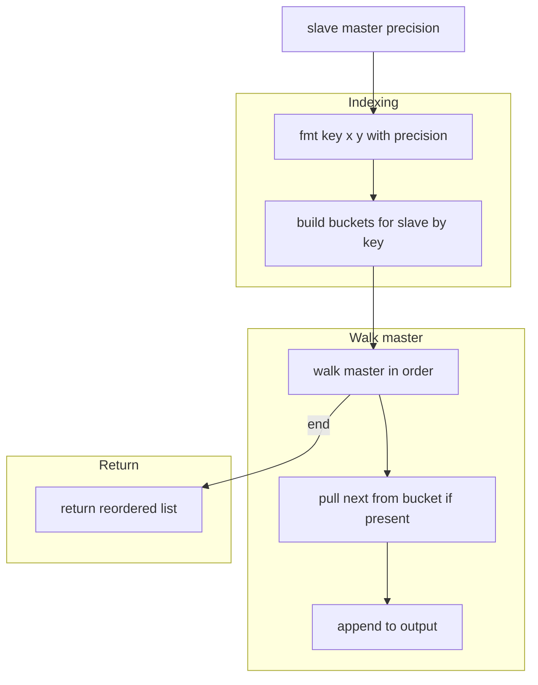
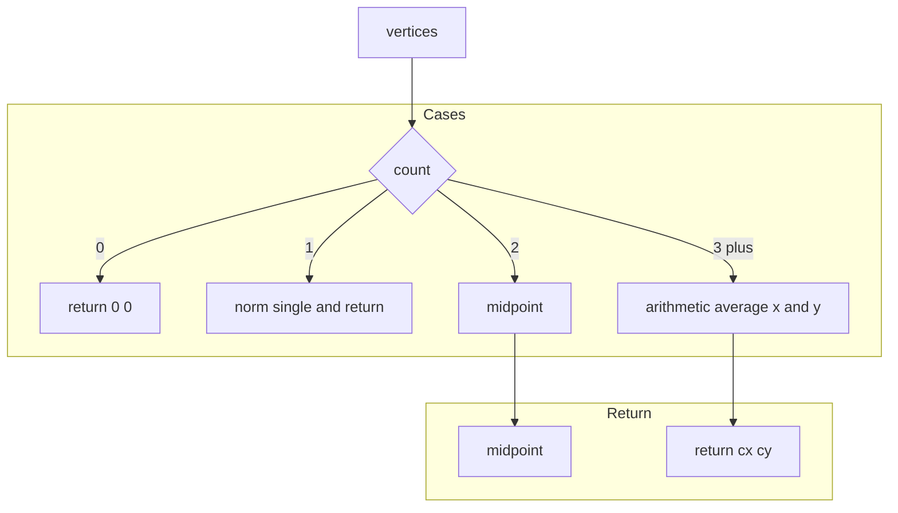
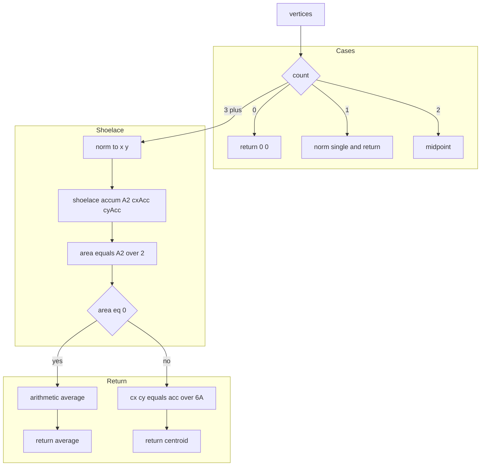
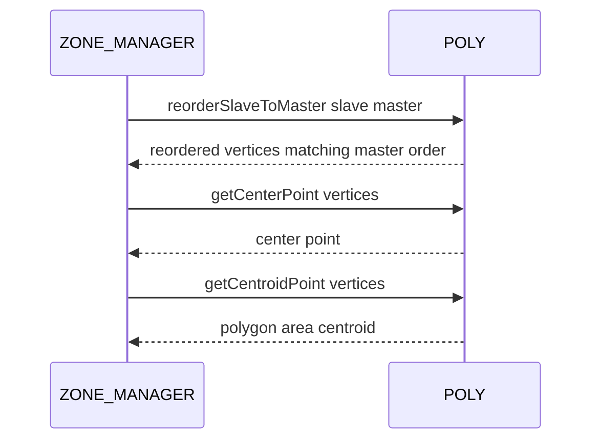

# POLY reorder and centroids

Reordering vertex lists to match a master ordering and computing center and centroid points.

### Source anchors
- [AETHR.POLY:reorderSlaveToMaster()](../../dev/POLY.lua:1705)
- [AETHR.POLY:getCenterPoint()](../../dev/POLY.lua:1779)
- [AETHR.POLY:getCentroidPoint()](../../dev/POLY.lua:1830)
- Helpers: [AETHR.POLY:normalizePoint()](../../dev/POLY.lua:236)

### Overview
- reorderSlaveToMaster reorders a slave vertex array to match the order of a master by bucketing slave points using rounded x y keys and walking the master
- getCenterPoint returns a center representative of a set of vertices using simple rules:
  - 0 verts 0,0
  - 1 vert that vertex normalized
  - 2 verts midpoint
  - 3 or more arithmetic centroid
- getCentroidPoint returns the polygon area centroid using the shoelace method with degenerate fallback to arithmetic centroid

# reorderSlaveToMaster flow

# getCenterPoint flow

# getCentroidPoint flow

# Sequence usage

# Implementation notes
- reorderSlaveToMaster uses rounded keys with default precision 3 to allow near-equality matches
  - Buckets store arrays and a read pointer to avoid costly front removals
  - Only vertices present in the master order are included in output
- getCenterPoint selects from rules and uses arithmetic centroid for 3 or more without area weighting
- getCentroidPoint computes the true area centroid with shoelace accumulators and a degenerate fallback

# Validation checklist
- reorderSlaveToMaster: [dev/POLY.lua](../../dev/POLY.lua:1705)
- getCenterPoint: [dev/POLY.lua](../../dev/POLY.lua:1779)
- getCentroidPoint: [dev/POLY.lua](../../dev/POLY.lua:1830)

# Related docs
- Convert and order: [docs/poly/convert_and_order.md](./convert_and_order.md)
- Bounds and divisions: [docs/poly/bounds_and_divisions.md](./bounds_and_divisions.md)

# Conventions
- Mermaid fenced blocks use GitHub Mermaid parser
- Subgraph labels use double quotes per [docs/_mermaid/README.md](../_mermaid/README.md)
- Labels inside brackets avoid double quotes and parentheses
- Links use relative paths for repository portability