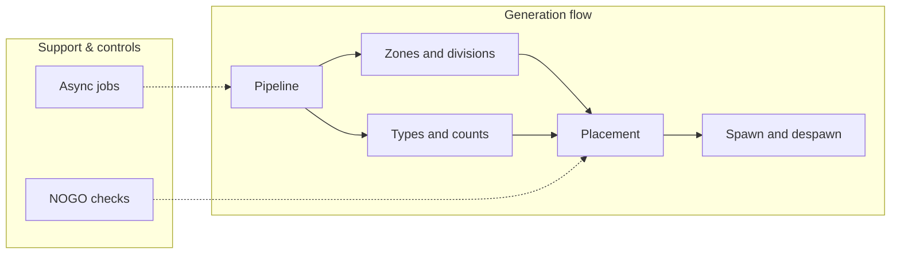
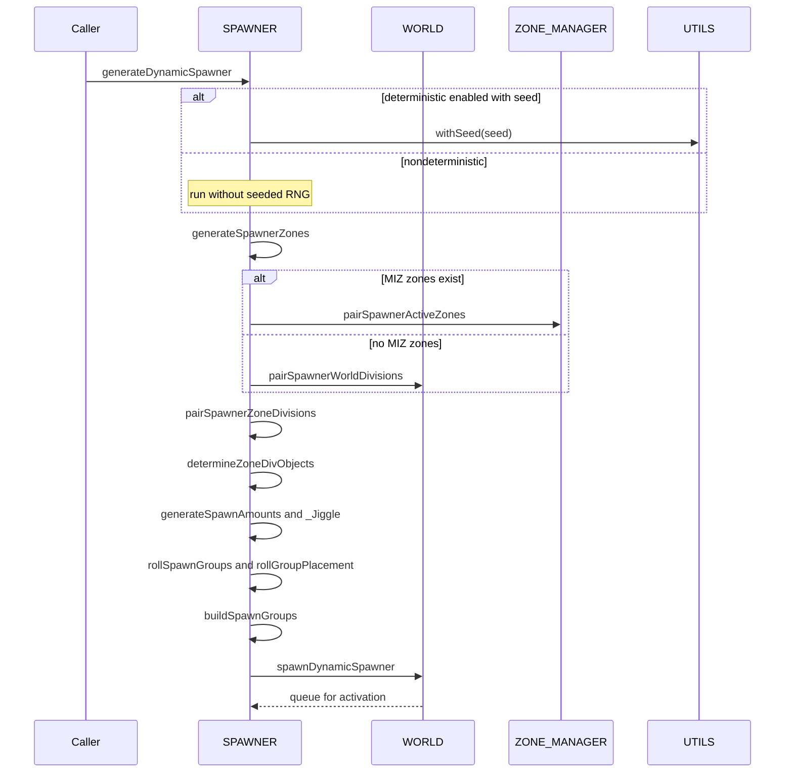

# AETHR SPAWNER diagrams index

Primary module entry: [AETHR.SPAWNER:generateDynamicSpawner()](https://github.com/Gh0st352/AETHR/blob/main/dev/SPAWNER.lua#L563)

Documents
- Pipeline overview: [pipeline.md](./pipeline.md)
- Zones and divisions: [zones_and_divisions.md](./zones_and_divisions.md)
- Placement logic: [placement.md](./placement.md)
- Types and counts: [types_and_counts.md](./types_and_counts.md)
- Build, spawn, despawn: [spawn_despawn.md](./spawn_despawn.md)
- NOGO checks: [nogo.md](./nogo.md)
- Async jobs: [async.md](./async.md)

# End to end relationship

# Sequence overview

# Key anchors
- Deterministic scope: [AETHR.UTILS:withSeed()](https://github.com/Gh0st352/AETHR/blob/main/dev/UTILS.lua#L242)
- Zone generation: [AETHR.SPAWNER:generateSpawnerZones()](https://github.com/Gh0st352/AETHR/blob/main/dev/SPAWNER.lua#L2012)
- Pair to divisions: [AETHR.SPAWNER:pairSpawnerWorldDivisions()](https://github.com/Gh0st352/AETHR/blob/main/dev/SPAWNER.lua#L723), [AETHR.SPAWNER:pairSpawnerActiveZones()](https://github.com/Gh0st352/AETHR/blob/main/dev/SPAWNER.lua#L760)
- Group type pools: [AETHR.SPAWNER:seedTypes()](https://github.com/Gh0st352/AETHR/blob/main/dev/SPAWNER.lua#L1804), [AETHR.SPAWNER:generateGroupTypes()](https://github.com/Gh0st352/AETHR/blob/main/dev/SPAWNER.lua#L1600)
- Counts and balancing: [AETHR.SPAWNER:generateSpawnAmounts()](https://github.com/Gh0st352/AETHR/blob/main/dev/SPAWNER.lua#L1918), [AETHR.SPAWNER:_Jiggle()](https://github.com/Gh0st352/AETHR/blob/main/dev/SPAWNER.lua#L1978)
- Placement loops: [AETHR.SPAWNER:generateVec2GroupCenters()](https://github.com/Gh0st352/AETHR/blob/main/dev/SPAWNER.lua#L1067), [AETHR.SPAWNER:generateVec2UnitPos()](https://github.com/Gh0st352/AETHR/blob/main/dev/SPAWNER.lua#L1301)
- NOGO checks: [AETHR.SPAWNER:checkIsInNOGO()](https://github.com/Gh0st352/AETHR/blob/main/dev/SPAWNER.lua#L2085), [AETHR.POLY:pointInPolygon()](https://github.com/Gh0st352/AETHR/blob/main/dev/POLY.lua#L66)
- Async enqueue: [AETHR.SPAWNER:enqueueGenerateDynamicSpawner()](https://github.com/Gh0st352/AETHR/blob/main/dev/SPAWNER.lua#L520)
- Auxiliary logic wrappers and utilities: [auxiliary.md](./auxiliary.md)