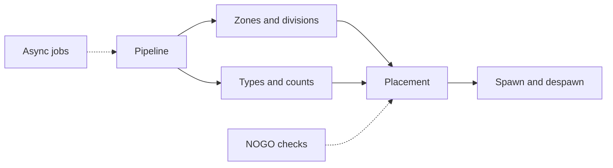
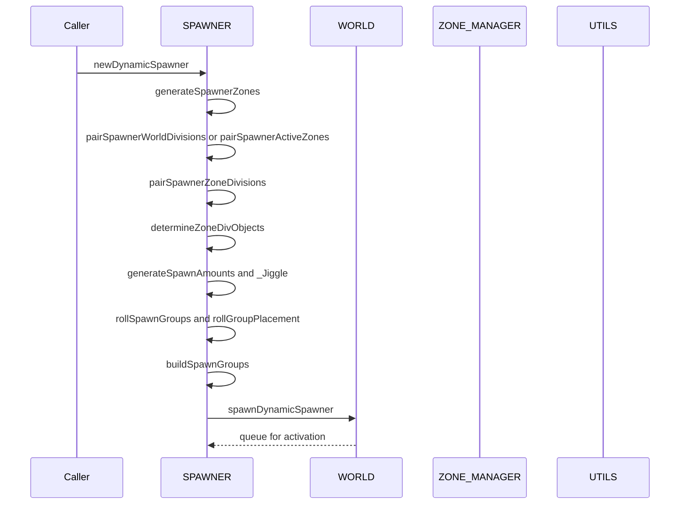

# AETHR SPAWNER diagrams index

Primary module entry: [AETHR.SPAWNER:generateDynamicSpawner()](../../dev/SPAWNER.lua:563)

Documents
- Pipeline overview: [pipeline.md](./pipeline.md)
- Zones and divisions: [zones_and_divisions.md](./zones_and_divisions.md)
- Placement logic: [placement.md](./placement.md)
- Types and counts: [types_and_counts.md](./types_and_counts.md)
- Build, spawn, despawn: [spawn_despawn.md](./spawn_despawn.md)
- NOGO checks: [nogo.md](./nogo.md)
- Async jobs: [async.md](./async.md)

End to end relationship

Sequence overview

Key anchors
- Deterministic scope: [AETHR.UTILS:withSeed()](../../dev/UTILS.lua:242)
- Zone generation: [AETHR.SPAWNER:generateSpawnerZones()](../../dev/SPAWNER.lua:2012)
- Pair to divisions: [AETHR.SPAWNER:pairSpawnerWorldDivisions()](../../dev/SPAWNER.lua:723), [AETHR.SPAWNER:pairSpawnerActiveZones()](../../dev/SPAWNER.lua:760)
- Group type pools: [AETHR.SPAWNER:seedTypes()](../../dev/SPAWNER.lua:1804), [AETHR.SPAWNER:generateGroupTypes()](../../dev/SPAWNER.lua:1600)
- Counts and balancing: [AETHR.SPAWNER:generateSpawnAmounts()](../../dev/SPAWNER.lua:1918), [AETHR.SPAWNER:_Jiggle()](../../dev/SPAWNER.lua:1978)
- Placement loops: [AETHR.SPAWNER:generateVec2GroupCenters()](../../dev/SPAWNER.lua:1067), [AETHR.SPAWNER:generateVec2UnitPos()](../../dev/SPAWNER.lua:1301)
- NOGO checks: [AETHR.SPAWNER:checkIsInNOGO()](../../dev/SPAWNER.lua:2085), [AETHR.POLY:pointInPolygon()](../../dev/POLY.lua:66)
- Async enqueue: [AETHR.SPAWNER:enqueueGenerateDynamicSpawner()](../../dev/SPAWNER.lua:520)
- Auxiliary logic wrappers and utilities: [auxiliary.md](./auxiliary.md)