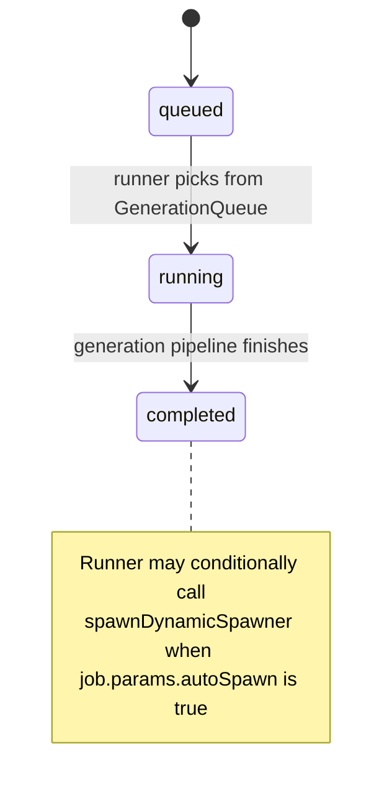

# AETHR SPAWNER async generation jobs

Covered functions
- Enqueue and status
  - [AETHR.SPAWNER:enqueueGenerateDynamicSpawner()](dev/SPAWNER.lua:520)
  - [AETHR.SPAWNER:getGenerationJobStatus()](dev/SPAWNER.lua:550)
- Async-friendly yield hook
  - [AETHR.SPAWNER:_maybeYield()](dev/SPAWNER.lua:255)
- Generation invoked by runner
  - [AETHR.SPAWNER:generateDynamicSpawner()](dev/SPAWNER.lua:563)
  - Optional auto-spawn after generation: [AETHR.SPAWNER:spawnDynamicSpawner()](dev/SPAWNER.lua:438)
- Runner context
  - Cooperates with BRAIN queue: [dev/BRAIN.lua](dev/BRAIN.lua)


1) Job enqueue lifecycle

```mermaid
flowchart TB
  E0[start enqueueGenerateDynamicSpawner] --> E1[id = DATA.GenerationJobCounter; increment counter]
  E1 --> E2[build job table: id, status queued, enqueuedAt via UTILS.getTime or os.time, params payload]
  E2 --> E3[DATA.GenerationJobs[id] = job]
  E3 --> E4[push id to DATA.GenerationQueue (FIFO)]
  E4 --> E5[return id to caller]
```

Parameters payload stored on the job
- dynamicSpawner
- vec2 (center)
- minRadius, nominalRadius, maxRadius, nudgeFactorRadius
- countryID
- autoSpawn (boolean, controls optional spawn phase after successful generation)


2) Runner and cooperative yielding

Jobs are processed by a coroutine-owned runner in BRAIN (see [dev/BRAIN.lua](dev/BRAIN.lua)). Hot inner loops call [_maybeYield()](dev/SPAWNER.lua:255) to avoid long blocking frames.

```mermaid
sequenceDiagram
  participant Caller
  participant SPAWNER
  participant BRAIN as BRAIN runner
  participant WORLD
  Caller->>SPAWNER: enqueueGenerateDynamicSpawner(params)
  SPAWNER-->>Caller: jobId
  Note over BRAIN: FIFO consume DATA.GenerationQueue
  BRAIN->>SPAWNER: generateDynamicSpawner(job.params...)
  rect rgb(245,245,245)
    Note over SPAWNER: Inside generation pipeline
    SPAWNER-->>SPAWNER: generateSpawnerZones, weightZones, generateSpawnAmounts
    SPAWNER-->>SPAWNER: rollSpawnGroupSizes, generateSpawnerGroups, buildSpawnGroups
    loop hot loops
      SPAWNER-->>SPAWNER: _maybeYield(inc)
      SPAWNER-->>BRAIN: coroutine.yield when threshold reached
      BRAIN-->>SPAWNER: resume
    end
  end
  alt job.params.autoSpawn is true
    BRAIN->>SPAWNER: spawnDynamicSpawner(dynamicSpawner, countryID)
    SPAWNER->>WORLD: coalition.addGroup per group; enqueue spawnQueue
  end
  BRAIN-->>BRAIN: mark job status completed
```

Yield logic in [_maybeYield()](dev/SPAWNER.lua:255)
- Increments a per-coroutine yieldCounter by the provided inc (often 1 in hot loops).
- When yieldCounter reaches yieldThreshold (stored on BRAIN.DATA.coroutines.spawnerGenerationQueue), resets counter and yields.
- Emits debugInfo when present via [dev/UTILS.lua](dev/UTILS.lua).


3) Job state model



Status accessor
- [AETHR.SPAWNER:getGenerationJobStatus()](dev/SPAWNER.lua:550) returns the job record for a given id from DATA.GenerationJobs.


4) Deterministic execution interaction

- The outer generation entry [AETHR.SPAWNER:generateDynamicSpawner()](dev/SPAWNER.lua:563) may run inside [AETHR.UTILS:withSeed()](dev/UTILS.lua:192) when either SPAWNER.DATA.CONFIG.Deterministic.Enabled or dynamicSpawner.deterministicEnabled is true and a numeric deterministicSeed is provided on the spawner.
- Determinism scope covers type selection, counts, and placement randomness executed within the pipeline; yielding does not affect RNG behavior but controls scheduling across frames.


5) Operational notes

- FIFO fairness: DATA.GenerationQueue is first-in-first-out; long jobs periodically yield to maintain frame responsiveness.
- Operation budgets: placement loops respect SPAWNER.DATA.CONFIG.operationLimit; yielding cadence is independent but complementary.
- Auto spawn: When autoSpawn is true, runner triggers [spawnDynamicSpawner()](dev/SPAWNER.lua:438) after build, which sets _engineAddTime and enqueues group names into SPAWNER.DATA.spawnQueue for WORLD to process.
- Status and metrics: Consider extending job record with startedAt, finishedAt, and error fields in the runner for observability (current enqueue sets enqueuedAt).