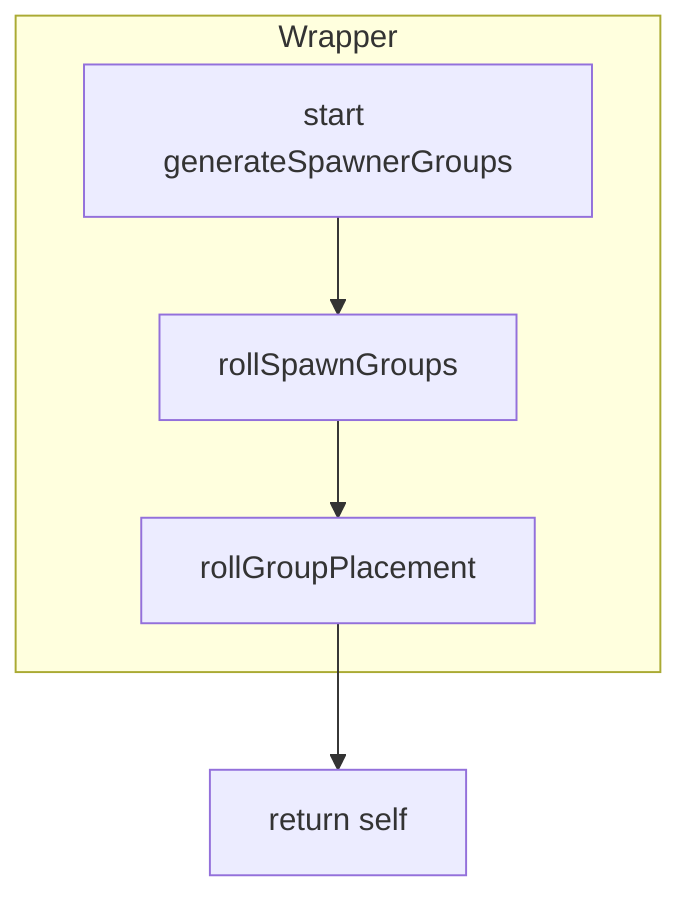
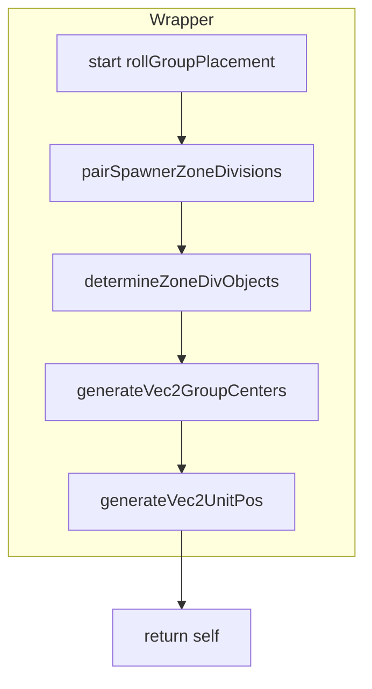
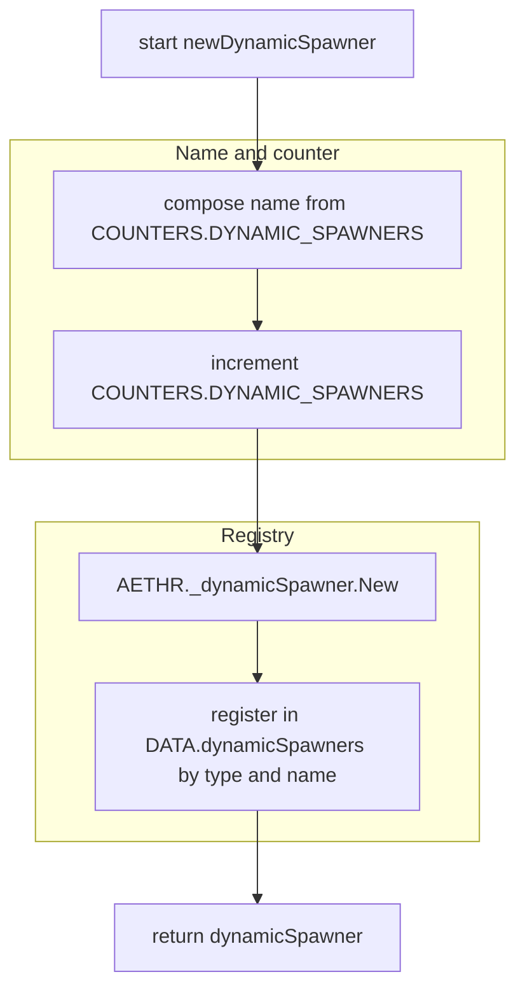
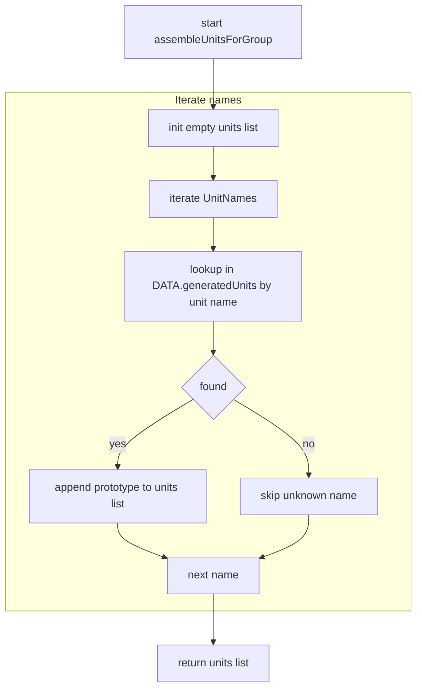
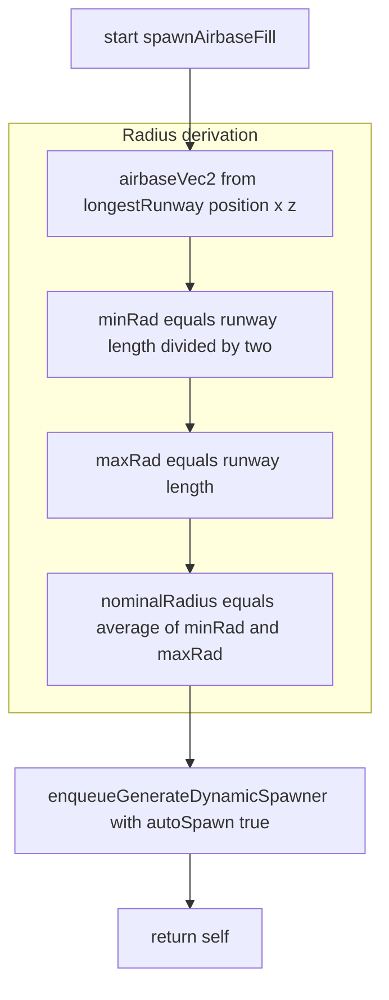

# AETHR SPAWNER auxiliary logic flows

This file documents additional logic sequences defined in [dev/SPAWNER.lua](../../dev/SPAWNER.lua) to ensure complete coverage.

# Covered functions
- Wrapper sequencing
  - [AETHR.SPAWNER:generateSpawnerGroups()](../../dev/SPAWNER.lua:660)
  - [AETHR.SPAWNER:rollGroupPlacement()](../../dev/SPAWNER.lua:670)
- Spawner lifecycle helpers
  - [AETHR.SPAWNER:newDynamicSpawner()](../../dev/SPAWNER.lua:467)
  - [AETHR.SPAWNER:assembleUnitsForGroup()](../../dev/SPAWNER.lua:358)
  - [AETHR.SPAWNER:spawnAirbaseFill()](../../dev/SPAWNER.lua:2169)

# 1) generateSpawnerGroups wrapper

- rollSpawnGroups: see [types_and_counts.md](./types_and_counts.md) for type pool seeding and group typing.
- rollGroupPlacement: wrapper sequence documented below and detailed in [placement.md](./placement.md).

# 2) rollGroupPlacement wrapper

- Each step is documented with detailed flows in:
  - Zone division pairing and object collection: [zones_and_divisions.md](./zones_and_divisions.md)
  - Placement loops and grid hashing: [placement.md](./placement.md)

# 3) newDynamicSpawner

References
- Entry: [AETHR.SPAWNER:newDynamicSpawner()](../../dev/SPAWNER.lua:467)

# 4) assembleUnitsForGroup

References
- Entry: [AETHR.SPAWNER:assembleUnitsForGroup()](../../dev/SPAWNER.lua:358)

# 5) spawnAirbaseFill

# References
- Entry: [AETHR.SPAWNER:spawnAirbaseFill()](../../dev/SPAWNER.lua:2169)
- Enqueue: [AETHR.SPAWNER:enqueueGenerateDynamicSpawner()](../../dev/SPAWNER.lua:520)

# Notes
- Wrapper diagrams ensure high level readability across files while detailed decision logic remains in specialized documents:
  - Type and count flows: [types_and_counts.md](./types_and_counts.md)
  - Zones and divisions: [zones_and_divisions.md](./zones_and_divisions.md)
  - Placement and NOGO checks: [placement.md](./placement.md), [nogo.md](./nogo.md)
  - Build and world actions: [spawn_despawn.md](./spawn_despawn.md)
  - Async job lifecycle and yielding: [async.md](./async.md)