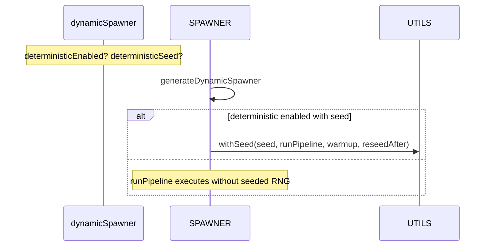

# Deterministic generation and RNG scope

This page documents the deterministic wrapper used during spawner generation and how to enable, scope, and reason about seeded randomness.

Primary anchors
- [AETHR.SPAWNER:generateDynamicSpawner()](https://github.com/Gh0st352/AETHR/blob/main/dev/SPAWNER.lua#L563)
- [AETHR.UTILS:withSeed()](https://github.com/Gh0st352/AETHR/blob/main/dev/UTILS.lua#L242)
- SPAWNER config fields: [SPAWNER.DATA.CONFIG.Deterministic](https://github.com/Gh0st352/AETHR/blob/main/dev/SPAWNER.lua#L103)

Last updated: 2025-10-19

# What runs deterministically

When enabled and a numeric seed is present on the dynamic spawner, the entire generation pipeline inside [AETHR.SPAWNER:generateDynamicSpawner()](https://github.com/Gh0st352/AETHR/blob/main/dev/SPAWNER.lua#L563) is executed within [AETHR.UTILS:withSeed()](https://github.com/Gh0st352/AETHR/blob/main/dev/UTILS.lua#L242):

- Zone construction and weighting
- Spawn amount calculation and balancing
- Group size allocation and type selection
- Spatial placement for centers and units

Yielding cooperates with the BRAIN runner but does not affect the RNG sequence.

# Enabling determinism

Two switches and one seed control the behavior:

- Module config (default off): [SPAWNER.DATA.CONFIG.Deterministic.Enabled](https://github.com/Gh0st352/AETHR/blob/main/dev/SPAWNER.lua#L103)
- Per-spawner override: dynamicSpawner.deterministicEnabled (optional boolean)
- Per-spawner seed: dynamicSpawner.deterministicSeed (required numeric to activate)

Warmup and reseed controls:
- [SPAWNER.DATA.CONFIG.Deterministic.Warmup](https://github.com/Gh0st352/AETHR/blob/main/dev/SPAWNER.lua#L105) invokes N extra math.random() calls after seeding (default 2) to avoid low-entropy initial draws.
- [SPAWNER.DATA.CONFIG.Deterministic.ReseedAfter](https://github.com/Gh0st352/AETHR/blob/main/dev/SPAWNER.lua#L106) re-initializes RNG to a mixed entropy after generation (default true).

# Sequence



# Trade-offs and scope

- RNG is global (Lua 5.1); [AETHR.UTILS:withSeed()](https://github.com/Gh0st352/AETHR/blob/main/dev/UTILS.lua#L242) narrows the seeded window strictly to generation, then optionally reseeds to restore unpredictability.
- For complete isolation in the future, random sources could accept an injected RNG interface.
- Determinism affects only the generation frame; live simulation after spawning is unaffected.

# Minimal example

Lua (seeded run for reproducible generation):

```lua
local spType = AETHR.ENUMS.dynamicSpawnerTypes.Town
local ds = AETHR.SPAWNER:newDynamicSpawner(spType)
  :setNumSpawnZones(4, 2, 6, 0.25)
  :setSpawnAmount(20, 15, 25, 0.2)
  :setGroupSizes(4, 2)
  :setNamePrefix("Town_")
ds.deterministicEnabled = true
ds.deterministicSeed = 1337

-- Enqueue async generation with auto spawn on completion
AETHR.SPAWNER:enqueueGenerateDynamicSpawner(
  ds,
  { x = 50000, y = 50000 },
  600, 800, 1000, 0.5,
  AETHR.CONFIG.MAIN.DefaultRedCountry,
  true
)
```

# Troubleshooting

- No effect? Ensure both a numeric seed is set on the spawner and either the module or the spawner flag enables determinism.
- Cross-frame differences? Determinism only covers generation; subsequent WORLD and AI behavior is non-deterministic by design.
- Mixed results across builds? Confirm the same CONFIG nudge factors, group size priorities, and spawn type pools are used; these feed into the deterministic draws.

# Related docs

- Pipeline overview: [pipeline.md](./pipeline.md)
- Placement details and checks: [placement.md](./placement.md), [nogo.md](./nogo.md)
- Async jobs and runner: [async.md](./async.md)