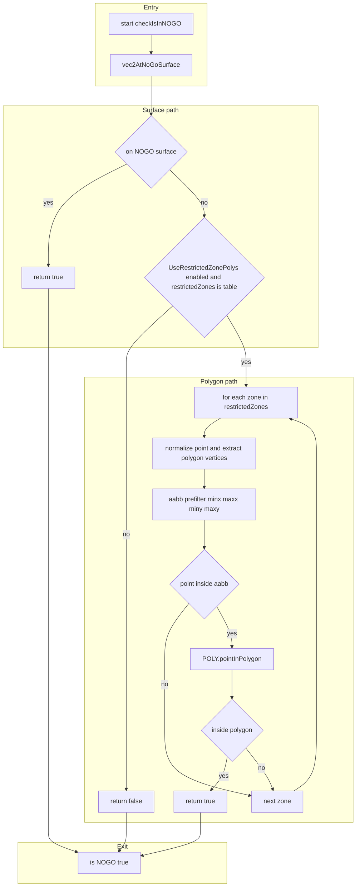
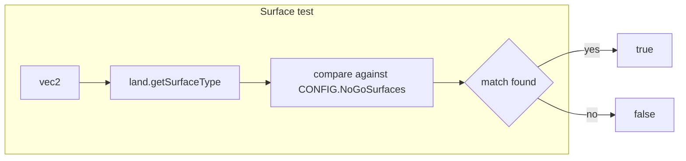
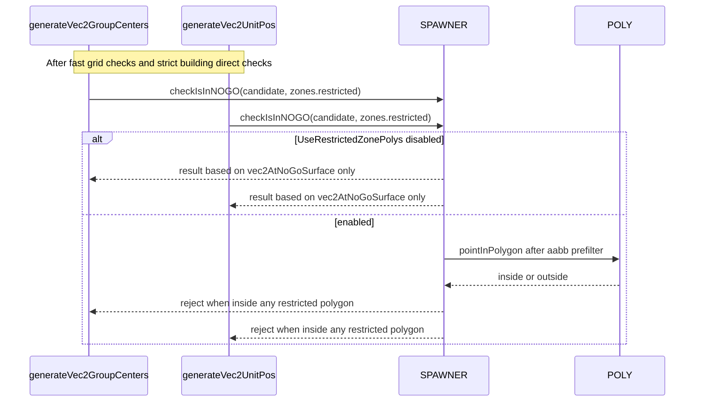

# AETHR SPAWNER NOGO checks

Covered functions
- Surface and polygon checks
  - [AETHR.SPAWNER:checkIsInNOGO()](https://github.com/Gh0st352/AETHR/blob/main/dev/SPAWNER.lua#L2085)
  - [AETHR.SPAWNER:vec2AtNoGoSurface()](https://github.com/Gh0st352/AETHR/blob/main/dev/SPAWNER.lua#L2128)
  - [AETHR.POLY:pointInPolygon](https://github.com/Gh0st352/AETHR/blob/main/dev/POLY.lua#L66)
- Call sites during placement
  - Centers: NOGO check used in [AETHR.SPAWNER:generateVec2GroupCenters](https://github.com/Gh0st352/AETHR/blob/main/dev/SPAWNER.lua#L1227)
  - Units: NOGO check used in [AETHR.SPAWNER:generateVec2UnitPos](https://github.com/Gh0st352/AETHR/blob/main/dev/SPAWNER.lua#L1504)
- Configuration
  - NoGoSurfaces list: [SPAWNER.DATA.CONFIG.NoGoSurfaces](https://github.com/Gh0st352/AETHR/blob/main/dev/SPAWNER.lua#L108)
  - Polygon toggle: [SPAWNER.DATA.CONFIG.UseRestrictedZonePolys](https://github.com/Gh0st352/AETHR/blob/main/dev/SPAWNER.lua#L101)

# 1. NOGO decision flow

# 2. Surface classification path

# 3. Integration in placement loops

# 4. Notes and guardrails

- Surface checks are always enforced via [AETHR.SPAWNER:vec2AtNoGoSurface](https://github.com/Gh0st352/AETHR/blob/main/dev/SPAWNER.lua#L2128) using DCS land.getSurfaceType and the configured [NoGoSurfaces](https://github.com/Gh0st352/AETHR/blob/main/dev/SPAWNER.lua#L108).
- Polygon checks are optional, controlled by [UseRestrictedZonePolys](https://github.com/Gh0st352/AETHR/blob/main/dev/SPAWNER.lua#L101). When enabled, an axis aligned bounding box prefilter is applied before [POLY.pointInPolygon](https://github.com/Gh0st352/AETHR/blob/main/dev/POLY.lua#L66).
- Placement loops call NOGO only after cheap spatial pruning and strict building checks. See call points in [generateVec2GroupCenters](https://github.com/Gh0st352/AETHR/blob/main/dev/SPAWNER.lua#L1227) and [generateVec2UnitPos](https://github.com/Gh0st352/AETHR/blob/main/dev/SPAWNER.lua#L1504).
- Performance tradeoff: polygon checks add cost proportional to number of polygons and their vertex counts, mitigated by the aabb prefilter.