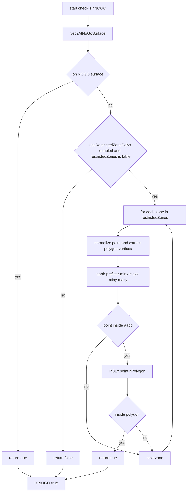
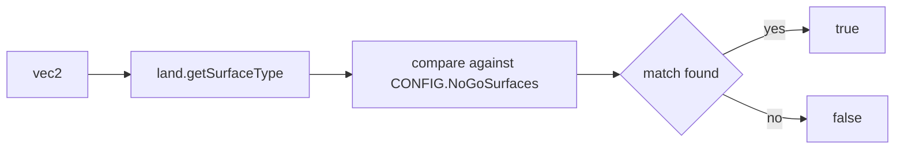
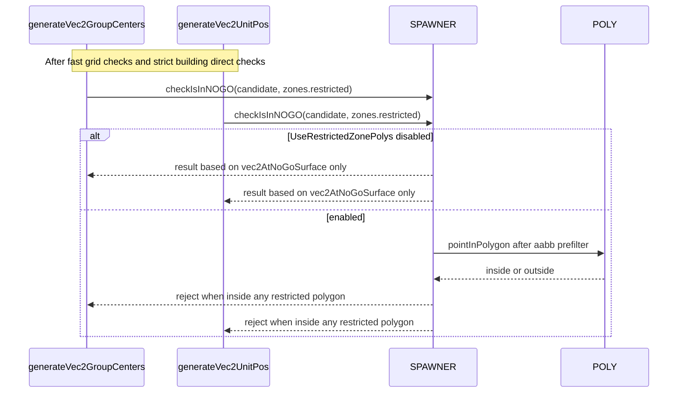

# AETHR SPAWNER NOGO checks

Covered functions
- Surface and polygon checks
  - [AETHR.SPAWNER:checkIsInNOGO()](../../dev/SPAWNER.lua:2085)
  - [AETHR.SPAWNER:vec2AtNoGoSurface()](../../dev/SPAWNER.lua:2128)
  - [AETHR.POLY:pointInPolygon](../../dev/POLY.lua:66)
- Call sites during placement
  - Centers: NOGO check used in [AETHR.SPAWNER:generateVec2GroupCenters](../../dev/SPAWNER.lua:1227)
  - Units: NOGO check used in [AETHR.SPAWNER:generateVec2UnitPos](../../dev/SPAWNER.lua:1504)
- Configuration
  - NoGoSurfaces list: [SPAWNER.DATA.CONFIG.NoGoSurfaces](../../dev/SPAWNER.lua:108)
  - Polygon toggle: [SPAWNER.DATA.CONFIG.UseRestrictedZonePolys](../../dev/SPAWNER.lua:101)

1. NOGO decision flow

2. Surface classification path

3. Integration in placement loops

4. Notes and guardrails

- Surface checks are always enforced via [AETHR.SPAWNER:vec2AtNoGoSurface](../../dev/SPAWNER.lua:2128) using DCS land.getSurfaceType and the configured [NoGoSurfaces](../../dev/SPAWNER.lua:108).
- Polygon checks are optional, controlled by [UseRestrictedZonePolys](../../dev/SPAWNER.lua:101). When enabled, an axis aligned bounding box prefilter is applied before [POLY.pointInPolygon](../../dev/POLY.lua:66).
- Placement loops call NOGO only after cheap spatial pruning and strict building checks. See call points in [generateVec2GroupCenters](../../dev/SPAWNER.lua:1227) and [generateVec2UnitPos](../../dev/SPAWNER.lua:1504).
- Performance tradeoff: polygon checks add cost proportional to number of polygons and their vertex counts, mitigated by the aabb prefilter.