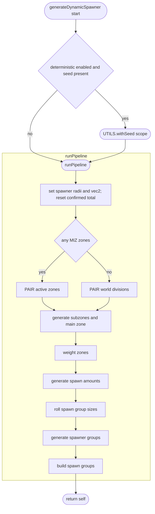
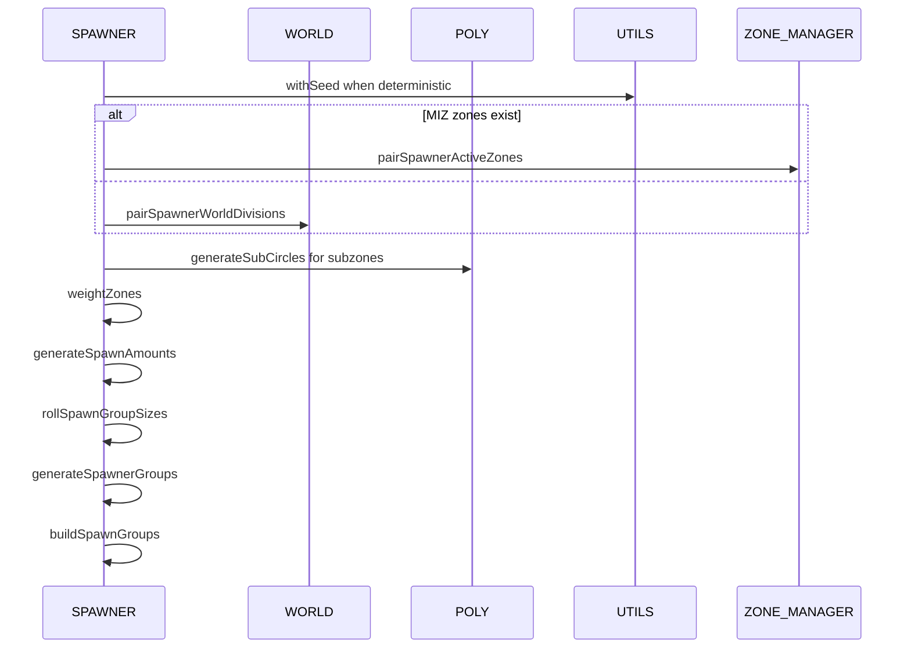

# AETHR SPAWNER generation pipeline

Primary entry point: [AETHR.SPAWNER:generateDynamicSpawner()](https://github.com/Gh0st352/AETHR/blob/main/dev/SPAWNER.lua#L563). Deterministic wrapper: [AETHR.UTILS:withSeed()](https://github.com/Gh0st352/AETHR/blob/main/dev/UTILS.lua#L242).

Key sub-steps referenced in this diagram:
- Pair zones or divisions: [AETHR.SPAWNER:pairSpawnerActiveZones()](https://github.com/Gh0st352/AETHR/blob/main/dev/SPAWNER.lua#L760) and [AETHR.SPAWNER:pairSpawnerWorldDivisions()](https://github.com/Gh0st352/AETHR/blob/main/dev/SPAWNER.lua#L723)
- Generate zones: [AETHR.SPAWNER:generateSpawnerZones()](https://github.com/Gh0st352/AETHR/blob/main/dev/SPAWNER.lua#L2012) and weight via [AETHR.SPAWNER:weightZones()](https://github.com/Gh0st352/AETHR/blob/main/dev/SPAWNER.lua#L2148)
- Spawn counts and group sizes: [AETHR.SPAWNER:generateSpawnAmounts()](https://github.com/Gh0st352/AETHR/blob/main/dev/SPAWNER.lua#L1918), [AETHR.SPAWNER:rollSpawnGroupSizes()](https://github.com/Gh0st352/AETHR/blob/main/dev/SPAWNER.lua#L1876)
- Group roll and placement: [AETHR.SPAWNER:generateSpawnerGroups()](https://github.com/Gh0st352/AETHR/blob/main/dev/SPAWNER.lua#L660)
- Build prototypes: [AETHR.SPAWNER:buildSpawnGroups()](https://github.com/Gh0st352/AETHR/blob/main/dev/SPAWNER.lua#L684)

# Flowchart overview

# Module interactions during generation

## Notes and guardrails

- Deterministic mode activates only when a numeric seed exists and either module or spawner flags are enabled.
- Pairing chooses active MIZ zones when available, otherwise falls back to WORLD divisions.
- Building and polygon NOGO enforcement occurs later in placement flows documented in [placement.md](./placement.md).
- Operation budgets and relaxation apply in placement, not in this high level pipeline.

# Flowchart: Spawner pipeline overview

```mermaid
%% shared theme: docs/_mermaid/theme.json %%
flowchart LR
  subgraph "Zone & Pairing"
    NEW[newDynamicSpawner] --> GENZ[generateSpawnerZones]
    GENZ --> PAIRW[pairSpawnerWorldDivisions or pairSpawnerActiveZones]
    PAIRW --> PAIRZ[pairSpawnerZoneDivisions]
  end
  subgraph "Placement & Build"
    PAIRZ --> OBJ[determineZoneDivObjects]
    OBJ --> WEIGHT[weightZones]
    WEIGHT --> AMT[generateSpawnAmounts]
    AMT --> GROUPS[generateSpawnerGroups]
    GROUPS --> ROLL[rollSpawnGroups]
    ROLL --> PLACE[rollGroupPlacement]
    PLACE --> BUILD[buildSpawnGroups]
  end
  BUILD --> SPAWN[spawnDynamicSpawner]
  class NEW class_io;
  class GENZ,PAIRW,PAIRZ,OBJ,WEIGHT,AMT,GROUPS,ROLL,PLACE,BUILD class_step;
  class SPAWN class_result;
```

# Source anchors
- [AETHR.SPAWNER:newDynamicSpawner()](https://github.com/Gh0st352/AETHR/blob/main/dev/SPAWNER.lua#L468)
- [AETHR.SPAWNER:generateSpawnerZones()](https://github.com/Gh0st352/AETHR/blob/main/dev/SPAWNER.lua#L2012)
- [AETHR.SPAWNER:pairSpawnerWorldDivisions()](https://github.com/Gh0st352/AETHR/blob/main/dev/SPAWNER.lua#L723)
- [AETHR.SPAWNER:pairSpawnerActiveZones()](https://github.com/Gh0st352/AETHR/blob/main/dev/SPAWNER.lua#L760)
- [AETHR.SPAWNER:pairSpawnerZoneDivisions()](https://github.com/Gh0st352/AETHR/blob/main/dev/SPAWNER.lua#L803)
- [AETHR.SPAWNER:determineZoneDivObjects()](https://github.com/Gh0st352/AETHR/blob/main/dev/SPAWNER.lua#L857)
- [AETHR.SPAWNER:weightZones()](https://github.com/Gh0st352/AETHR/blob/main/dev/SPAWNER.lua#L2148)
- [AETHR.SPAWNER:generateSpawnAmounts()](https://github.com/Gh0st352/AETHR/blob/main/dev/SPAWNER.lua#L1918)
- [AETHR.SPAWNER:generateSpawnerGroups()](https://github.com/Gh0st352/AETHR/blob/main/dev/SPAWNER.lua#L660)
- [AETHR.SPAWNER:rollSpawnGroups()](https://github.com/Gh0st352/AETHR/blob/main/dev/SPAWNER.lua#L1589)
- [AETHR.SPAWNER:rollGroupPlacement()](https://github.com/Gh0st352/AETHR/blob/main/dev/SPAWNER.lua#L671)
- [AETHR.SPAWNER:buildSpawnGroups()](https://github.com/Gh0st352/AETHR/blob/main/dev/SPAWNER.lua#L684)
- [AETHR.SPAWNER:spawnDynamicSpawner()](https://github.com/Gh0st352/AETHR/blob/main/dev/SPAWNER.lua#L438)