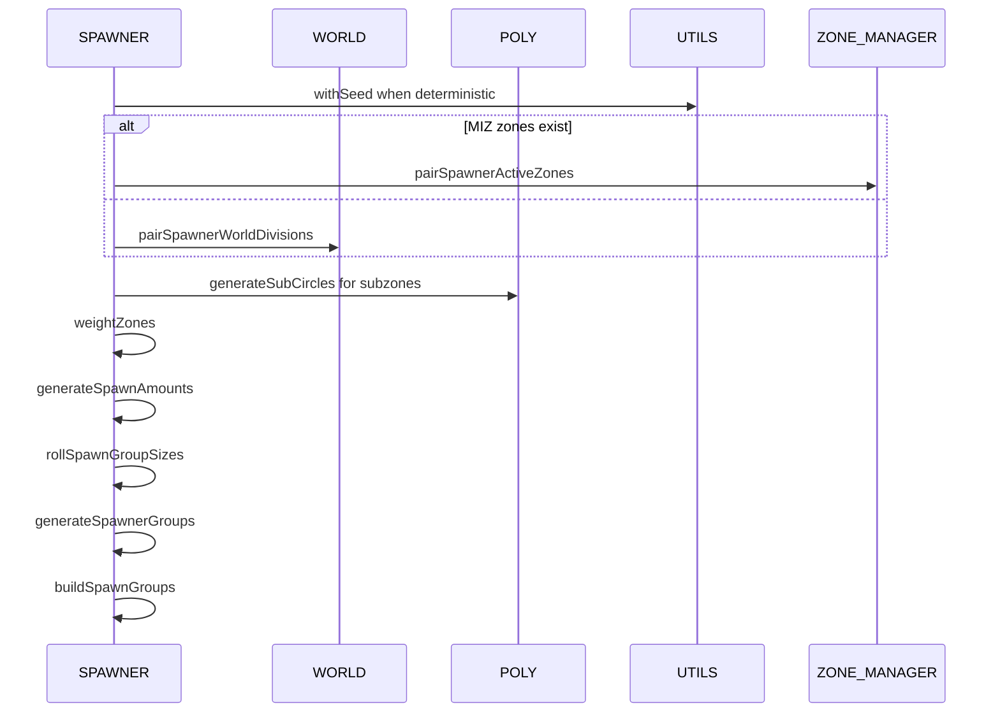

# AETHR SPAWNER generation pipeline

Primary entry point: [AETHR.SPAWNER:generateDynamicSpawner()](dev/SPAWNER.lua:563). Deterministic wrapper: [AETHR.UTILS:withSeed()](dev/UTILS.lua:192).

Key sub-steps referenced in this diagram:
- Pair zones or divisions: [AETHR.SPAWNER:pairSpawnerActiveZones()](dev/SPAWNER.lua:760) and [AETHR.SPAWNER:pairSpawnerWorldDivisions()](dev/SPAWNER.lua:723)
- Generate zones: [AETHR.SPAWNER:generateSpawnerZones()](dev/SPAWNER.lua:2012) and weight via [AETHR.SPAWNER:weightZones()](dev/SPAWNER.lua:2148)
- Spawn counts and group sizes: [AETHR.SPAWNER:generateSpawnAmounts()](dev/SPAWNER.lua:1918), [AETHR.SPAWNER:rollSpawnGroupSizes()](dev/SPAWNER.lua:1876)
- Group roll and placement: [AETHR.SPAWNER:generateSpawnerGroups()](dev/SPAWNER.lua:660)
- Build prototypes: [AETHR.SPAWNER:buildSpawnGroups()](dev/SPAWNER.lua:684)

Flowchart overview

Module interactions during generation

Notes and guardrails

- Deterministic mode activates only when a numeric seed exists and either module or spawner flags are enabled.
- Pairing chooses active MIZ zones when available, otherwise falls back to WORLD divisions.
- Building and polygon NOGO enforcement occurs later in placement flows documented in [placement.md](docs/spawner/placement.md).
- Operation budgets and relaxation apply in placement, not in this high level pipeline.