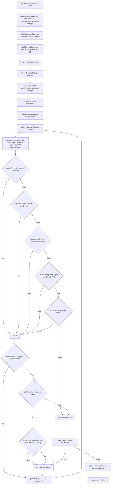
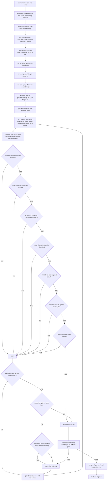
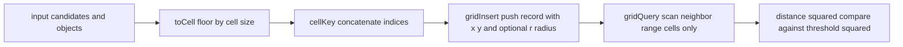

# AETHR SPAWNER placement logic

Covered functions
- Centers: [AETHR.SPAWNER:generateVec2GroupCenters()](dev/SPAWNER.lua:1067)
- Units: [AETHR.SPAWNER:generateVec2UnitPos()](dev/SPAWNER.lua:1301)
- Shared helpers
  - Extract XY: [AETHR.SPAWNER:_extractXY()](dev/SPAWNER.lua:157)
  - Grid index: [AETHR.SPAWNER:_toCell()](dev/SPAWNER.lua:171), [AETHR.SPAWNER:_cellKey()](dev/SPAWNER.lua:178)
  - Grid ops: [AETHR.SPAWNER:_gridInsert()](dev/SPAWNER.lua:183), [AETHR.SPAWNER:_gridQuery()](dev/SPAWNER.lua:195)
  - Strict building reject: [AETHR.SPAWNER:_directCellStructureReject()](dev/SPAWNER.lua:233)
  - Yielding: [AETHR.SPAWNER:_maybeYield()](dev/SPAWNER.lua:255)
  - NoGo checks: [AETHR.SPAWNER:checkIsInNOGO()](dev/SPAWNER.lua:2085)
- Config references
  - BUILD_PAD and EXTRA_ATTEMPTS_BUILDING: [SPAWNER.DATA.CONFIG](dev/SPAWNER.lua:92)
  - operationLimit and separationSettings: [SPAWNER.DATA.CONFIG](dev/SPAWNER.lua:98)

1. Group center placement flow

2. Unit position placement flow

3. Grid hashing mechanics

4. Notes and invariants

- Strict building separation is never relaxed during final accept checks. Center and unit placement both enforce direct per object checks via [AETHR.SPAWNER:_directCellStructureReject()](dev/SPAWNER.lua:233) with extra padding BUILD_PAD.
- Relaxation affects only group to group and unit to unit and structures fast prune thresholds, capped at thirty percent as operation budget depletes. See computation inside [AETHR.SPAWNER:generateVec2GroupCenters()](dev/SPAWNER.lua:1179) and [AETHR.SPAWNER:generateVec2UnitPos()](dev/SPAWNER.lua:1443).
- NoGo surfaces are always enforced through [AETHR.SPAWNER:vec2AtNoGoSurface()](dev/SPAWNER.lua:2128). Polygonal restricted zones are enforced only when enabled through [AETHR.SPAWNER:checkIsInNOGO()](dev/SPAWNER.lua:2085).
- Candidate selection uses uniform random sampling inside circles using POLY utilities: centers from sub zone circle [AETHR.POLY:getRandomVec2inCircle](dev/POLY.lua:0) and units from a radius around the group center, value maxGroups from separation settings.
- Cooperative yielding is done periodically based on operationLimit to avoid blocking frames via [AETHR.SPAWNER:_maybeYield()](dev/SPAWNER.lua:255).
- Grids reduce neighbor queries by scanning only a bounded number of cells around the candidate derived from neighbor ranges computed from thresholds and cell size.