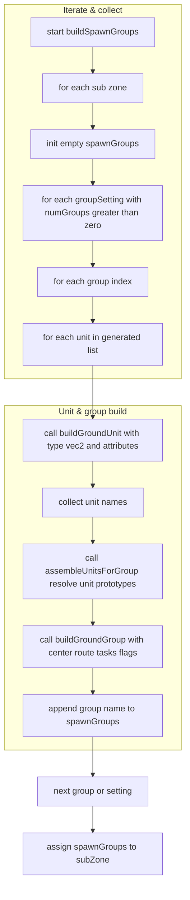
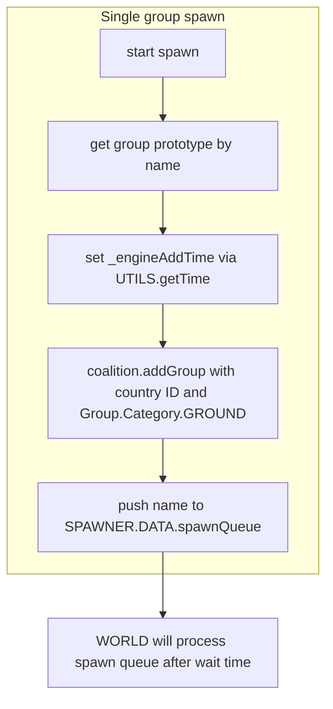
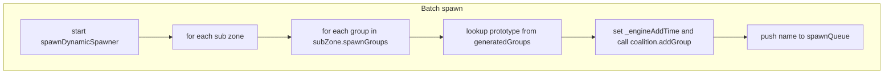
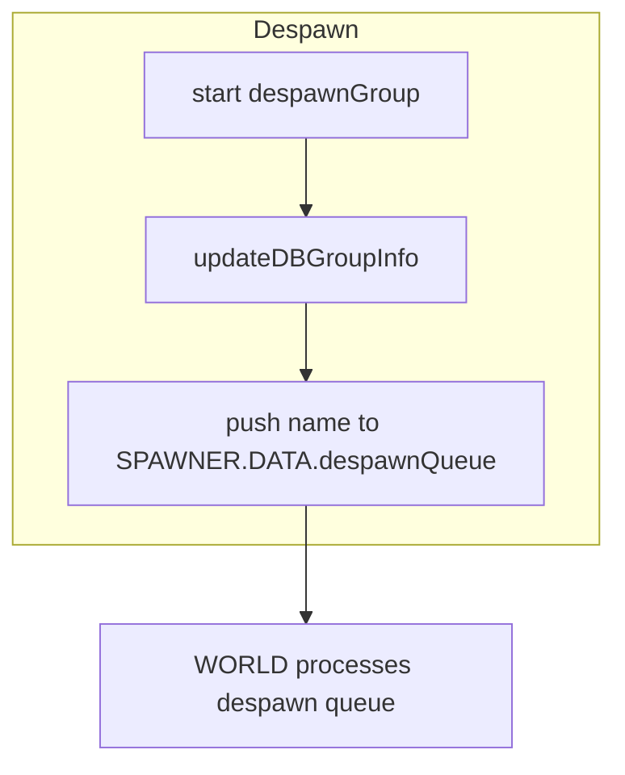
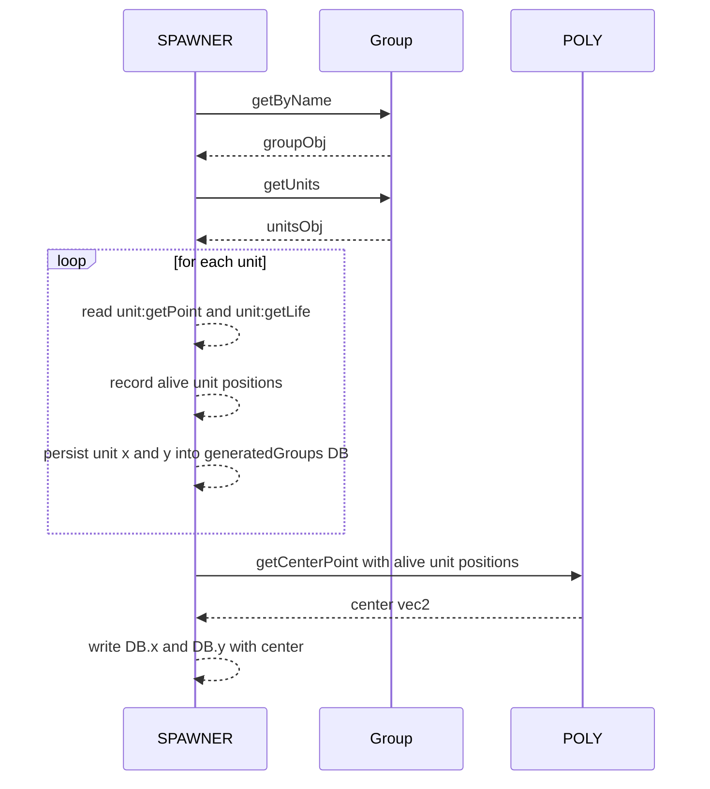
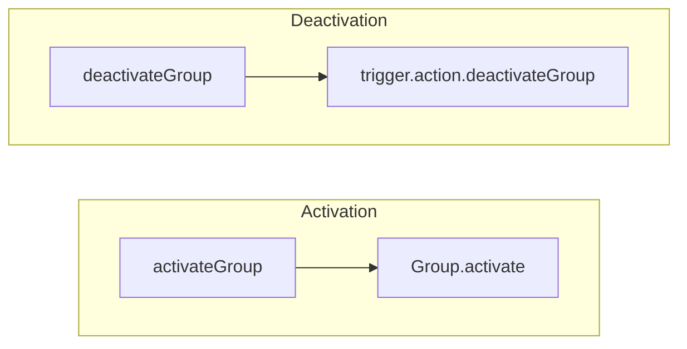

# AETHR SPAWNER build, spawn, and despawn flows

Covered functions
- Build prototypes:
  - [AETHR.SPAWNER:buildSpawnGroups()](../../dev/SPAWNER.lua:684)
  - [AETHR.SPAWNER:buildGroundUnit()](../../dev/SPAWNER.lua:282)
  - [AETHR.SPAWNER:buildGroundGroup()](../../dev/SPAWNER.lua:321)
  - [AETHR.SPAWNER:assembleUnitsForGroup()](../../dev/SPAWNER.lua:358)
- World actions:
  - [AETHR.SPAWNER:spawnGroup()](../../dev/SPAWNER.lua:425)
  - [AETHR.SPAWNER:spawnDynamicSpawner()](../../dev/SPAWNER.lua:438)
  - [AETHR.SPAWNER:despawnGroup()](../../dev/SPAWNER.lua:457)
  - [AETHR.SPAWNER:updateDBGroupInfo()](../../dev/SPAWNER.lua:393)

Context
- Queues: [SPAWNER.DATA.spawnQueue](../../dev/SPAWNER.lua:82), [SPAWNER.DATA.despawnQueue](../../dev/SPAWNER.lua:84) are processed by WORLD.
- Safety delay: [SPAWNER.DATA.CONFIG.SPAWNER_WAIT_TIME](../../dev/SPAWNER.lua:95) defines delay before a newly added group is eligible for further processing, to prevent DCS instability.
- WORLD-side handlers: spawning and despawning execution happens in WORLD routines, external to this module.

# 1) Building prototypes from generated plans

### Input sources for build:
- Per-subzone plans created earlier: groupSettings.generatedGroupTypes, groupSettings.generatedGroupUnitTypes, groupSettings.generatedGroupCenterVec2s, groupSettings.generatedUnitVec2s from [AETHR.SPAWNER:generateSpawnerGroups()](../../dev/SPAWNER.lua:660).

- [AETHR.SPAWNER:buildGroundUnit()](../../dev/SPAWNER.lua:282) creates a unit prototype via AETHR._groundUnit and stores it in [SPAWNER.DATA.generatedUnits](../../dev/SPAWNER.lua:80).
- [AETHR.SPAWNER:buildGroundGroup()](../../dev/SPAWNER.lua:321) creates a group prototype via AETHR._groundGroup and stores it in [SPAWNER.DATA.generatedGroups](../../dev/SPAWNER.lua:76).
- No mission engine mutation occurs in the build phase; prototypes are prepared for later instantiation.

# 2) Spawning prepared groups

## Two entry points:
- Single group spawn: [AETHR.SPAWNER:spawnGroup()](../../dev/SPAWNER.lua:425)
- Batch spawn for a dynamic spawner: [AETHR.SPAWNER:spawnDynamicSpawner()](../../dev/SPAWNER.lua:438)

## Batch spawn across a dynamic spawner:

Notes
- Country selection: explicit countryID overrides the prototype’s countryID when provided to [AETHR.SPAWNER:spawnGroup()](../../dev/SPAWNER.lua:425) and [AETHR.SPAWNER:spawnDynamicSpawner()](../../dev/SPAWNER.lua:438).
- After adding to the mission engine, WORLD respects [SPAWNER_WAIT_TIME](../../dev/SPAWNER.lua:95) before further actions.
- The queue enables WORLD to throttle operations within [operationLimit](../../dev/SPAWNER.lua:98) per cycle.

# 3) Despawning live groups

Before enqueueing despawn, the module snapshots the group’s latest unit positions and recomputes group center.

## Details of [AETHR.SPAWNER:updateDBGroupInfo()](../../dev/SPAWNER.lua:393)

Actions performed within updateDBGroupInfo:
- Read unit positions from DCS and write last-known ground X Z into the DB as x y for the group prototype.
- Recompute and store the group center using [AETHR.POLY:getCenterPoint](../../dev/POLY.lua).
- Ensures WORLD has accurate final positions for post-despawn analytics or re-spawn logic.

# 4) Activation utilities

- [AETHR.SPAWNER:activateGroup()](../../dev/SPAWNER.lua:375) calls Group.activate on a named group.
- [AETHR.SPAWNER:deactivateGroup()](../../dev/SPAWNER.lua:383) calls trigger.action.deactivateGroup on a named group.

# 5) End-to-end lifecycle overview

```mermaid
%% shared theme: docs/_mermaid/theme.json %%
flowchart LR
  subgraph "Plan & Build"
    direction LR
    PLAN[generateSpawnerGroups and buildSpawnGroups] --> PROTO[prototypes in generatedGroups and generatedUnits]
  end
  subgraph "Spawn & Live"
    direction LR
    PROTO --> SPAWN[spawnGroup or spawnDynamicSpawner]
    SPAWN --> Q[enqueue spawnQueue]
    Q --> WORLD[WORLD handles spawn timing and limits]
    WORLD --> LIVE[live group in world]
  end
  subgraph "Despawn"
    direction LR
    LIVE --> DESP[despawnGroup]
    DESP --> SNAP[updateDBGroupInfo]
    SNAP --> DQ[enqueue despawnQueue]
    DQ --> W2[WORLD performs despawn]
  end
  class PLAN class_io;
  class PROTO,SPAWN,Q,WORLD,LIVE,DESP,SNAP,DQ,W2 class_step;
```

# Operational guardrails
- Avoid immediate post-add mutations until after [SPAWNER_WAIT_TIME](../../dev/SPAWNER.lua:95) elapses to prevent engine instability.
- Respect [operationLimit](../../dev/SPAWNER.lua:98) to bound per-cycle spawn and despawn work.
- Always snapshot before despawn to keep DB consistent for analytics and potential future reuse.