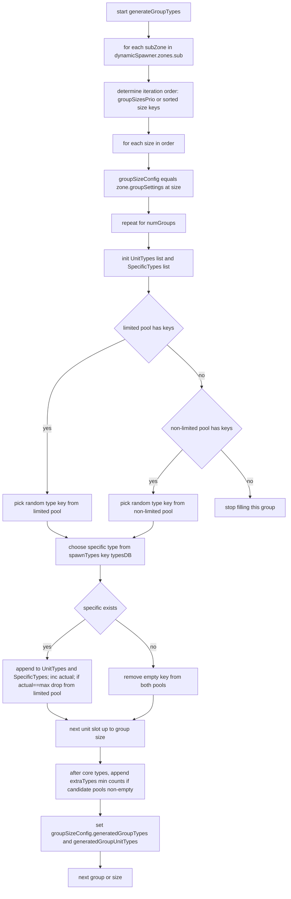
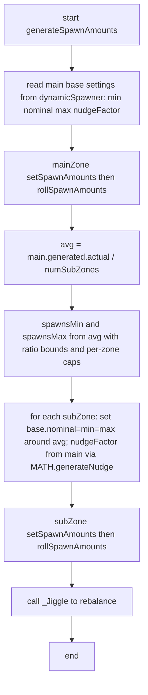
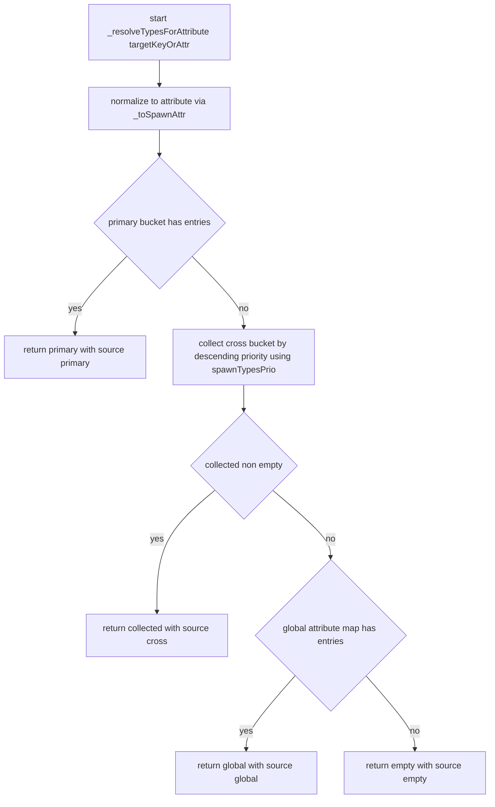
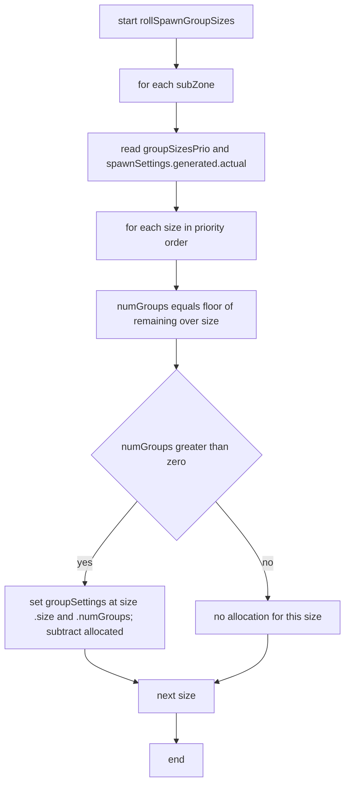

# AETHR SPAWNER types and counts

Covered functions
- Seeding and resolution
  - [AETHR.SPAWNER:seedTypes()](../../dev/SPAWNER.lua:1804)
  - [AETHR.SPAWNER:_resolveTypesForAttribute()](../../dev/SPAWNER.lua:1748)
  - [AETHR.SPAWNER:_toSpawnAttr()](../../dev/SPAWNER.lua:1712)
  - [AETHR.SPAWNER:_attrToEnumKey()](../../dev/SPAWNER.lua:1721)
- Group type generation
  - [AETHR.SPAWNER:generateGroupTypes()](../../dev/SPAWNER.lua:1600)
  - [AETHR.SPAWNER:rollSpawnGroups()](../../dev/SPAWNER.lua:1588)
- Counts and balancing
  - [AETHR.SPAWNER:generateSpawnAmounts()](../../dev/SPAWNER.lua:1918)
  - [AETHR.SPAWNER:rollSpawnGroupSizes()](../../dev/SPAWNER.lua:1876)
  - [AETHR.SPAWNER:_Jiggle()](../../dev/SPAWNER.lua:1978)
  - [AETHR.SPAWNER:_RollUpdates()](../../dev/SPAWNER.lua:2002)

1. Type seeding and attribute resolution

The spawner builds per-run type pools on each dynamic spawner to determine which unit attributes and concrete types can be drawn.

Resolution strategy in [AETHR.SPAWNER:_resolveTypesForAttribute()](../../dev/SPAWNER.lua:1748):
- Primary: WORLD prioritized bucket where the unit’s highest-priority attribute equals the target.
- Cross-bucket: scan other prioritized buckets in descending priority; include units whose attributes include target.
- Last resort: global attribute map in WORLD.
- Returns empty map when nothing matches.

Helpers:
- [AETHR.SPAWNER:_toSpawnAttr()](../../dev/SPAWNER.lua:1712) maps enum key or display string to canonical attribute.
- [AETHR.SPAWNER:_attrToEnumKey()](../../dev/SPAWNER.lua:1721) caches reverse mapping to enum key for priority ordering.

Notes
- Each typeData tracks actual draws this run and a max. Limited types are removed from the limited pool when actual reaches max.
- Extra types contribute only after a group’s core types are chosen and do not participate in pool exhaustion.

2. Group type generation

For each subzone and each group size setting, concrete unit types are selected from the seeded pools and extras are appended.

Outputs
- For each groupSizeConfig, fields are populated:
  - generatedGroupTypes: list of attribute keys per group.
  - generatedGroupUnitTypes: list of concrete unit type names per group.

3. Spawn amount computation and distribution

The main zone computes the total target count, subzones receive nudged targets, then a balancing pass jitters distribution.

4. Jiggle and update chain

Rebalancing iterates a number of times equal to main.generated.nudgeReciprocal and applies a fixed method chain on the dynamic spawner.

Group size allocation after counts
- [AETHR.SPAWNER:rollSpawnGroupSizes()](../../dev/SPAWNER.lua:1876) converts each subzone’s generated count into discrete groups at sizes listed in groupSizesPrio, greedily filling larger sizes first.

5. Notes and guardrails

- Pool separation: dynamicSpawner._limitedTypesPool vs _nonLimitedTypesPool; only limited pool enforces per-type caps.
- Fallback: when limited pool empties, non-limited pool supplies additional units until both pools are exhausted.
- Extras: appended after core selection; they do not consume the limited/non-limited pools.
- Deterministic execution: if enabled with a seed, all random draws in the outer pipeline run under [AETHR.UTILS:withSeed()](../../dev/UTILS.lua:242), ensuring repeatable group typing and counts for the same seed.

6. Additional logic diagrams

6.1 Attribute resolution flow for [AETHR.SPAWNER:_resolveTypesForAttribute()](../../dev/SPAWNER.lua:1748)

Notes
- Priority ordering uses reverse map from attribute name to enum key via [AETHR.SPAWNER:_attrToEnumKey()](../../dev/SPAWNER.lua:1721).

6.2 rollSpawnGroups wrapper [AETHR.SPAWNER:rollSpawnGroups()](../../dev/SPAWNER.lua:1588)

6.3 Group size allocation flow [AETHR.SPAWNER:rollSpawnGroupSizes()](../../dev/SPAWNER.lua:1876)

Determinism note
- When deterministic mode is enabled, upstream random draws for typing and counts execute under [AETHR.UTILS:withSeed()](../../dev/UTILS.lua:242), as documented in [pipeline.md](docs/spawner/pipeline.md).
