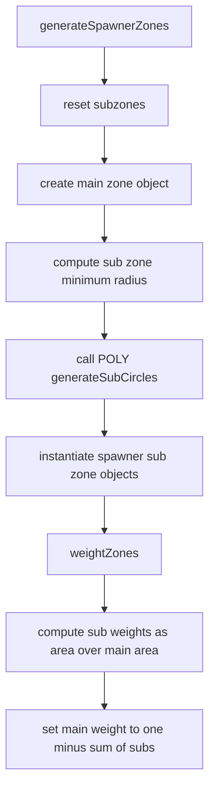
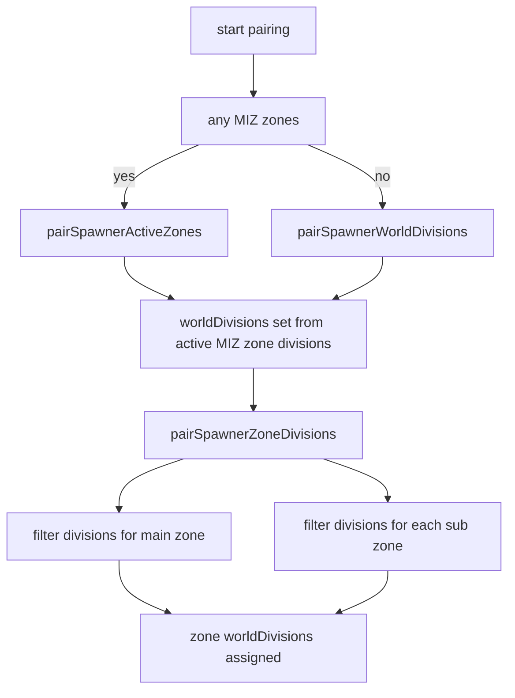
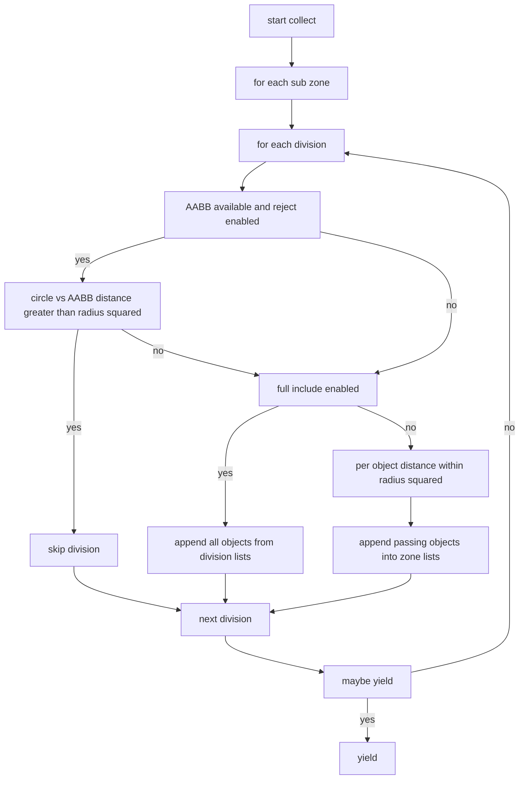

# AETHR SPAWNER zones and divisions

Covered functions
- [AETHR.SPAWNER:generateSpawnerZones()](dev/SPAWNER.lua:2012)
- [AETHR.SPAWNER:weightZones()](dev/SPAWNER.lua:2148)
- [AETHR.SPAWNER:pairSpawnerWorldDivisions()](dev/SPAWNER.lua:723)
- [AETHR.SPAWNER:pairSpawnerActiveZones()](dev/SPAWNER.lua:760)
- [AETHR.SPAWNER:pairSpawnerZoneDivisions()](dev/SPAWNER.lua:803)
- [AETHR.SPAWNER:determineZoneDivObjects()](dev/SPAWNER.lua:857)

1. Zone generation and weighting
The spawner constructs a main zone and subzones, then assigns weights to each. Generation avoids restricted zones when provided to POLY utilities. See [dev/POLY.lua](dev/POLY.lua).

2. Pairing to divisions
The spawner pairs against MIZ zones when available, otherwise world divisions. Results populate dynamicSpawner.worldDivisions and per zone worldDivisions.

3. Object collection per sub zone
For each sub zone and its divisions, objects are collected into zoneDivSceneryObjects, zoneDivStaticObjects, and zoneDivBaseObjects using AABB prefilter and optional full include optimization. Config switches: [UseDivisionAABBReject](dev/SPAWNER.lua:96), [UseDivisionAABBFullInclude](dev/SPAWNER.lua:97). Cooperative yielding: [AETHR.SPAWNER:_maybeYield()](dev/SPAWNER.lua:255).

Notes
- Division object sources come from WORLD databases for scenery, static, and base objects.
- Full include treats a division as entirely inside when all AABB corners lie inside the sub zone circle.
- Distance checks use squared distances to avoid square roots.