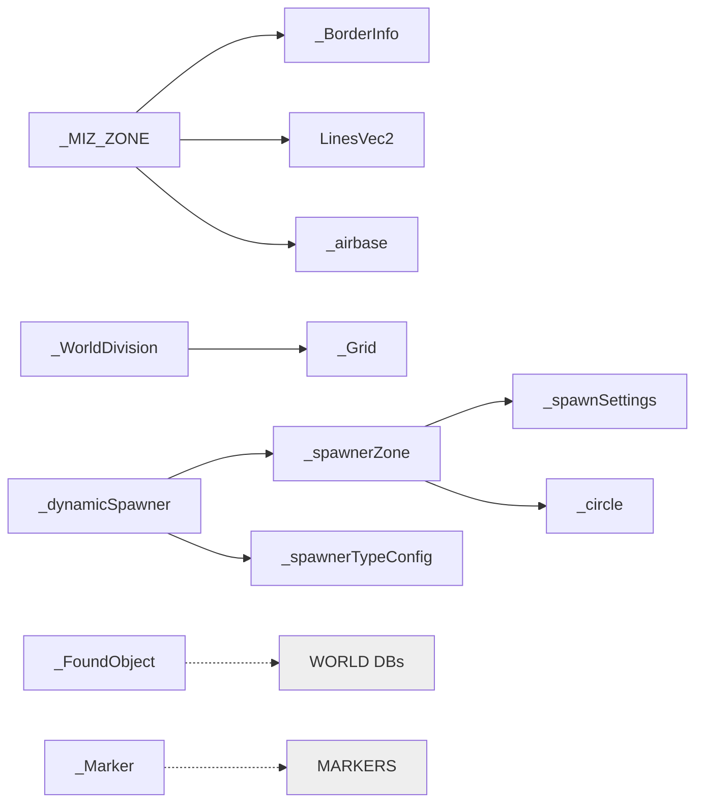
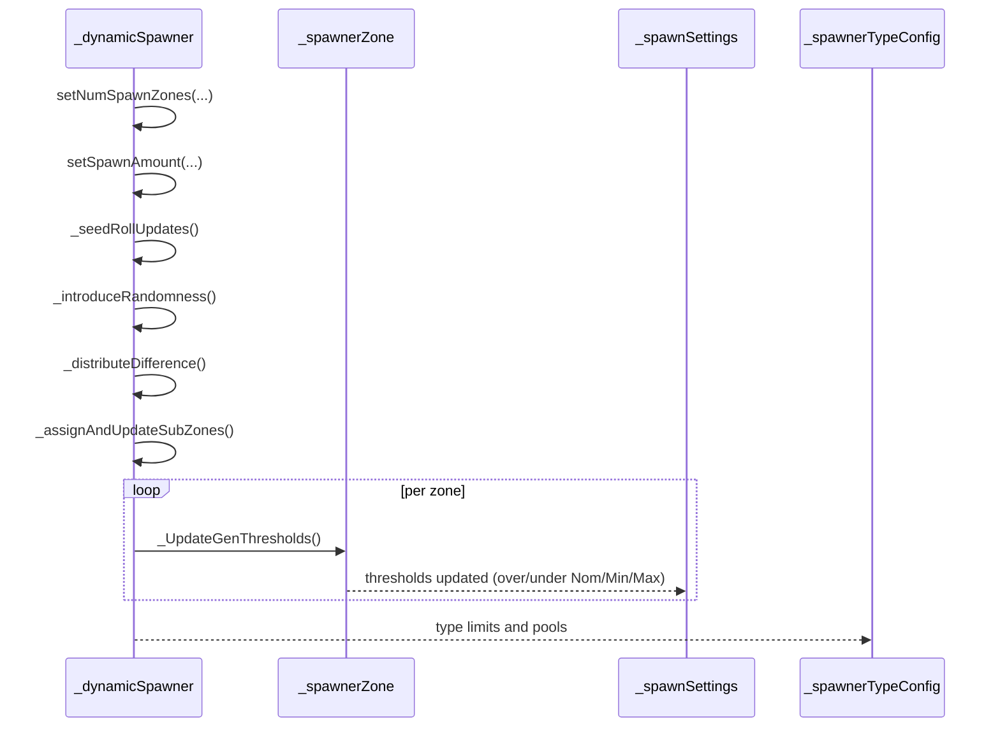
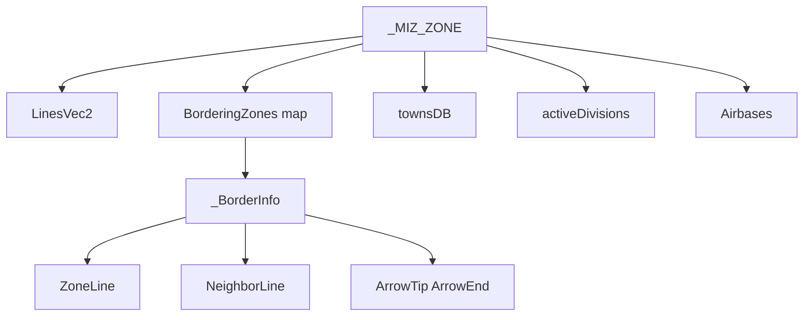
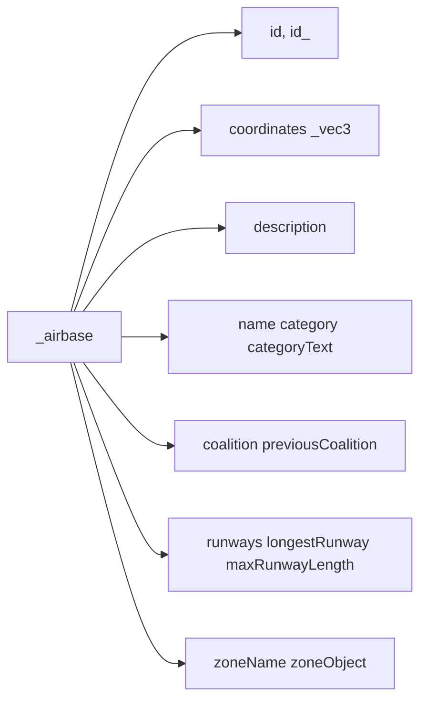
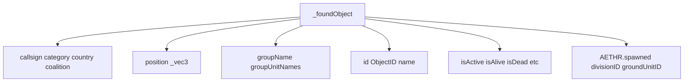

# AETHR TYPES data structures and flows

Primary constructors and anchors
- Basic geometry and containers
  - [AETHR._vec3:New()](dev/customTypes.lua:114)
  - [AETHR._vec2:New()](dev/customTypes.lua:522)
  - [AETHR._vec2xz:New()](dev/customTypes.lua:542)
  - [AETHR._ColorRGBA:New()](dev/customTypes.lua:27)
  - [AETHR._BBox:New()](dev/customTypes.lua:136)
  - [AETHR._ZoneCellEntry:New()](dev/customTypes.lua:178)
  - [AETHR._WorldBoundsAxis:New()](dev/customTypes.lua:52), [AETHR._WorldBounds:New()](dev/customTypes.lua:68)
- Mission and world descriptors
  - [AETHR._MIZ_ZONE:New()](dev/customTypes.lua:283)
  - [AETHR._WorldDivision:New()](dev/customTypes.lua:159)
  - [AETHR._Grid:New()](dev/customTypes.lua:330)
  - [AETHR._BorderInfo:New()](dev/customTypes.lua:232)
  - [AETHR._airbase:New()](dev/customTypes.lua:432)
  - [AETHR._FoundObject:New()](dev/customTypes.lua:198), [AETHR._foundObject:New()](dev/customTypes.lua:578)
- Markers and drawing
  - [AETHR._Marker:New()](dev/customTypes.lua:375)
- Spawner ecosystem
  - [AETHR._dynamicSpawner:New()](dev/customTypes.lua:868)
  - [AETHR._spawnerZone:New()](dev/customTypes.lua:1177)
  - [AETHR._spawnSettings:New()](dev/customTypes.lua:1401)
  - [AETHR._spawnerTypeConfig:New()](dev/customTypes.lua:1444)
  - [AETHR._circle:New()](dev/customTypes.lua:1471)

Documents and indices
- Master diagrams index: [docs/README.md](../README.md)
- WORLD: [docs/world/README.md](../world/README.md)
- ZONE_MANAGER: [docs/zone_manager/README.md](../zone_manager/README.md)
- SPAWNER: [docs/spawner/README.md](../spawner/README.md)
- MARKERS: [docs/markers/README.md](../markers/README.md)
- POLY: [docs/poly/README.md](../poly/README.md)
- MATH: [docs/math/README.md](../math/README.md)

Core relationships



Spawner data flow at a glance



_zone and border structures



Airbase descriptor fields



Grid and world division

```mermaid
flowchart TD
  WD[_WorldDivision] --> ID2[ID active]
  WD --> CNR[corners[4]]
  WD --> HT[height]
  WD --> G2[_Grid]
  G2 --> ORG[minX minZ]
  G2 --> STEP[dx dz invDx invDz]
  G2 --> COR[corners]
```

Marker structure

```mermaid
flowchart LR
  MK[_Marker] --> id[markID]
  MK --> str[label string]
  MK --> pos[vec2Origin radius]
  MK --> style[lineType lineColor fillColor coalition]
  MK --> verts[freeFormVec2Table]
```

Found object container



Key anchors by area
- Zones and borders
  - [AETHR._MIZ_ZONE:New()](dev/customTypes.lua:283), [AETHR._BorderInfo:New()](dev/customTypes.lua:232)
- World and grid
  - [AETHR._WorldDivision:New()](dev/customTypes.lua:159), [AETHR._Grid:New()](dev/customTypes.lua:330), [AETHR._ZoneCellEntry:New()](dev/customTypes.lua:178)
- Spawner ecosystem
  - [AETHR._dynamicSpawner:New()](dev/customTypes.lua:868), [AETHR._spawnerZone:New()](dev/customTypes.lua:1177), [AETHR._spawnSettings:New()](dev/customTypes.lua:1401), [AETHR._spawnerTypeConfig:New()](dev/customTypes.lua:1444), [AETHR._circle:New()](dev/customTypes.lua:1471)
- Markers and IO-facing
  - [AETHR._Marker:New()](dev/customTypes.lua:375), [AETHR._FoundObject:New()](dev/customTypes.lua:198), [AETHR._airbase:New()](dev/customTypes.lua:432)

Notes
- Mermaid labels avoid double quotes and parentheses.
- All diagrams use GitHub Mermaid fenced blocks.