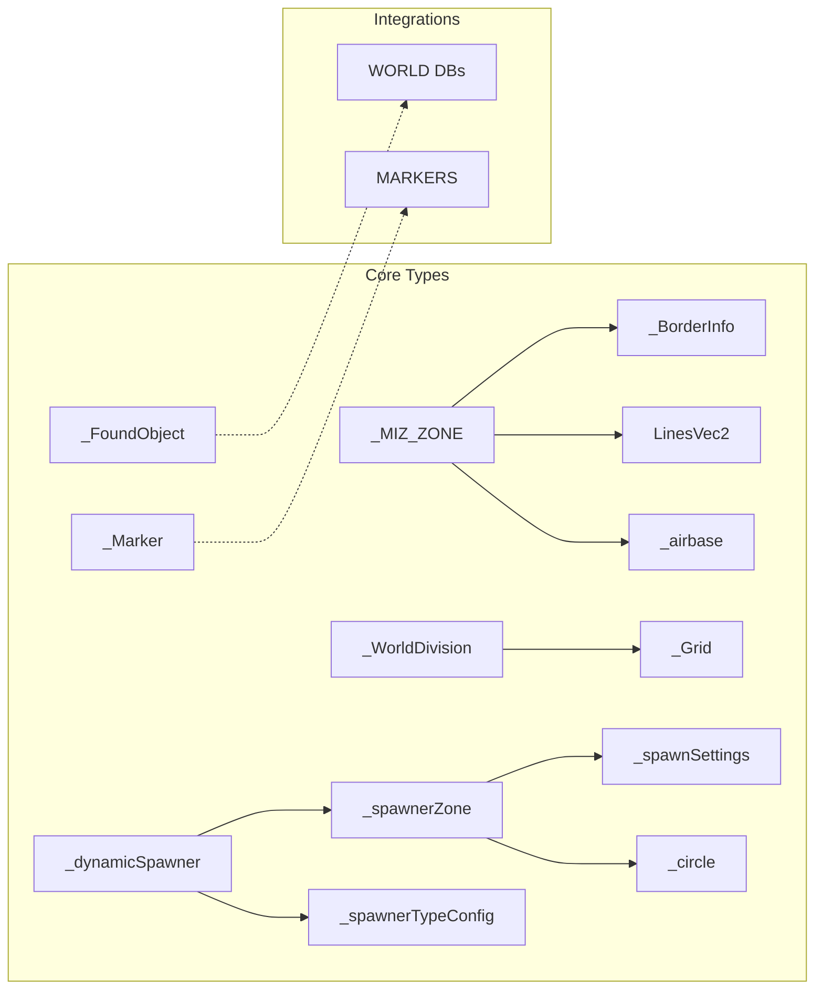
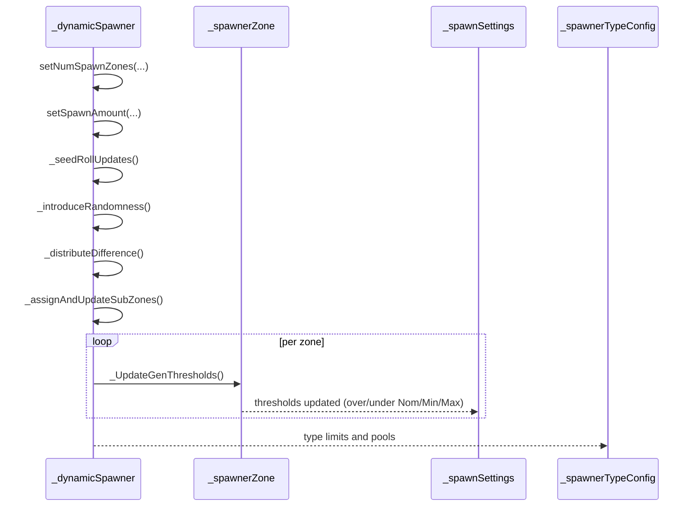
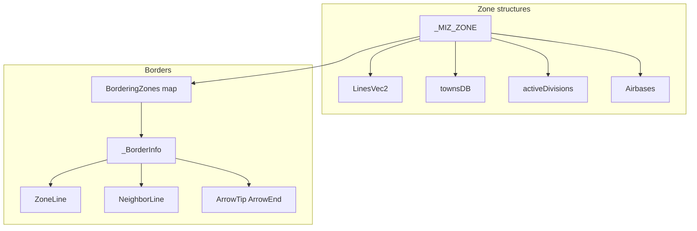
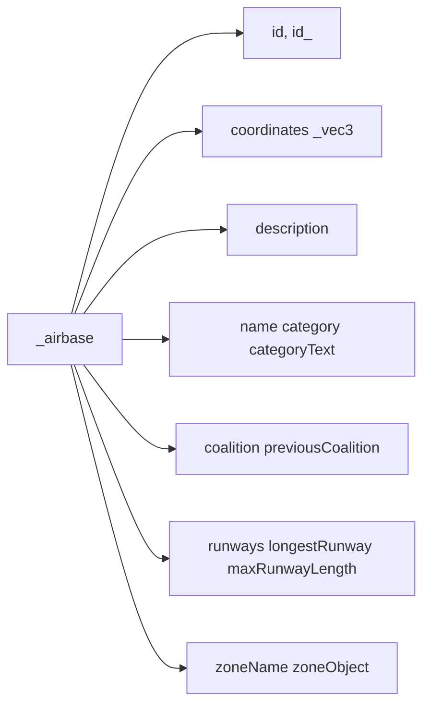
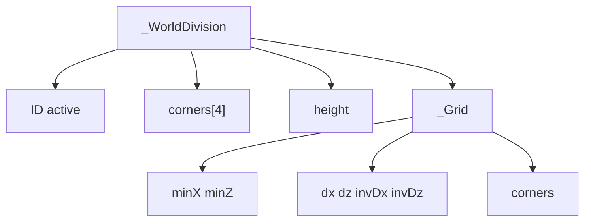
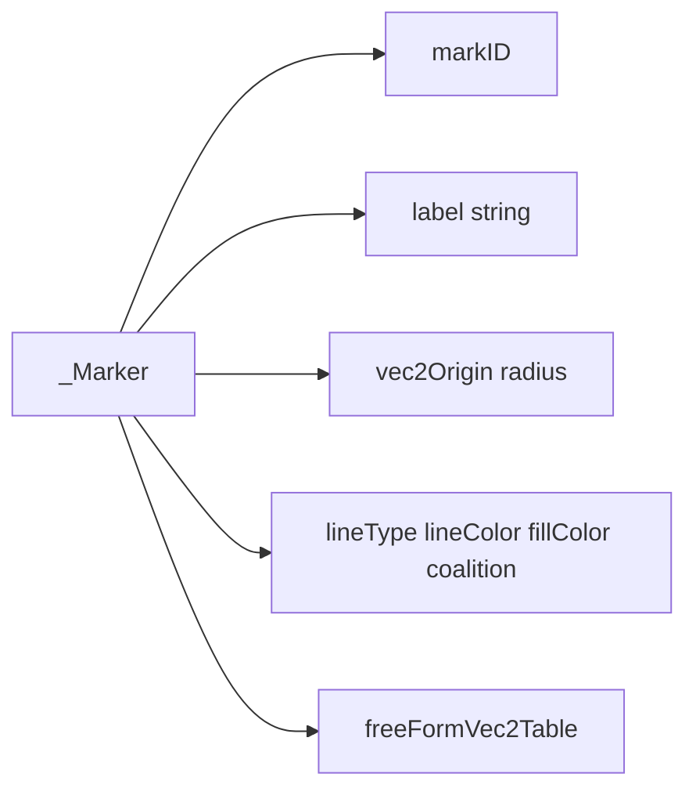
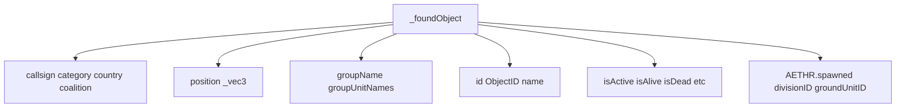

# AETHR TYPES data structures and flows

### Primary constructors and anchors
- Basic geometry and containers
  - [AETHR._vec3:New()](https://github.com/Gh0st352/AETHR/blob/main/dev/customTypes.lua#L114)
  - [AETHR._vec2:New()](https://github.com/Gh0st352/AETHR/blob/main/dev/customTypes.lua#L522)
  - [AETHR._vec2xz:New()](https://github.com/Gh0st352/AETHR/blob/main/dev/customTypes.lua#L542)
  - [AETHR._ColorRGBA:New()](https://github.com/Gh0st352/AETHR/blob/main/dev/customTypes.lua#L27)
  - [AETHR._BBox:New()](https://github.com/Gh0st352/AETHR/blob/main/dev/customTypes.lua#L136)
  - [AETHR._ZoneCellEntry:New()](https://github.com/Gh0st352/AETHR/blob/main/dev/customTypes.lua#L178)
  - [AETHR._WorldBoundsAxis:New()](https://github.com/Gh0st352/AETHR/blob/main/dev/customTypes.lua#L51), [AETHR._WorldBounds:New()](https://github.com/Gh0st352/AETHR/blob/main/dev/customTypes.lua#L68)
- Mission and world descriptors
  - [AETHR._MIZ_ZONE:New()](https://github.com/Gh0st352/AETHR/blob/main/dev/customTypes.lua#L283)
  - [AETHR._WorldDivision:New()](https://github.com/Gh0st352/AETHR/blob/main/dev/customTypes.lua#L159)
  - [AETHR._Grid:New()](https://github.com/Gh0st352/AETHR/blob/main/dev/customTypes.lua#L330)
  - [AETHR._BorderInfo:New()](https://github.com/Gh0st352/AETHR/blob/main/dev/customTypes.lua#L232)
  - [AETHR._airbase:New()](https://github.com/Gh0st352/AETHR/blob/main/dev/customTypes.lua#L432)
  - [AETHR._FoundObject:New()](https://github.com/Gh0st352/AETHR/blob/main/dev/customTypes.lua#L198), [AETHR._foundObject:New()](https://github.com/Gh0st352/AETHR/blob/main/dev/customTypes.lua#L578)
- Markers and drawing
  - [AETHR._Marker:New()](https://github.com/Gh0st352/AETHR/blob/main/dev/customTypes.lua#L375)
- Spawner ecosystem
  - [AETHR._dynamicSpawner:New()](https://github.com/Gh0st352/AETHR/blob/main/dev/customTypes.lua#L868)
  - [AETHR._spawnerZone:New()](https://github.com/Gh0st352/AETHR/blob/main/dev/customTypes.lua#L1177)
  - [AETHR._spawnSettings:New()](https://github.com/Gh0st352/AETHR/blob/main/dev/customTypes.lua#L1401)
  - [AETHR._spawnerTypeConfig:New()](https://github.com/Gh0st352/AETHR/blob/main/dev/customTypes.lua#L1444)
  - [AETHR._circle:New()](https://github.com/Gh0st352/AETHR/blob/main/dev/customTypes.lua#L1471)

### Documents and indices
- Master diagrams index: [docs/README.md](../README.md)
- WORLD: [docs/world/README.md](../world/README.md)
- ZONE_MANAGER: [docs/zone_manager/README.md](../zone_manager/README.md)
- SPAWNER: [docs/spawner/README.md](../spawner/README.md)
- MARKERS: [docs/markers/README.md](../markers/README.md)
- POLY: [docs/poly/README.md](../poly/README.md)
- MATH: [docs/math/README.md](../math/README.md)

# Core relationships

# Spawner data flow at a glance

# _zone and border structures

# Airbase descriptor fields

# Grid and world division

# Marker structure

# Found object container

# Key anchors by area
- Zones and borders
  - [AETHR._MIZ_ZONE:New()](https://github.com/Gh0st352/AETHR/blob/main/dev/customTypes.lua#L283), [AETHR._BorderInfo:New()](https://github.com/Gh0st352/AETHR/blob/main/dev/customTypes.lua#L232)
- World and grid
  - [AETHR._WorldDivision:New()](https://github.com/Gh0st352/AETHR/blob/main/dev/customTypes.lua#L159), [AETHR._Grid:New()](https://github.com/Gh0st352/AETHR/blob/main/dev/customTypes.lua#L330), [AETHR._ZoneCellEntry:New()](https://github.com/Gh0st352/AETHR/blob/main/dev/customTypes.lua#L178)
- Spawner ecosystem
  - [AETHR._dynamicSpawner:New()](https://github.com/Gh0st352/AETHR/blob/main/dev/customTypes.lua#L868), [AETHR._spawnerZone:New()](https://github.com/Gh0st352/AETHR/blob/main/dev/customTypes.lua#L1177), [AETHR._spawnSettings:New()](https://github.com/Gh0st352/AETHR/blob/main/dev/customTypes.lua#L1401), [AETHR._spawnerTypeConfig:New()](https://github.com/Gh0st352/AETHR/blob/main/dev/customTypes.lua#L1444), [AETHR._circle:New()](https://github.com/Gh0st352/AETHR/blob/main/dev/customTypes.lua#L1471)
- Markers and IO-facing
  - [AETHR._Marker:New()](https://github.com/Gh0st352/AETHR/blob/main/dev/customTypes.lua#L375), [AETHR._FoundObject:New()](https://github.com/Gh0st352/AETHR/blob/main/dev/customTypes.lua#L198), [AETHR._airbase:New()](https://github.com/Gh0st352/AETHR/blob/main/dev/customTypes.lua#L432)

### Notes
- Mermaid labels avoid double quotes and parentheses.
- All diagrams use GitHub Mermaid fenced blocks.
## Breakout documents

- Constructors and vectors: [docs/types/constructors_and_vectors.md](constructors_and_vectors.md)
- Colors, markers, and grid: [docs/types/colors_markers_and_grid.md](colors_markers_and_grid.md)
- Bounds and world: [docs/types/bounds_and_world.md](bounds_and_world.md)
- Borders and zones: [docs/types/borders_and_zones.md](borders_and_zones.md)
- Objects and airbases: [docs/types/objects_and_airbases.md](objects_and_airbases.md)
- Scheduler and circle: [docs/types/scheduler_and_circle.md](scheduler_and_circle.md)
- Spawner ecosystem: [docs/types/spawner_types.md](spawner_types.md)