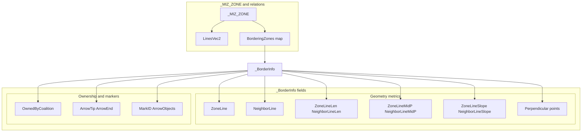
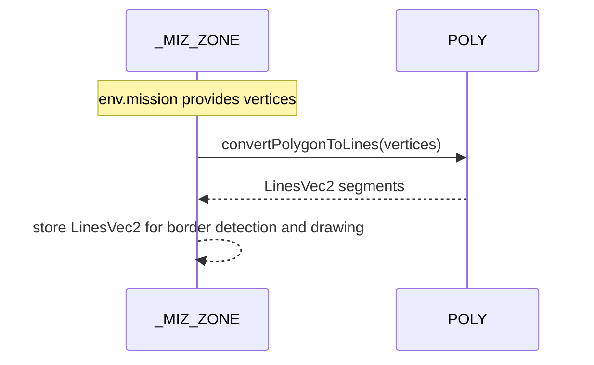
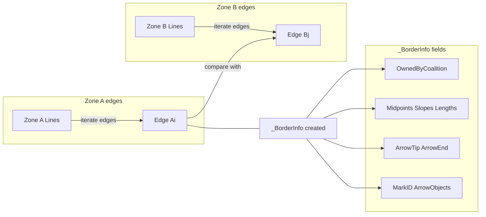

# TYPES borders and zones

Anchors
- [AETHR._BorderInfo:New()](https://github.com/Gh0st352/AETHR/blob/main/dev/customTypes.lua#L232)
- [AETHR._ZoneBorder:New()](https://github.com/Gh0st352/AETHR/blob/main/dev/customTypes.lua#L97) (deprecated wrapper to BorderInfo)
- [AETHR._MIZ_ZONE:New()](https://github.com/Gh0st352/AETHR/blob/main/dev/customTypes.lua#L283)
- [AETHR.POLY:convertPolygonToLines()](https://github.com/Gh0st352/AETHR/blob/main/dev/POLY.lua#L737)

Overview
- _BorderInfo captures geometric and ownership metadata for a shared border segment between two zones.
- _ZoneBorder is deprecated and forwards to _BorderInfo for backward compatibility.
- _MIZ_ZONE normalizes env.mission trigger zone data and precomputes LinesVec2 for downstream processing.

# Structure relationships

# Zone initialization path

# Border detection and storage concept

# Deprecated wrapper
- [AETHR._ZoneBorder:New()](https://github.com/Gh0st352/AETHR/blob/main/dev/customTypes.lua#L97) calls [AETHR._BorderInfo:New()](https://github.com/Gh0st352/AETHR/blob/main/dev/customTypes.lua#L232) and sets OwnedByCoalition; prefer constructing _BorderInfo directly.

# Usage notes
- Ownership toggles and marker updates consume _BorderInfo to compute arrow placement and color decisions.
- LinesVec2 must reflect current zone vertex ordering; if vertices are mutated, recompute LinesVec2.

# Source anchors
- _BorderInfo constructor: [AETHR._BorderInfo:New()](https://github.com/Gh0st352/AETHR/blob/main/dev/customTypes.lua#L232)
- Deprecated alias: [AETHR._ZoneBorder:New()](https://github.com/Gh0st352/AETHR/blob/main/dev/customTypes.lua#L97)
- Zone constructor: [AETHR._MIZ_ZONE:New()](https://github.com/Gh0st352/AETHR/blob/main/dev/customTypes.lua#L283)
- Segment conversion: [AETHR.POLY:convertPolygonToLines()](https://github.com/Gh0st352/AETHR/blob/main/dev/POLY.lua#L737)