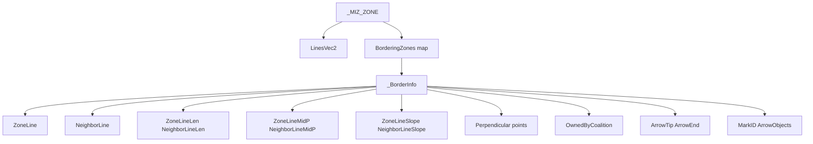
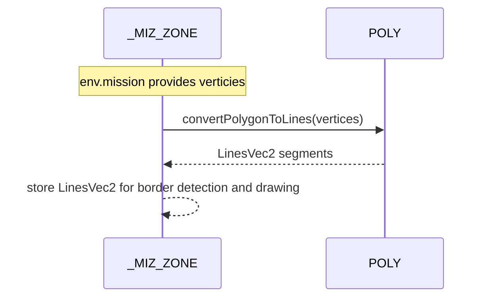
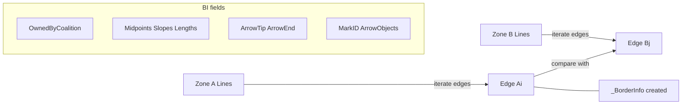

# TYPES borders and zones

Anchors
- [AETHR._BorderInfo:New()](../../dev/customTypes.lua:232)
- [AETHR._ZoneBorder:New()](../../dev/customTypes.lua:97) (deprecated wrapper to BorderInfo)
- [AETHR._MIZ_ZONE:New()](../../dev/customTypes.lua:283)
- [AETHR.POLY:convertPolygonToLines()](../../dev/POLY.lua:737)

Overview
- _BorderInfo captures geometric and ownership metadata for a shared border segment between two zones.
- _ZoneBorder is deprecated and forwards to _BorderInfo for backward compatibility.
- _MIZ_ZONE normalizes env.mission trigger zone data and precomputes LinesVec2 for downstream processing.

Structure relationships

Zone initialization path

Border detection and storage concept

Deprecated wrapper
- [AETHR._ZoneBorder:New()](../../dev/customTypes.lua:97) calls [AETHR._BorderInfo:New()](../../dev/customTypes.lua:232) and sets OwnedByCoalition; prefer constructing _BorderInfo directly.

Usage notes
- Ownership toggles and marker updates consume _BorderInfo to compute arrow placement and color decisions.
- LinesVec2 must reflect current zone vertex ordering; if vertices are mutated, recompute LinesVec2.

Source anchors
- _BorderInfo constructor: [AETHR._BorderInfo:New()](../../dev/customTypes.lua:232)
- Deprecated alias: [AETHR._ZoneBorder:New()](../../dev/customTypes.lua:97)
- Zone constructor: [AETHR._MIZ_ZONE:New()](../../dev/customTypes.lua:283)
- Segment conversion: [AETHR.POLY:convertPolygonToLines()](../../dev/POLY.lua:737)