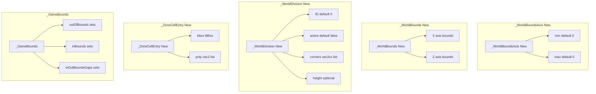
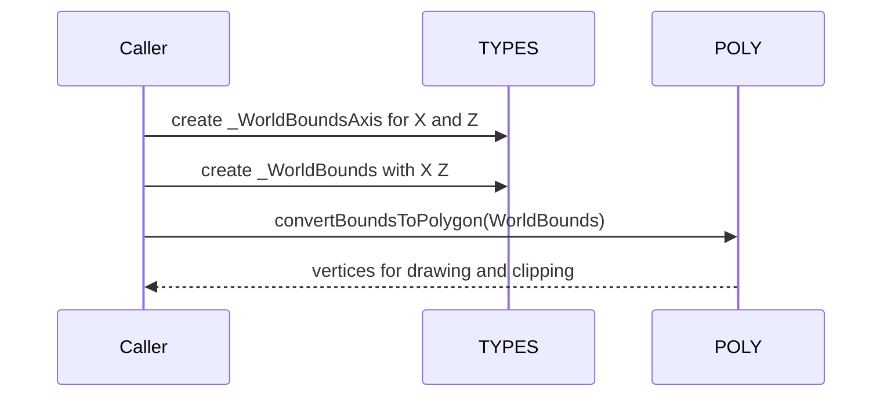
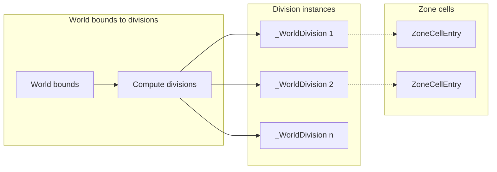

# TYPES bounds and world structures

Anchors
- [AETHR._WorldBoundsAxis:New()](https://github.com/Gh0st352/AETHR/blob/main/dev/customTypes.lua#L51)
- [AETHR._WorldBounds:New()](https://github.com/Gh0st352/AETHR/blob/main/dev/customTypes.lua#L68)
- [AETHR._WorldDivision:New()](https://github.com/Gh0st352/AETHR/blob/main/dev/customTypes.lua#L159)
- [AETHR._ZoneCellEntry:New()](https://github.com/Gh0st352/AETHR/blob/main/dev/customTypes.lua#L178)
- [_GameBounds structure](https://github.com/Gh0st352/AETHR/blob/main/dev/customTypes.lua#L795)

Overview
- [_WorldBoundsAxis](../../dev/customTypes.lua) encapsulates min and max along one axis with safe defaults.
- [_WorldBounds](../../dev/customTypes.lua) composes X and Z axes into a theater bound descriptor for world space.
- [_WorldDivision](../../dev/customTypes.lua) describes rectangular grid cells used for spatial partitioning.
- [_ZoneCellEntry](../../dev/customTypes.lua) pairs a polygon with its axis aligned bounding box for coarse checks.
- [_GameBounds](../../dev/customTypes.lua) aggregates in bounds and out of bounds polygons used by zone manager and markers.

# Mermaid flow overview

# World bounds to polygon rendering
- World bounds polygons are derived for visualization and clipping using POLY helpers:
  - [AETHR.POLY:convertBoundsToPolygon()](https://github.com/Gh0st352/AETHR/blob/main/dev/POLY.lua#L1039)

# Division grid concept
- Divisions represent coarse spatial buckets for world lookups, overlays, and spawning.
- Each [_WorldDivision](../../dev/customTypes.lua) stores 4 corners in XZ for quick polygon tests and intersections.

# Key constructors and defaults
- Axis: [AETHR._WorldBoundsAxis:New()](https://github.com/Gh0st352/AETHR/blob/main/dev/customTypes.lua#L51) initializes min and max to 0 when nil.
- Bounds: [AETHR._WorldBounds:New()](https://github.com/Gh0st352/AETHR/blob/main/dev/customTypes.lua#L68) defaults each axis via axis constructor.
- Division: [AETHR._WorldDivision:New()](https://github.com/Gh0st352/AETHR/blob/main/dev/customTypes.lua#L159) defaults ID 0, active false, empty corners.
- Zone cell entry: [AETHR._ZoneCellEntry:New()](https://github.com/Gh0st352/AETHR/blob/main/dev/customTypes.lua#L178) defaults bbox to [AETHR._BBox:New()](https://github.com/Gh0st352/AETHR/blob/main/dev/customTypes.lua#L136) and empty polygon.

# Related anchors
- [AETHR._BBox:New()](https://github.com/Gh0st352/AETHR/blob/main/dev/customTypes.lua#L136)
- [AETHR._vec2xz:New()](https://github.com/Gh0st352/AETHR/blob/main/dev/customTypes.lua#L542), [AETHR._vec2:New()](https://github.com/Gh0st352/AETHR/blob/main/dev/customTypes.lua#L522)
- [_GameBounds fields](https://github.com/Gh0st352/AETHR/blob/main/dev/customTypes.lua#L795)