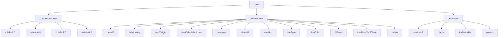
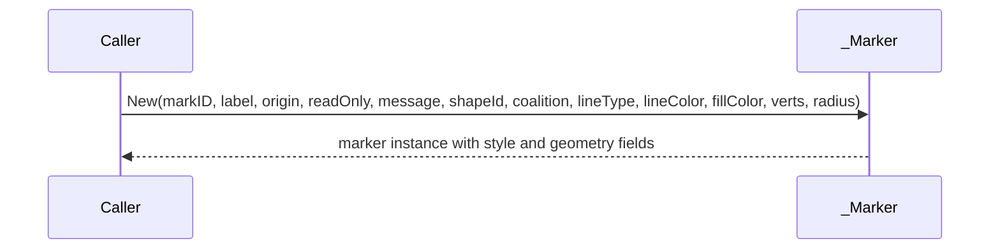
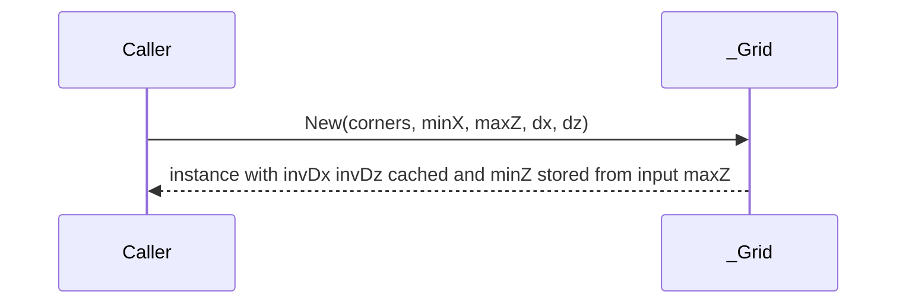

# TYPES colors, markers, and grid

Anchors
- [AETHR._ColorRGBA:New()](../../dev/customTypes.lua:27)
- [AETHR._Marker:New()](../../dev/customTypes.lua:375)
- [AETHR._Grid:New()](../../dev/customTypes.lua:330)

Overview
- _ColorRGBA is an RGBA struct using 0..255 channels, defaulting to 0.
- _Marker encapsulates drawing primitives compatible with DCS map markup, including style and geometry fields.
- _Grid provides precomputed step and inverse step for fast cell indexing in spatial maps.

Mermaid flow overview

Marker structure and defaults
- Field defaults in constructor:
  - markID as provided
  - string and label default to empty
  - vec2Origin defaults to {} if not supplied
  - readOnly defaults to true when nil
  - shapeId and lineType default to 0
  - coalition defaults to -1
  - lineColor and fillColor default to { 0, 0, 0, 0 }
  - freeFormVec2Table defaults to {}
  - radius defaults to 0

Typical marker creation sequence

Grid initialization sequence

Source anchors
- [AETHR._ColorRGBA:New()](../../dev/customTypes.lua:27)
- [AETHR._Marker:New()](../../dev/customTypes.lua:375)
- [AETHR._Grid:New()](../../dev/customTypes.lua:330)
- Related types: [AETHR._vec2:New()](../../dev/customTypes.lua:522), [AETHR._ColorRGBA fields](../../dev/customTypes.lua:15)