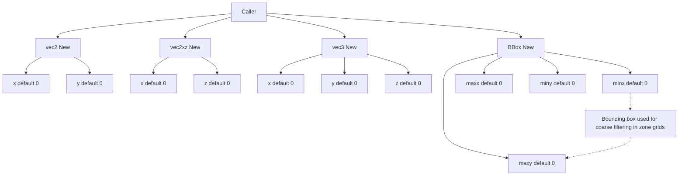
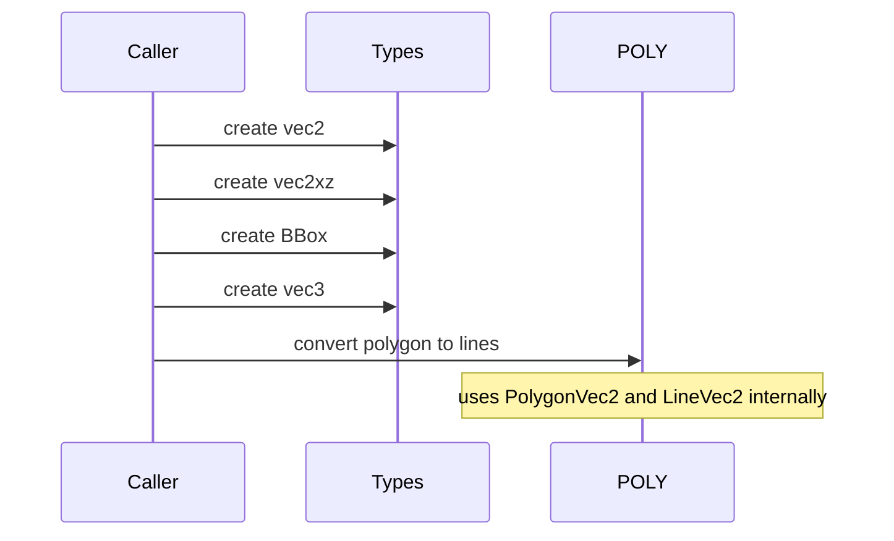

# TYPES constructors and vectors

Anchors
- [AETHR._vec2:New()](../../dev/customTypes.lua:522)
- [AETHR._vec2xz:New()](../../dev/customTypes.lua:542)
- [AETHR._vec3:New()](../../dev/customTypes.lua:114)
- [AETHR._BBox:New()](../../dev/customTypes.lua:136)

Aliases
- [_LineVec2](../../dev/customTypes.lua:38) two point array representing a segment
- [_PolygonVec2](../../dev/customTypes.lua:39) 3 or more vertices forming a polygon

Overview
- These are foundational constructors used across POLY, WORLD, SPAWNER, and MARKERS.
- Defaults are defensive: unset numeric fields default to 0 to ensure arithmetic safety.
- _vec2 is the canonical 2D point for POLY and MATH. Many APIs also accept _vec2xz for world XZ.

Mermaid flow overview

Key creation paths
- _vec2: [AETHR._vec2:New()](../../dev/customTypes.lua:522) sets x and y, defaulting to 0.
- _vec2xz: [AETHR._vec2xz:New()](../../dev/customTypes.lua:542) sets x and z for world plane calculations.
- _vec3: [AETHR._vec3:New()](../../dev/customTypes.lua:114) sets x y z for world coordinates.
- _BBox: [AETHR._BBox:New()](../../dev/customTypes.lua:136) sets minx maxx miny maxy for spatial indexing.

Typical usage sequences

Cross module references
- POLY polygon conversion: [AETHR.POLY:convertPolygonToLines()](../../dev/POLY.lua:737)
- POLY bounds to polygon: [AETHR.POLY:convertBoundsToPolygon()](../../dev/POLY.lua:1039)

Notes
- Prefer _vec2 for planar math; pass _vec2xz when consuming world XZ data and normalize at module edges.
- Maintain consistent winding for polygon vertices when interoperating with POLY utilities.

Source anchors
- [_LineVec2](../../dev/customTypes.lua:38), [_PolygonVec2](../../dev/customTypes.lua:39)
- [AETHR._vec2:New()](../../dev/customTypes.lua:522), [AETHR._vec2xz:New()](../../dev/customTypes.lua:542), [AETHR._vec3:New()](../../dev/customTypes.lua:114), [AETHR._BBox:New()](../../dev/customTypes.lua:136)