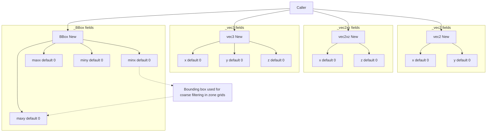
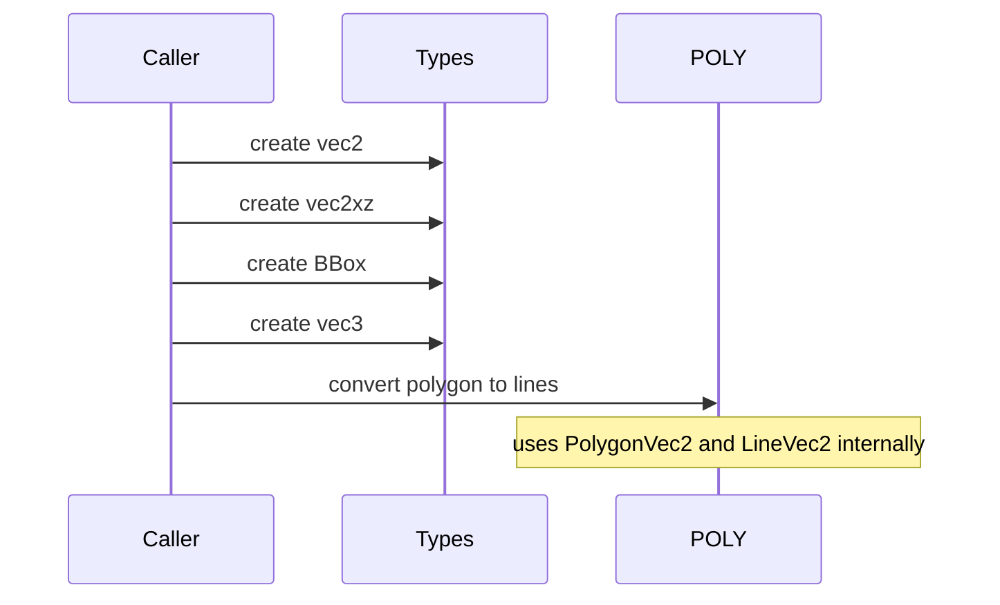

# TYPES constructors and vectors

Anchors
- [AETHR._vec2:New()](https://github.com/Gh0st352/AETHR/blob/main/dev/customTypes.lua#L522)
- [AETHR._vec2xz:New()](https://github.com/Gh0st352/AETHR/blob/main/dev/customTypes.lua#L542)
- [AETHR._vec3:New()](https://github.com/Gh0st352/AETHR/blob/main/dev/customTypes.lua#L114)
- [AETHR._BBox:New()](https://github.com/Gh0st352/AETHR/blob/main/dev/customTypes.lua#L136)

Aliases
- [_LineVec2](https://github.com/Gh0st352/AETHR/blob/main/dev/customTypes.lua#L38) two point array representing a segment
- [_PolygonVec2](https://github.com/Gh0st352/AETHR/blob/main/dev/customTypes.lua#L39) 3 or more vertices forming a polygon

Overview
- These are foundational constructors used across POLY, WORLD, SPAWNER, and MARKERS.
- Defaults are defensive: unset numeric fields default to 0 to ensure arithmetic safety.
- _vec2 is the canonical 2D point for POLY and MATH. Many APIs also accept _vec2xz for world XZ.

# Mermaid flow overview

# Key creation paths
- _vec2: [AETHR._vec2:New()](https://github.com/Gh0st352/AETHR/blob/main/dev/customTypes.lua#L522) sets x and y, defaulting to 0.
- _vec2xz: [AETHR._vec2xz:New()](https://github.com/Gh0st352/AETHR/blob/main/dev/customTypes.lua#L542) sets x and z for world plane calculations.
- _vec3: [AETHR._vec3:New()](https://github.com/Gh0st352/AETHR/blob/main/dev/customTypes.lua#L114) sets x y z for world coordinates.
- _BBox: [AETHR._BBox:New()](https://github.com/Gh0st352/AETHR/blob/main/dev/customTypes.lua#L136) sets minx maxx miny maxy for spatial indexing.

## Typical usage sequences

## Cross module references
- POLY polygon conversion: [AETHR.POLY:convertPolygonToLines()](https://github.com/Gh0st352/AETHR/blob/main/dev/POLY.lua#L737)
- POLY bounds to polygon: [AETHR.POLY:convertBoundsToPolygon()](https://github.com/Gh0st352/AETHR/blob/main/dev/POLY.lua#L1039)

## Notes
- Prefer _vec2 for planar math; pass _vec2xz when consuming world XZ data and normalize at module edges.
- Maintain consistent winding for polygon vertices when interoperating with POLY utilities.

## Source anchors
- [_LineVec2](https://github.com/Gh0st352/AETHR/blob/main/dev/customTypes.lua#L38), [_PolygonVec2](https://github.com/Gh0st352/AETHR/blob/main/dev/customTypes.lua#L39)
- [AETHR._vec2:New()](https://github.com/Gh0st352/AETHR/blob/main/dev/customTypes.lua#L522), [AETHR._vec2xz:New()](https://github.com/Gh0st352/AETHR/blob/main/dev/customTypes.lua#L542), [AETHR._vec3:New()](https://github.com/Gh0st352/AETHR/blob/main/dev/customTypes.lua#L114), [AETHR._BBox:New()](https://github.com/Gh0st352/AETHR/blob/main/dev/customTypes.lua#L136)