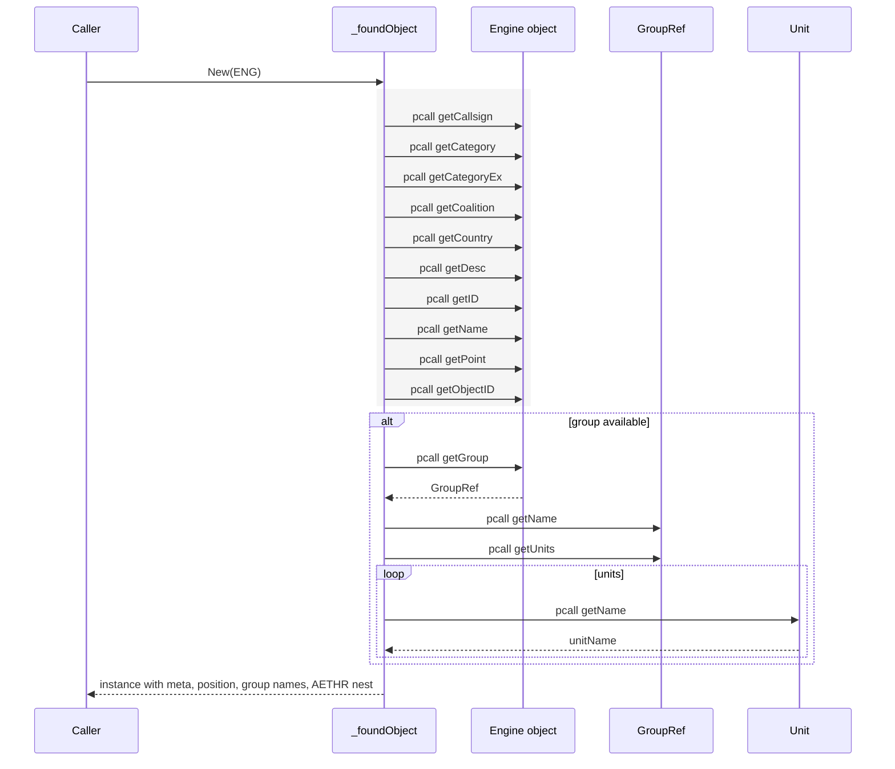
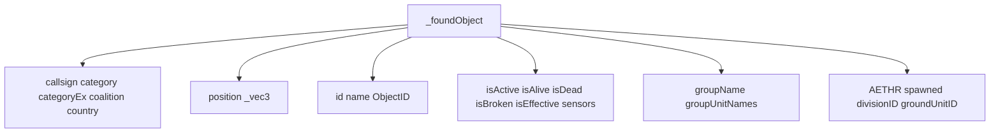
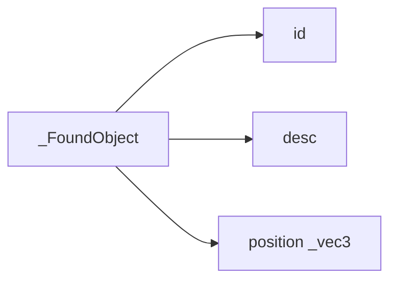
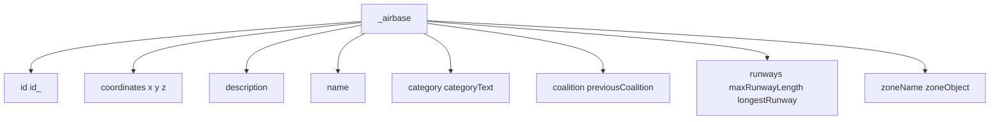

# TYPES objects and airbases

Anchors
- [AETHR._FoundObject:New()](../../dev/customTypes.lua:198)
- [AETHR._foundObject:New()](../../dev/customTypes.lua:578)
- [AETHR._airbase:New()](../../dev/customTypes.lua:432)

Overview
- _FoundObject is a lightweight container for engine object id, desc, and position.
- _foundObject safely introspects a live engine object via pcall, capturing metadata, group context, and position where available.
- _airbase is a normalized descriptor for Airbase state with coordinates, coalition, and runway info.

_foundObject introspection sequence

_foundObject fields overview

FoundObject lightweight container

Airbase descriptor

Usage notes
- _foundObject safely degrades when engine APIs are missing or throw; all lookups are pcalled.
- Group metadata collection is conditional and robust to absent group or unit functions.
- Airbase zoneName and zoneObject connect to [_MIZ_ZONE](../../dev/customTypes.lua:283) when available.

Source anchors
- [AETHR._foundObject:New()](../../dev/customTypes.lua:578), [AETHR._FoundObject:New()](../../dev/customTypes.lua:198)
- [AETHR._airbase:New()](../../dev/customTypes.lua:432)