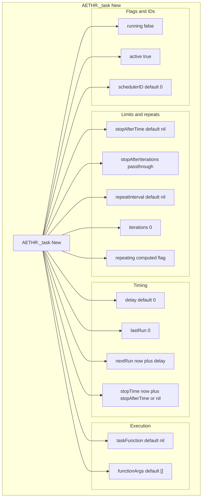
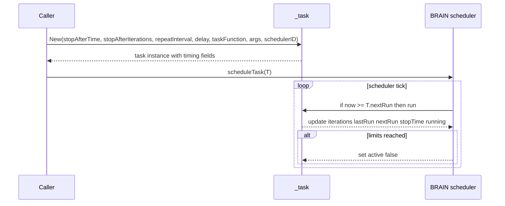
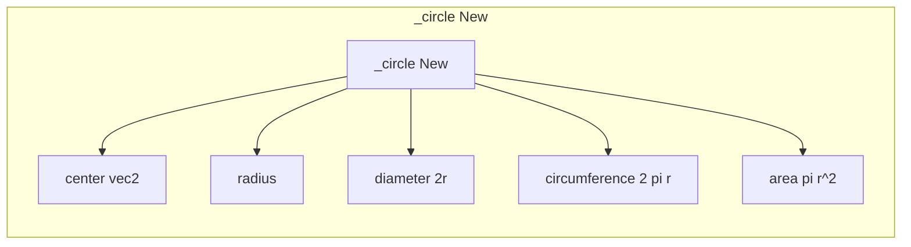
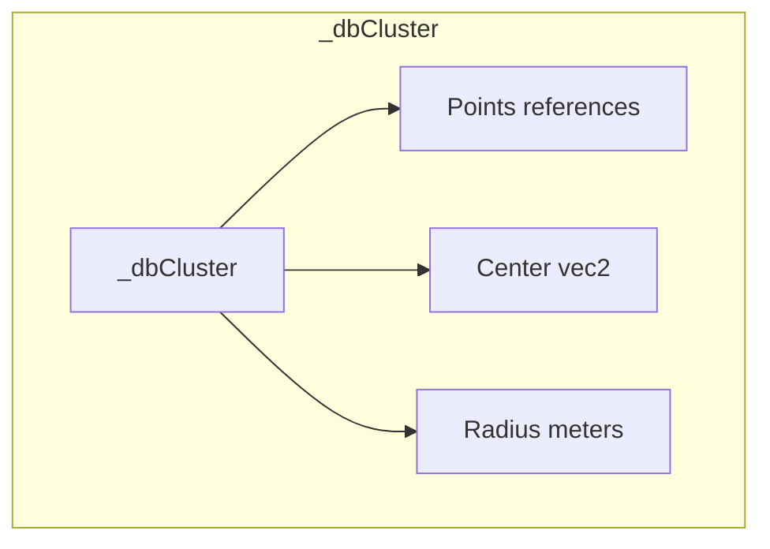

# TYPES scheduler and circle

Anchors
- [AETHR._task:New()](https://github.com/Gh0st352/AETHR/blob/main/dev/customTypes.lua#L483)
- [AETHR._circle:New()](https://github.com/Gh0st352/AETHR/blob/main/dev/customTypes.lua#L1471)
- [_dbCluster structure](https://github.com/Gh0st352/AETHR/blob/main/dev/customTypes.lua#L1482)

Overview
- _task encapsulates scheduling metadata used by the BRAIN scheduler, including time windows, iteration caps, and repeat logic.
- _circle provides a minimal geometric helper with precomputed diameter, circumference, and area.
- _dbCluster is a data structure returned by clustering utilities, containing references to points, a center, and a radius.

# Task constructor defaults and timing

# Scheduler interaction sequence

# Circle constructor fields

# Cluster result structure

# Source anchors
- Task: [AETHR._task:New()](https://github.com/Gh0st352/AETHR/blob/main/dev/customTypes.lua#L483)
- Circle: [AETHR._circle:New()](https://github.com/Gh0st352/AETHR/blob/main/dev/customTypes.lua#L1471)
- Cluster: [_dbCluster](https://github.com/Gh0st352/AETHR/blob/main/dev/customTypes.lua#L1482)
- Related scheduler pages: [docs/brain/scheduler.md](../brain/scheduler.md)