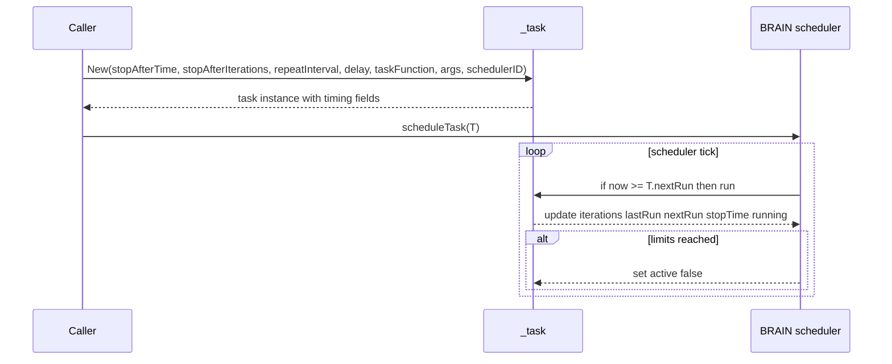
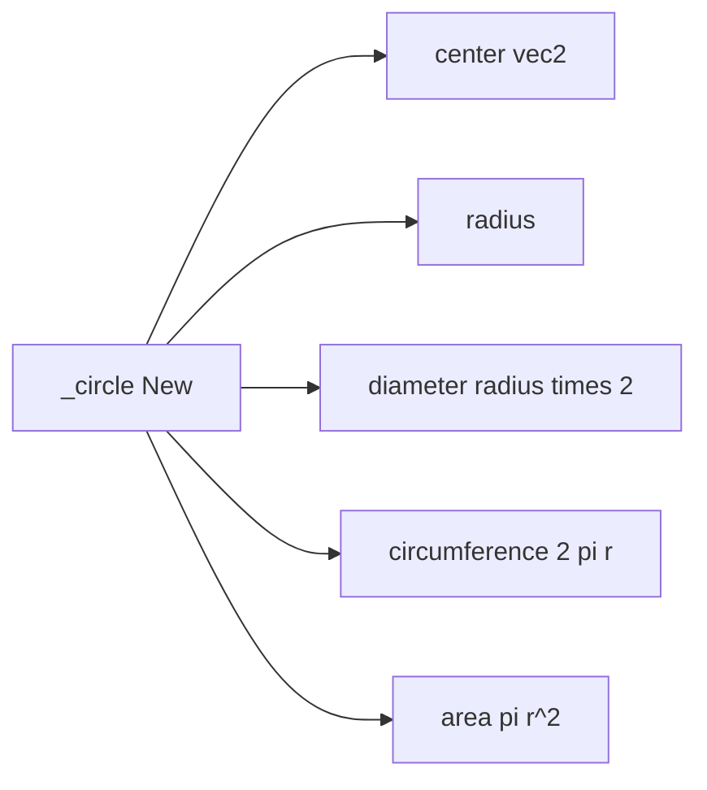
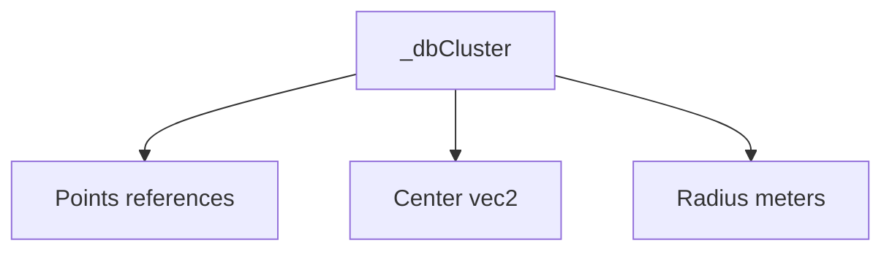

# TYPES scheduler and circle

Anchors
- [AETHR._task:New()](../../dev/customTypes.lua:483)
- [AETHR._circle:New()](../../dev/customTypes.lua:1471)
- [_dbCluster structure](../../dev/customTypes.lua:1482)

Overview
- _task encapsulates scheduling metadata used by the BRAIN scheduler, including time windows, iteration caps, and repeat logic.
- _circle provides a minimal geometric helper with precomputed diameter, circumference, and area.
- _dbCluster is a data structure returned by clustering utilities, containing references to points, a center, and a radius.

Task constructor defaults and timing
```mermaid
flowchart TD
  T[AETHR._task New] --> STA[stopAfterTime default nil]
  T --> SAI[stopAfterIterations passthrough]
  T --> RI[repeatInterval default nil]
  T --> DLY[delay default 0]
  T --> TF[taskFunction default nil]
  T --> ARGS[functionArgs default []]
  T --> ITR[iterations 0]
  T --> LR[lastRun 0]
  T --> NR[nextRun now plus delay]
  T --> ST[stopTime now plus stopAfterTime or nil]
  T --> RUN[running false]
  T --> ACT[active true]
  T --> SID[schedulerID default 0]
  T --> REP[repeating computed flag]
```

Scheduler interaction sequence


Circle constructor fields


Cluster result structure


Source anchors
- Task: [AETHR._task:New()](../../dev/customTypes.lua:483)
- Circle: [AETHR._circle:New()](../../dev/customTypes.lua:1471)
- Cluster: [_dbCluster](../../dev/customTypes.lua:1482)
- Related scheduler pages: [docs/brain/scheduler.md](../brain/scheduler.md)