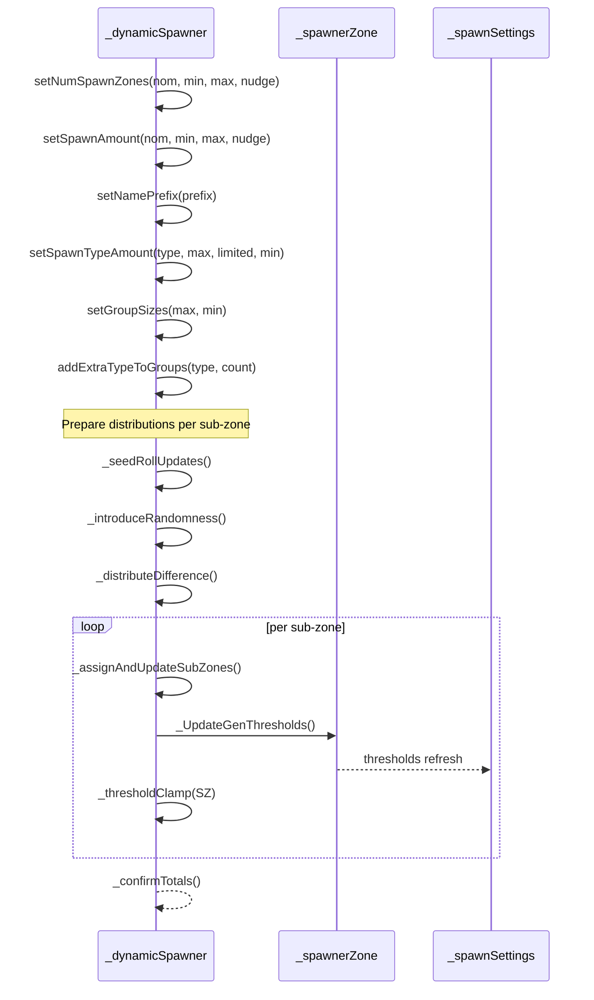
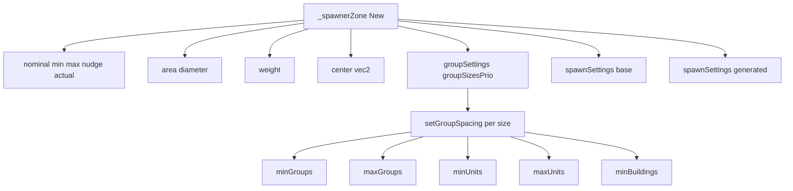
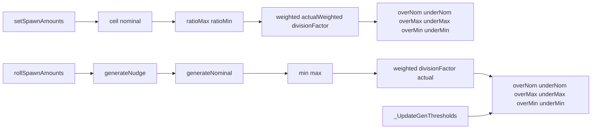

# TYPES spawner ecosystem

Anchors
- [AETHR._dynamicSpawner:New()](../../dev/customTypes.lua:868)
- Setters:
  - [setNumSpawnZones](../../dev/customTypes.lua:928)
  - [setSpawnAmount](../../dev/customTypes.lua:946)
  - [setNamePrefix](../../dev/customTypes.lua:963)
  - [setSpawnTypeAmount](../../dev/customTypes.lua:969)
  - [setGroupSizes](../../dev/customTypes.lua:977)
  - [addExtraTypeToGroups](../../dev/customTypes.lua:983)
- Internals:
  - [_seedRollUpdates](../../dev/customTypes.lua:992)
  - [_introduceRandomness](../../dev/customTypes.lua:1006)
  - [_distributeDifference](../../dev/customTypes.lua:1036)
  - [_assignAndUpdateSubZones](../../dev/customTypes.lua:1059)
  - [_thresholdClamp](../../dev/customTypes.lua:1082)
  - [_confirmTotals](../../dev/customTypes.lua:1115)
- Zones and settings:
  - [AETHR._spawnerZone:New()](../../dev/customTypes.lua:1177)
  - [setGroupSpacing](../../dev/customTypes.lua:1276)
  - [setSpawnAmounts](../../dev/customTypes.lua:1303)
  - [rollSpawnAmounts](../../dev/customTypes.lua:1330)
  - [_UpdateGenThresholds](../../dev/customTypes.lua:1365)
  - [AETHR._spawnSettings:New()](../../dev/customTypes.lua:1401)
  - [AETHR._spawnerTypeConfig:New()](../../dev/customTypes.lua:1444)

Overview
- _dynamicSpawner coordinates counts and type distribution across a main zone and multiple sub-zones.
- Setters define nominal ranges and nudge factors. Internals roll values, introduce bounded randomness, clamp thresholds, and confirm totals.
- _spawnerZone stores per-zone weights, spacing, and generated spawn settings, leveraging _spawnSettings for min max nominal with thresholds.
- _spawnerTypeConfig defines per-type limits and pools.

Spawner orchestration

Zones and spacing

Spawn settings lifecycle

Key behaviors
- setNumSpawnZones and setSpawnAmount compute final counts using MATH.generateNominal under the hood, with nudge factors to vary around nominal while honoring min and max.
- _introduceRandomness perturbs sub-zone actuals within allowed ranges and the main max constraint.
- _distributeDifference reconciles totals to match the main expected actual.
- _thresholdClamp nudges out-of-bounds sub-zone actuals back toward valid ranges using a randomized index selection.
- _confirmTotals recomputes and stores the aggregate for later verification.

Related anchors and modules
- MATH randomization helpers indexed under MATH docs:
  - [Randomization helpers](../math/randomization.md)
- WORLD integration of divisions and zone pairing:
  - [Zones and divisions pairing](../spawner/zones_and_divisions.md)