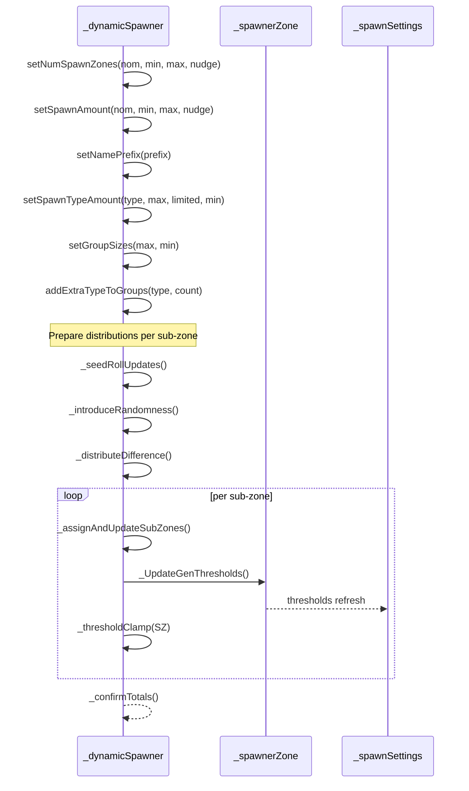
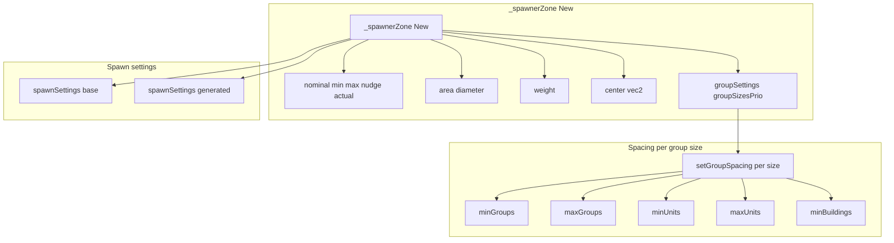
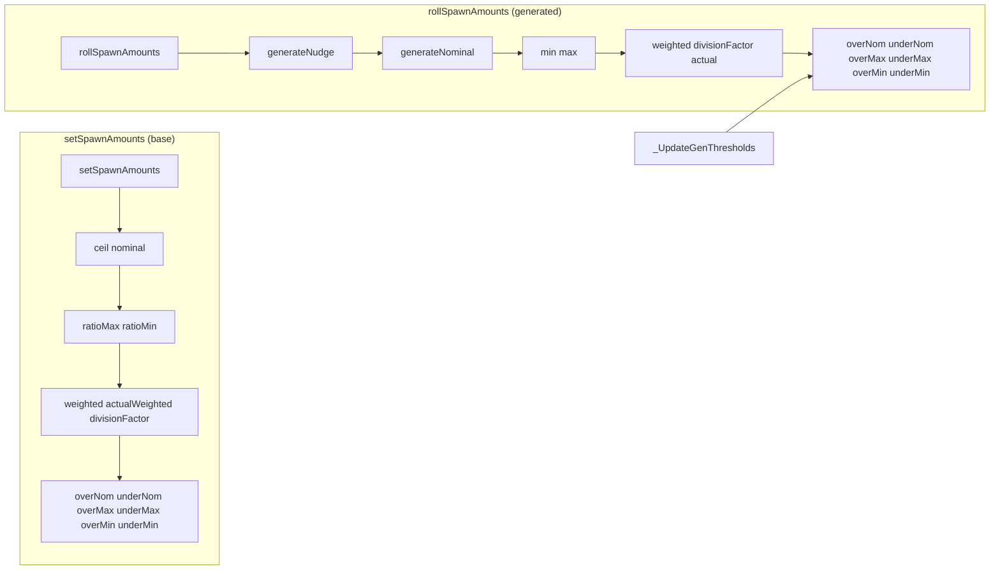

# TYPES spawner ecosystem

### Anchors
- [AETHR._dynamicSpawner:New()](https://github.com/Gh0st352/AETHR/blob/main/dev/customTypes.lua#L868)
- Setters:
  - [setNumSpawnZones](https://github.com/Gh0st352/AETHR/blob/main/dev/customTypes.lua#L928)
  - [setSpawnAmount](https://github.com/Gh0st352/AETHR/blob/main/dev/customTypes.lua#L946)
  - [setNamePrefix](https://github.com/Gh0st352/AETHR/blob/main/dev/customTypes.lua#L963)
  - [setSpawnTypeAmount](https://github.com/Gh0st352/AETHR/blob/main/dev/customTypes.lua#L969)
  - [setGroupSizes](https://github.com/Gh0st352/AETHR/blob/main/dev/customTypes.lua#L977)
  - [addExtraTypeToGroups](https://github.com/Gh0st352/AETHR/blob/main/dev/customTypes.lua#L983)
- Internals:
  - [_seedRollUpdates](https://github.com/Gh0st352/AETHR/blob/main/dev/customTypes.lua#L992)
  - [_introduceRandomness](https://github.com/Gh0st352/AETHR/blob/main/dev/customTypes.lua#L1006)
  - [_distributeDifference](https://github.com/Gh0st352/AETHR/blob/main/dev/customTypes.lua#L1036)
  - [_assignAndUpdateSubZones](https://github.com/Gh0st352/AETHR/blob/main/dev/customTypes.lua#L1059)
  - [_thresholdClamp](https://github.com/Gh0st352/AETHR/blob/main/dev/customTypes.lua#L1082)
  - [_confirmTotals](https://github.com/Gh0st352/AETHR/blob/main/dev/customTypes.lua#L1115)
- Zones and settings:
  - [AETHR._spawnerZone:New()](https://github.com/Gh0st352/AETHR/blob/main/dev/customTypes.lua#L1177)
  - [setGroupSpacing](https://github.com/Gh0st352/AETHR/blob/main/dev/customTypes.lua#L1276)
  - [setSpawnAmounts](https://github.com/Gh0st352/AETHR/blob/main/dev/customTypes.lua#L1303)
  - [rollSpawnAmounts](https://github.com/Gh0st352/AETHR/blob/main/dev/customTypes.lua#L1330)
  - [_UpdateGenThresholds](https://github.com/Gh0st352/AETHR/blob/main/dev/customTypes.lua#L1365)
  - [AETHR._spawnSettings:New()](https://github.com/Gh0st352/AETHR/blob/main/dev/customTypes.lua#L1401)
  - [AETHR._spawnerTypeConfig:New()](https://github.com/Gh0st352/AETHR/blob/main/dev/customTypes.lua#L1444)

# Overview
- _dynamicSpawner coordinates counts and type distribution across a main zone and multiple sub-zones.
- Setters define nominal ranges and nudge factors. Internals roll values, introduce bounded randomness, clamp thresholds, and confirm totals.
- _spawnerZone stores per-zone weights, spacing, and generated spawn settings, leveraging _spawnSettings for min max nominal with thresholds.
- _spawnerTypeConfig defines per-type limits and pools.

# Spawner orchestration

# Zones and spacing

# Spawn settings lifecycle

# Key behaviors
- setNumSpawnZones and setSpawnAmount compute final counts using MATH.generateNominal under the hood, with nudge factors to vary around nominal while honoring min and max.
- _introduceRandomness perturbs sub-zone actuals within allowed ranges and the main max constraint.
- _distributeDifference reconciles totals to match the main expected actual.
- _thresholdClamp nudges out-of-bounds sub-zone actuals back toward valid ranges using a randomized index selection.
- _confirmTotals recomputes and stores the aggregate for later verification.

# Related anchors and modules
- MATH randomization helpers indexed under MATH docs:
  - [Randomization helpers](../math/randomization.md)
- WORLD integration of divisions and zone pairing:
  - [Zones and divisions pairing](../spawner/zones_and_divisions.md)