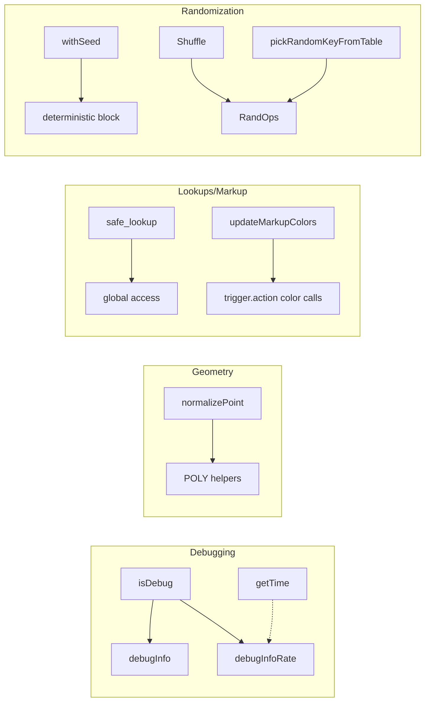
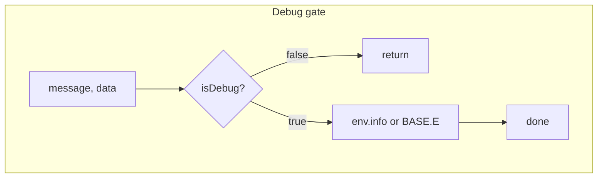
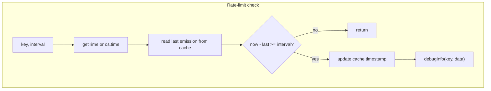
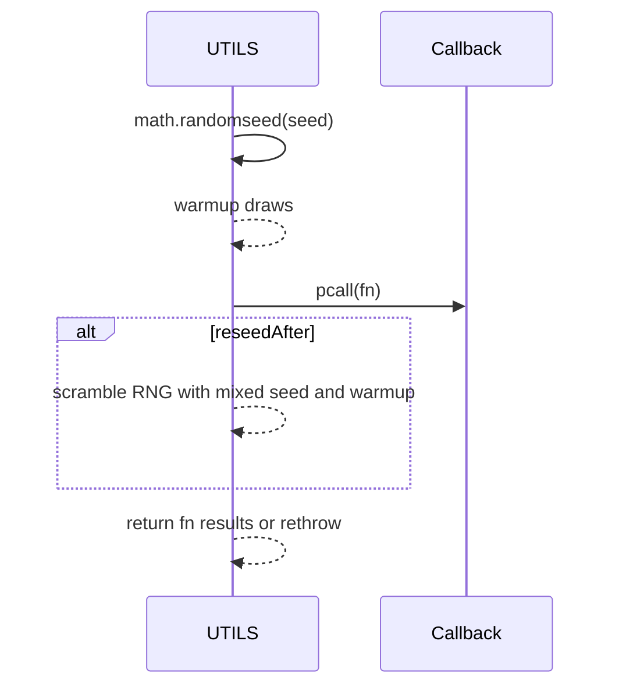
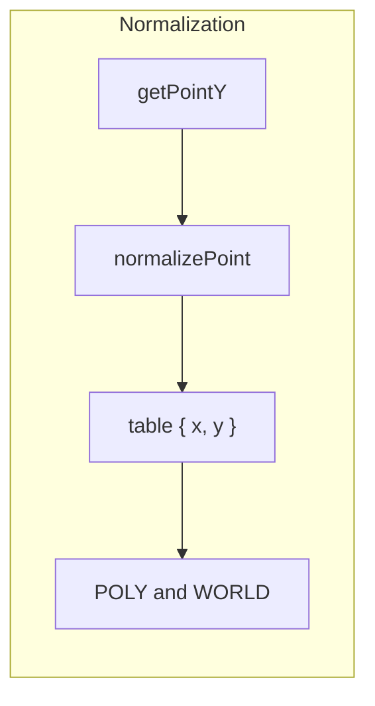
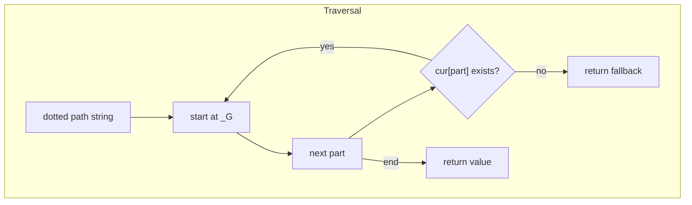
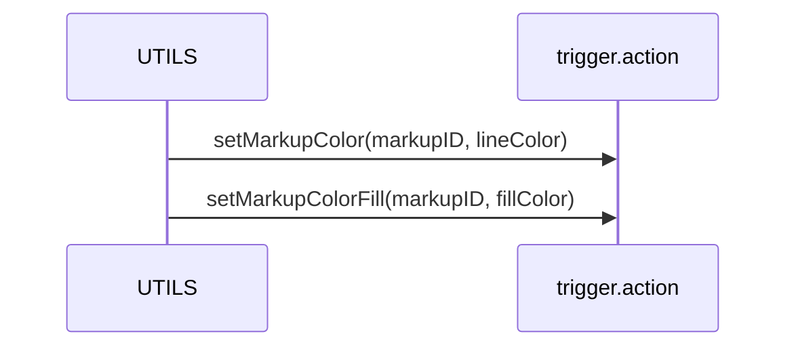
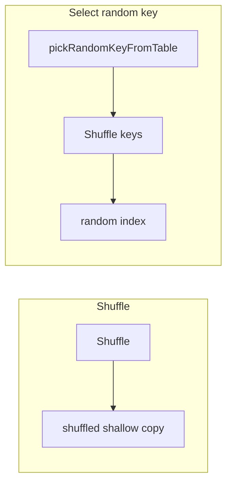

# AETHR UTILS diagrams and flows

Primary anchors
- [AETHR.UTILS:isDebug()](https://github.com/Gh0st352/AETHR/blob/main/dev/UTILS.lua#L70)
- [AETHR.UTILS:debugInfo()](https://github.com/Gh0st352/AETHR/blob/main/dev/UTILS.lua#L79)
- [AETHR.UTILS:debugInfoRate()](https://github.com/Gh0st352/AETHR/blob/main/dev/UTILS.lua#L101)
- [AETHR.UTILS.getTime()](https://github.com/Gh0st352/AETHR/blob/main/dev/UTILS.lua#L56)
- [AETHR.UTILS:getPointY()](https://github.com/Gh0st352/AETHR/blob/main/dev/UTILS.lua#L129)
- [AETHR.UTILS:normalizePoint()](https://github.com/Gh0st352/AETHR/blob/main/dev/UTILS.lua#L137)
- [AETHR.UTILS:hasValue()](https://github.com/Gh0st352/AETHR/blob/main/dev/UTILS.lua#L147)
- [AETHR.UTILS:table_hasValue()](https://github.com/Gh0st352/AETHR/blob/main/dev/UTILS.lua#L162)
- [AETHR.UTILS.safe_lookup()](https://github.com/Gh0st352/AETHR/blob/main/dev/UTILS.lua#L170)
- [AETHR.UTILS:updateMarkupColors()](https://github.com/Gh0st352/AETHR/blob/main/dev/UTILS.lua#L188)
- [AETHR.UTILS:pickRandomKeyFromTable()](https://github.com/Gh0st352/AETHR/blob/main/dev/UTILS.lua#L201)
- [AETHR.UTILS:Shuffle()](https://github.com/Gh0st352/AETHR/blob/main/dev/UTILS.lua#L218)
- [AETHR.UTILS:withSeed()](https://github.com/Gh0st352/AETHR/blob/main/dev/UTILS.lua#L243)

Documents and indices
- Master diagrams index: [docs/README.md](../README.md)
- AETHR overview: [docs/aethr/README.md](../aethr/README.md)
- MARKERS: [docs/markers/README.md](../markers/README.md)

# Overview relationships

# Debug gating and rate limiting

# Rate-limited debug logger

# Deterministic RNG scope

# Point normalization and helpers

# Safe lookup guard

# Update markup colors

# Randomization helpers

# Key anchors
- Debug: [isDebug](https://github.com/Gh0st352/AETHR/blob/main/dev/UTILS.lua#L70), [debugInfo](https://github.com/Gh0st352/AETHR/blob/main/dev/UTILS.lua#L79), [debugInfoRate](https://github.com/Gh0st352/AETHR/blob/main/dev/UTILS.lua#L101)
- Time: [getTime](https://github.com/Gh0st352/AETHR/blob/main/dev/UTILS.lua#L56)
- Geometry helpers: [getPointY](https://github.com/Gh0st352/AETHR/blob/main/dev/UTILS.lua#L129), [normalizePoint](https://github.com/Gh0st352/AETHR/blob/main/dev/UTILS.lua#L137)
- Lookups and colors: [safe_lookup](https://github.com/Gh0st352/AETHR/blob/main/dev/UTILS.lua#L170), [updateMarkupColors](https://github.com/Gh0st352/AETHR/blob/main/dev/UTILS.lua#L188)
- RNG and collections: [withSeed](https://github.com/Gh0st352/AETHR/blob/main/dev/UTILS.lua#L243), [Shuffle](https://github.com/Gh0st352/AETHR/blob/main/dev/UTILS.lua#L218), [pickRandomKeyFromTable](https://github.com/Gh0st352/AETHR/blob/main/dev/UTILS.lua#L201)

Notes
- Mermaid labels avoid double quotes and parentheses.
- All diagrams use GitHub Mermaid fenced blocks.

## Breakout documents

- Overview and constructor: [docs/utils/overview_and_constructor.md](overview_and_constructor.md)
- Debug and logging: [docs/utils/debug_and_logging.md](debug_and_logging.md)
- Time and timestamps: [docs/utils/time_and_timestamps.md](time_and_timestamps.md)
- Points and normalization: [docs/utils/points_and_normalization.md](points_and_normalization.md)
- Lookups and markup: [docs/utils/lookups_and_markup.md](lookups_and_markup.md)
- Randomization and RNG: [docs/utils/randomization_and_rng.md](randomization_and_rng.md)
- Collections and membership: [docs/utils/collections_and_membership.md](collections_and_membership.md)

Last updated: 2025-10-16