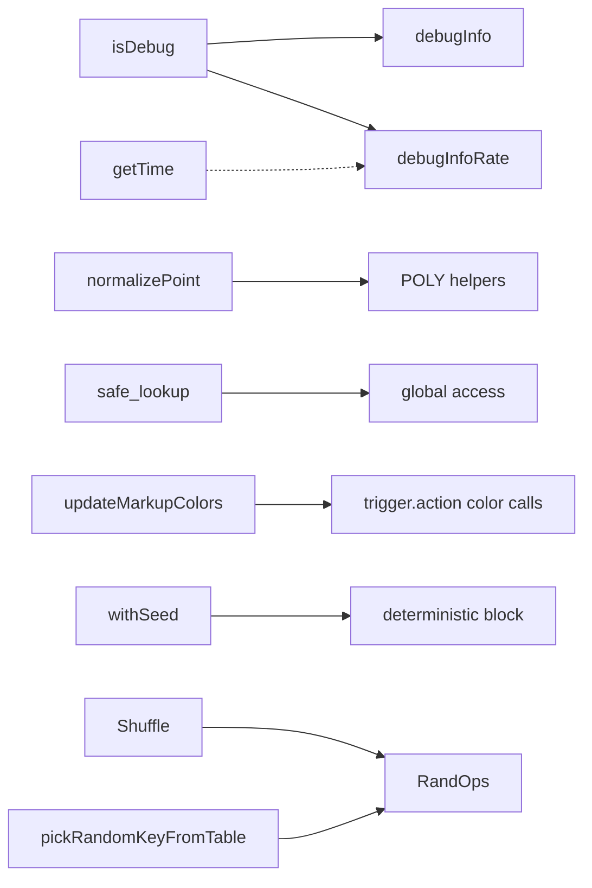
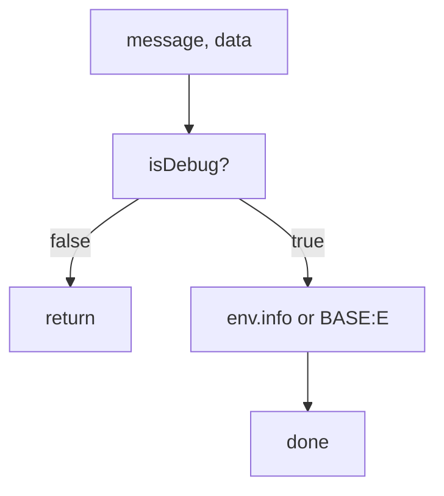
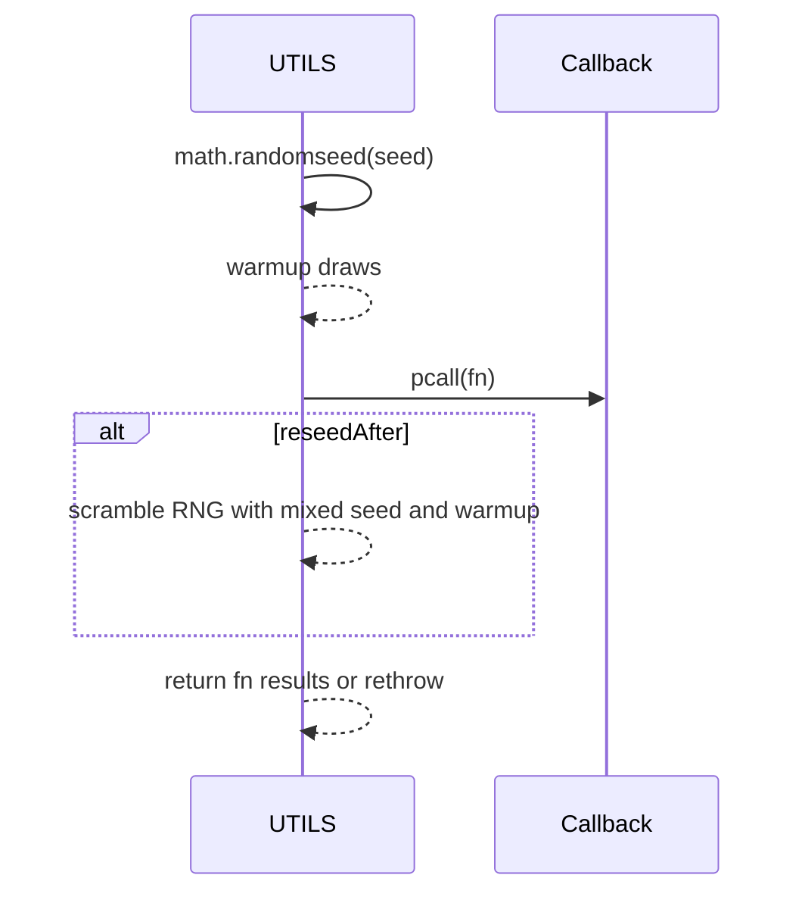
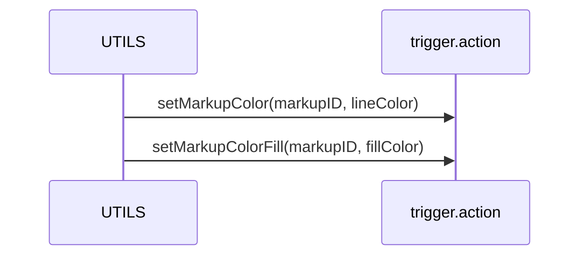
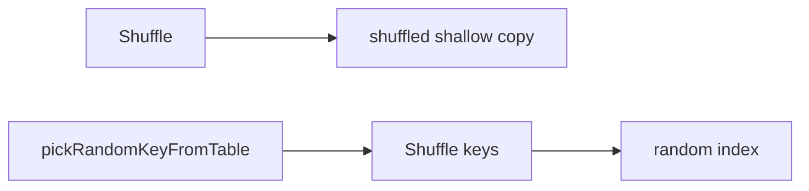

# AETHR UTILS diagrams and flows

Primary anchors
- [AETHR.UTILS:isDebug()](dev/UTILS.lua:70)
- [AETHR.UTILS:debugInfo()](dev/UTILS.lua:79)
- [AETHR.UTILS:debugInfoRate()](dev/UTILS.lua:101)
- [AETHR.UTILS.getTime()](dev/UTILS.lua:56)
- [AETHR.UTILS:getPointY()](dev/UTILS.lua:129)
- [AETHR.UTILS:normalizePoint()](dev/UTILS.lua:137)
- [AETHR.UTILS:hasValue()](dev/UTILS.lua:147)
- [AETHR.UTILS:table_hasValue()](dev/UTILS.lua:162)
- [AETHR.UTILS.safe_lookup()](dev/UTILS.lua:170)
- [AETHR.UTILS:updateMarkupColors()](dev/UTILS.lua:188)
- [AETHR.UTILS:pickRandomKeyFromTable()](dev/UTILS.lua:201)
- [AETHR.UTILS:Shuffle()](dev/UTILS.lua:218)
- [AETHR.UTILS:withSeed()](dev/UTILS.lua:243)

Documents and indices
- Master diagrams index: [docs/README.md](../README.md)
- AETHR overview: [docs/aethr/README.md](../aethr/README.md)
- MARKERS: [docs/markers/README.md](../markers/README.md)

Overview relationships



Debug gating and rate limiting



Rate-limited debug logger

```mermaid
flowchart TD
  K[key, interval] --> NOW[getTime or os.time]
  NOW --> LAST[read last emission from cache]
  LAST --> GAP[now - last >= interval?]
  GAP -->|no| RETURN2[return]
  GAP -->|yes| UPDATE[update cache timestamp]
  UPDATE --> LOG[debugInfo(key, data)]
```

Deterministic RNG scope



Point normalization and helpers

```mermaid
flowchart LR
  GY[getPointY] --> NP[normalizePoint]
  NP --> P2[table {x,y}]
  P2 --> CONSUMERS[POLY and WORLD]
```

Safe lookup guard

```mermaid
flowchart TD
  PATH[dotted path string] --> CUR[start at _G]
  CUR --> STEP[next part]
  STEP --> EXISTS[cur[part] exists?]
  EXISTS -->|no| FALLBACK[return fallback]
  EXISTS -->|yes| CUR
  CUR -->|end| OUT[return value]
```

Update markup colors



Randomization helpers



Key anchors
- Debug: [isDebug](dev/UTILS.lua:70), [debugInfo](dev/UTILS.lua:79), [debugInfoRate](dev/UTILS.lua:101)
- Time: [getTime](dev/UTILS.lua:56)
- Geometry helpers: [getPointY](dev/UTILS.lua:129), [normalizePoint](dev/UTILS.lua:137)
- Lookups and colors: [safe_lookup](dev/UTILS.lua:170), [updateMarkupColors](dev/UTILS.lua:188)
- RNG and collections: [withSeed](dev/UTILS.lua:243), [Shuffle](dev/UTILS.lua:218), [pickRandomKeyFromTable](dev/UTILS.lua:201)

Notes
- Mermaid labels avoid double quotes and parentheses.
- All diagrams use GitHub Mermaid fenced blocks.