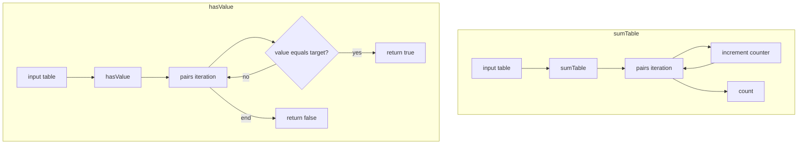
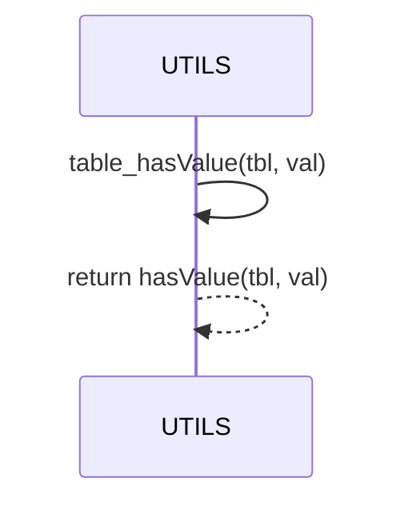

# UTILS collections and membership

Anchors
- [AETHR.UTILS.sumTable()](../../dev/UTILS.lua:42)
- [AETHR.UTILS:hasValue()](../../dev/UTILS.lua:147)
- [AETHR.UTILS:table_hasValue()](../../dev/UTILS.lua:162)

Overview
- sumTable counts keys in a table using pairs iteration; useful for sparse maps.
- hasValue performs a linear search for a value using pairs; returns true on first match.
- table_hasValue is a backward compatible alias that forwards to hasValue.

# Counting and membership flows

# Alias mapping

# Usage notes
- sumTable counts non nil keys; order is unspecified due to pairs traversal.
- hasValue compares via Lua equality; for deep comparisons consider a custom predicate.
- table_hasValue exists for legacy callers and should not be extended differently from hasValue.

# Source anchors
- [AETHR.UTILS.sumTable()](../../dev/UTILS.lua:42)
- [AETHR.UTILS:hasValue()](../../dev/UTILS.lua:147)
- [AETHR.UTILS:table_hasValue()](../../dev/UTILS.lua:162)

Last updated: 2025-10-16