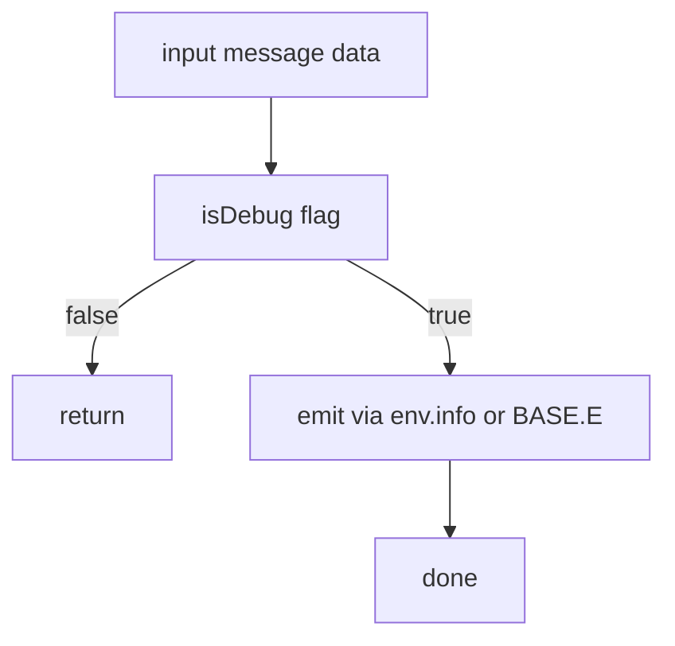
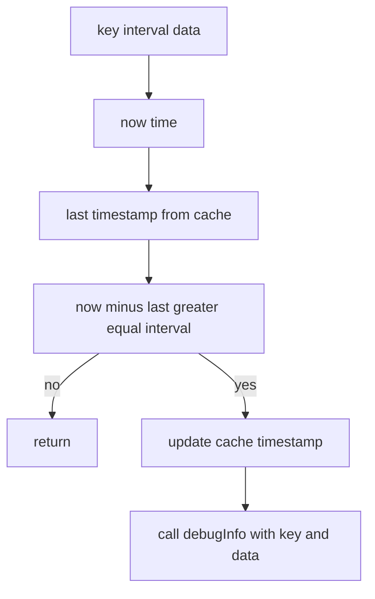

# UTILS debug and logging

Anchors
- [AETHR.UTILS:isDebug()](../../dev/UTILS.lua:70)
- [AETHR.UTILS:debugInfo()](../../dev/UTILS.lua:79)
- [AETHR.UTILS:debugInfoRate()](../../dev/UTILS.lua:101)

Overview
- isDebug checks CONFIG.MAIN.DEBUG_ENABLED with minimal overhead.
- debugInfo emits to env.info when available and optionally to BASE.E for structured data.
- debugInfoRate uses an in instance cache to rate limit log emission by key using engine time when available.

Debug gating overview

Rate limited logging flow

Time source selection for rate limiting

Integration and usage notes
- Avoid heavy string formatting on hot paths unless isDebug returns true.
- debugInfoRate keys should be stable identifiers for the emission point.
- Structured data logging to BASE.E is attempted only when provided and available.

Source anchors
- [AETHR.UTILS:isDebug()](../../dev/UTILS.lua:70)
- [AETHR.UTILS:debugInfo()](../../dev/UTILS.lua:79)
- [AETHR.UTILS:debugInfoRate()](../../dev/UTILS.lua:101)