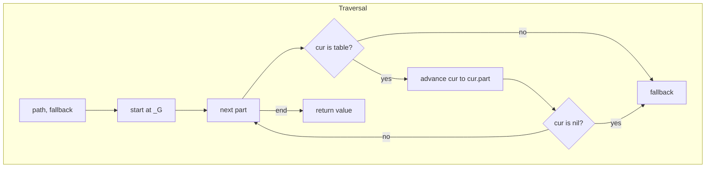
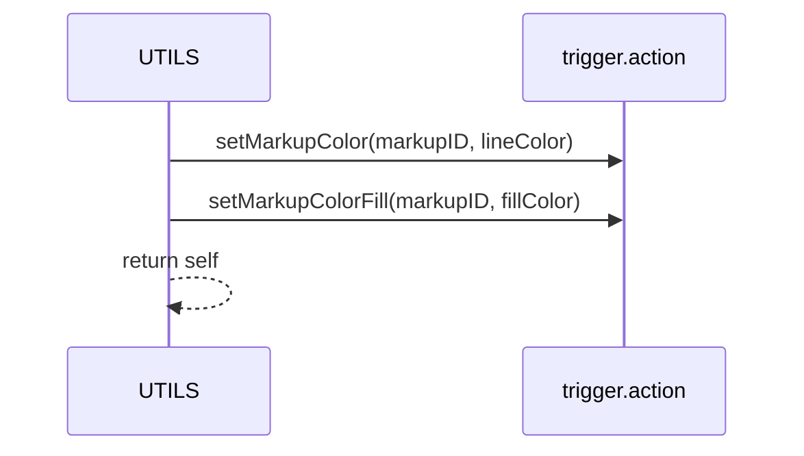

# UTILS lookups and markup

Anchors
- [AETHR.UTILS.safe_lookup()](https://github.com/Gh0st352/AETHR/blob/main/dev/UTILS.lua#L170)
- [AETHR.UTILS:updateMarkupColors()](https://github.com/Gh0st352/AETHR/blob/main/dev/UTILS.lua#L188)

Overview
- safe_lookup resolves dotted global paths like A.B.C against _G with guards, returning a fallback if any step fails.
- updateMarkupColors wraps DCS trigger.action color functions for line and fill and returns self for chaining.

# Dotted path resolution

# Markup color update sequence

# Usage notes
- safe_lookup is read only and never throws; it stops early on non table intermediates or nil members.
- updateMarkupColors expects AETHR.CONFIG compatible color tables and assumes trigger.action bindings are available.

# Source anchors
- [AETHR.UTILS.safe_lookup()](https://github.com/Gh0st352/AETHR/blob/main/dev/UTILS.lua#L170)
- [AETHR.UTILS:updateMarkupColors()](https://github.com/Gh0st352/AETHR/blob/main/dev/UTILS.lua#L188)

Last updated: 2025-10-16