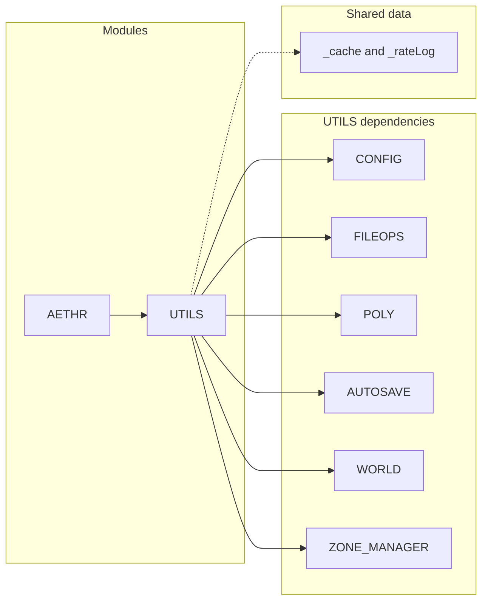
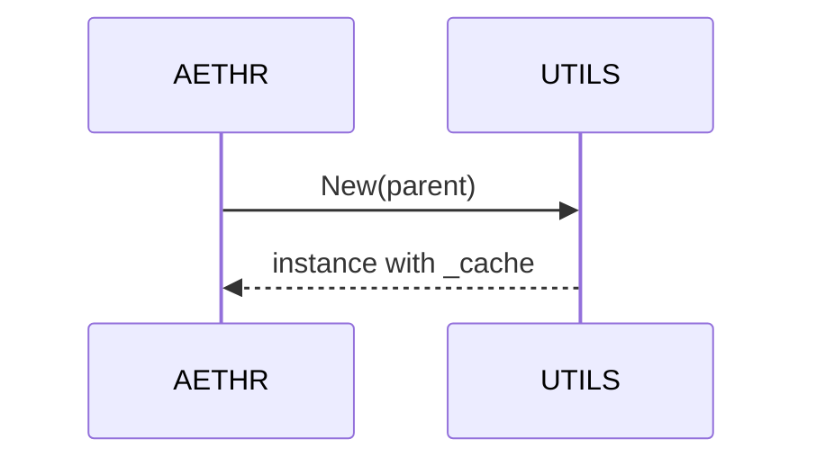

# AETHR UTILS overview and constructor

Anchors
- [AETHR.UTILS:New()](https://github.com/Gh0st352/AETHR/blob/main/dev/UTILS.lua#L27)
- [AETHR.UTILS.DATA](https://github.com/Gh0st352/AETHR/blob/main/dev/UTILS.lua#L14)

Overview
- Constructor binds parent AETHR instance and initializes per instance cache.
- DATA holds shared structures such as _cache and _rateLog defaults.
- UTILS interacts with CONFIG, FILEOPS, POLY, AUTOSAVE, WORLD, ZONE_MANAGER.

# Module relationships

# Construction sequence

Instance fields
- _cache table for per instance state including _rateLog used by [AETHR.UTILS:debugInfoRate()](https://github.com/Gh0st352/AETHR/blob/main/dev/UTILS.lua#L101)
- parent references via [AETHR.UTILS:New()](https://github.com/Gh0st352/AETHR/blob/main/dev/UTILS.lua#L27)
- defaults defined by [AETHR.UTILS.DATA](https://github.com/Gh0st352/AETHR/blob/main/dev/UTILS.lua#L14)

Source anchors
- [AETHR.UTILS:New()](https://github.com/Gh0st352/AETHR/blob/main/dev/UTILS.lua#L27)
- [AETHR.UTILS.DATA](https://github.com/Gh0st352/AETHR/blob/main/dev/UTILS.lua#L14)

Last updated: 2025-10-16