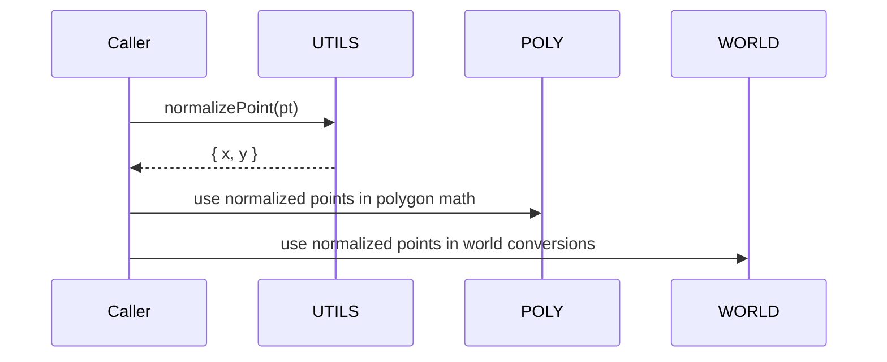

# UTILS points and normalization

Anchors
- [AETHR.UTILS:getPointY()](../../dev/UTILS.lua:129)
- [AETHR.UTILS:normalizePoint()](../../dev/UTILS.lua:137)

Overview
- getPointY extracts the vertical component from a point like table, supporting y or z fields.
- normalizePoint converts any point like input into a normalized table { x, y } with defaults for missing components and does not mutate the input.

# Point extraction and normalization
```mermaid
%% shared theme: docs/_mermaid/theme.json %%
flowchart LR
subgraph "Normalization"
  INP[point like x y or x z] --> GY[getPointY]
  GY --> OUTY[y or z]
  INP --> NP[normalizePoint]
  NP --> P2[table { x, y }]
end

class INP class_io;
class GY,NP class_compute;
class OUTY class_result;
class P2 class_data;
```

# Consumers and integration


# Edge cases and defaults
- getPointY
  - Returns nil when pt is nil.
  - Returns pt.y if present; otherwise pt.z.
- normalizePoint
  - Returns { x 0, y 0 } when pt is nil.
  - x defaults to 0 when missing.
  - y uses pt.y when present, else falls back to pt.z, else 0.

# Source anchors
- [AETHR.UTILS:getPointY()](../../dev/UTILS.lua:129)
- [AETHR.UTILS:normalizePoint()](../../dev/UTILS.lua:137)

Last updated: 2025-10-16