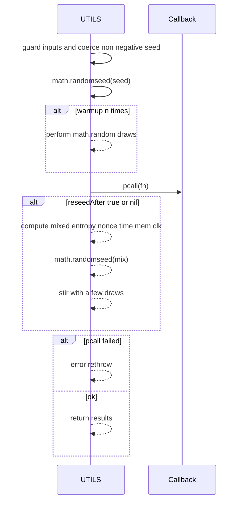
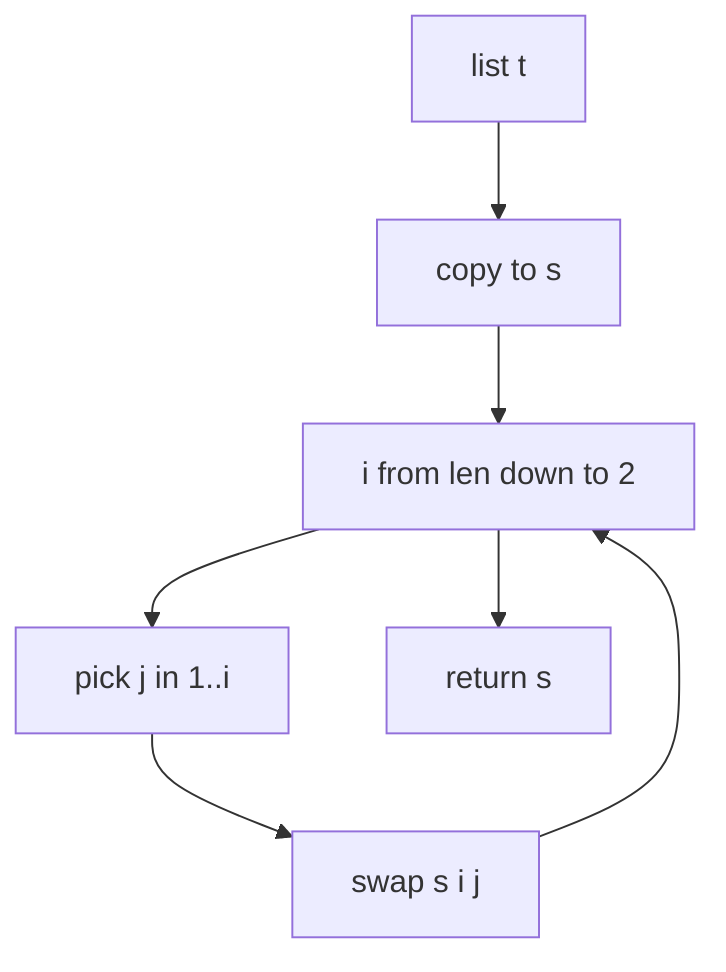

# UTILS randomization and RNG

Anchors
- [AETHR.UTILS:withSeed()](../../dev/UTILS.lua:243)
- [AETHR.UTILS:Shuffle()](../../dev/UTILS.lua:218)
- [AETHR.UTILS:pickRandomKeyFromTable()](../../dev/UTILS.lua:201)

Overview
- withSeed executes a callback under a deterministic RNG seed with optional warmup and reseedAfter scramble.
- Shuffle returns a shuffled shallow copy using Fisher Yates.
- pickRandomKeyFromTable builds a key list, shuffles it, then selects a random index.

Deterministic RNG scope and reseed


Shuffle algorithm


Pick random key from table
```mermaid
flowchart LR
  T[t map] --> KEYS[collect keys into array]
  KEYS --> SHUF[Shuffle(keys)]
  SHUF --> IDX[pick random index in 1..#keys]
  IDX --> KEY[out key]
```

Usage notes
- withSeed does not restore previous RNG state due to Lua 5.1 limitations; reseedAfter scrambles with mixed entropy for best effort safety.
- Shuffle preserves input order in a copied array then shuffles; the input t is not mutated.
- pickRandomKeyFromTable is O(n) to collect keys plus shuffle; for very large maps consider alternative streaming sampling.

Source anchors
- [AETHR.UTILS:withSeed()](../../dev/UTILS.lua:243)
- [AETHR.UTILS:Shuffle()](../../dev/UTILS.lua:218)
- [AETHR.UTILS:pickRandomKeyFromTable()](../../dev/UTILS.lua:201)