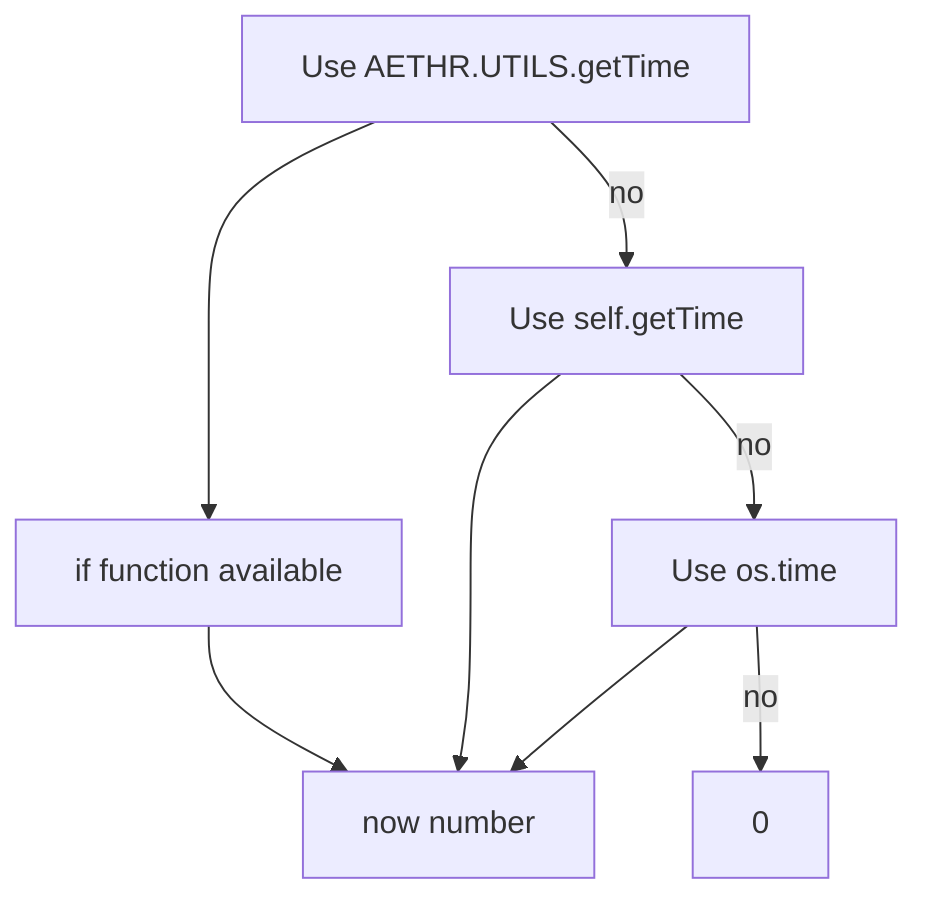
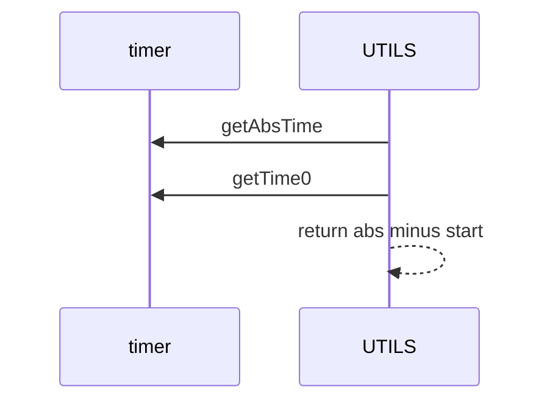

# UTILS time and timestamps

Anchors
- [AETHR.UTILS.getTime()](../../dev/UTILS.lua:56)
- [AETHR.UTILS:debugInfoRate()](../../dev/UTILS.lua:101) time source selection

Overview
- getTime uses DCS engine timers to return elapsed mission time seconds: timer.getAbsTime minus timer.getTime0.
- debugInfoRate picks the best available clock: AETHR.UTILS.getTime, or instance getTime, or os.time, else 0.

Time source flow

Elapsed mission time

Usage notes
- Prefer engine elapsed time for consistent sim relative timestamps used by rate limited logging.
- When running outside the sim, os.time fallback still provides reasonable debouncing.

Source anchors
- [AETHR.UTILS.getTime()](../../dev/UTILS.lua:56)
- [AETHR.UTILS:debugInfoRate()](../../dev/UTILS.lua:101)