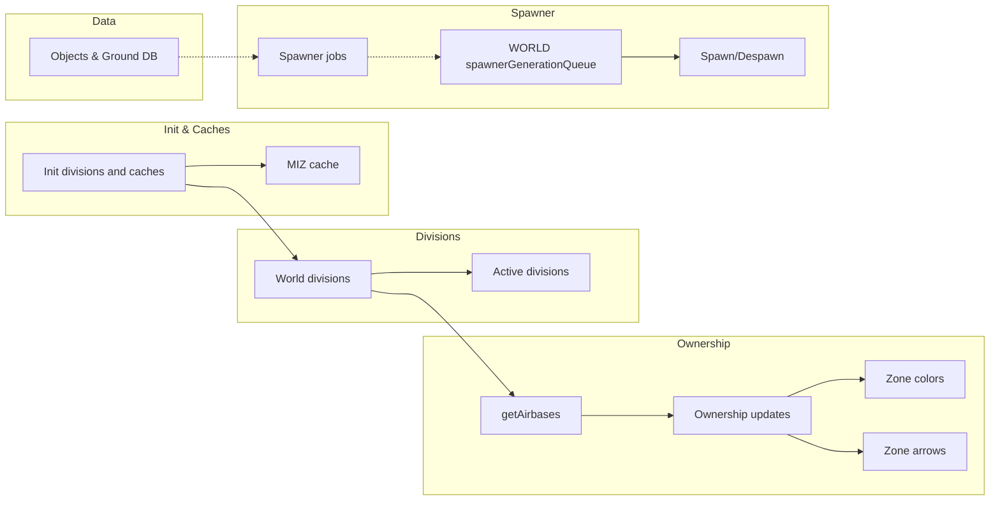
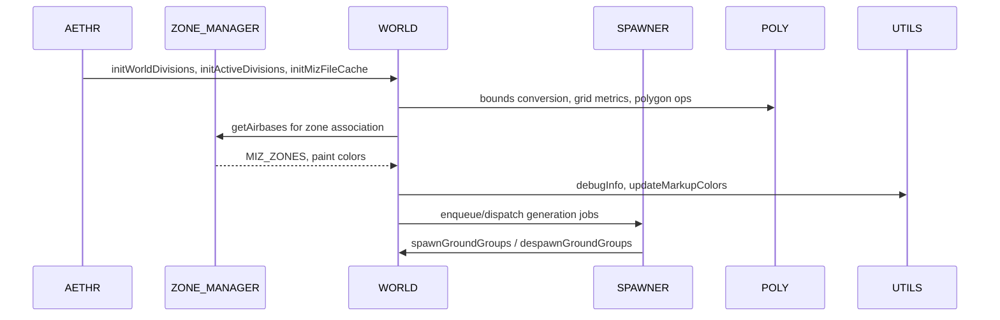

# AETHR WORLD diagrams index

### Primary flows
- Initialization chain: [AETHR.WORLD:initWorldDivisions()](https://github.com/Gh0st352/AETHR/blob/main/dev/WORLD.lua#L1176) -> [AETHR.WORLD:initActiveDivisions()](https://github.com/Gh0st352/AETHR/blob/main/dev/WORLD.lua#L1083) -> [AETHR.WORLD:initMizFileCache()](https://github.com/Gh0st352/AETHR/blob/main/dev/WORLD.lua#L90) -> [AETHR.WORLD:getAirbases()](https://github.com/Gh0st352/AETHR/blob/main/dev/WORLD.lua#L428)
- Ownership propagation: [AETHR.WORLD:updateAirbaseOwnership()](https://github.com/Gh0st352/AETHR/blob/main/dev/WORLD.lua#L501) -> [AETHR.WORLD:updateZoneOwnership()](https://github.com/Gh0st352/AETHR/blob/main/dev/WORLD.lua#L633) -> [AETHR.WORLD:updateZoneColors()](https://github.com/Gh0st352/AETHR/blob/main/dev/WORLD.lua#L683) -> [AETHR.WORLD:updateZoneArrows()](https://github.com/Gh0st352/AETHR/blob/main/dev/WORLD.lua#L730)
- Division activation: [AETHR.WORLD:generateWorldDivisions()](https://github.com/Gh0st352/AETHR/blob/main/dev/WORLD.lua#L1156) -> [AETHR.WORLD:buildWorldDivAABBCache()](https://github.com/Gh0st352/AETHR/blob/main/dev/WORLD.lua#L1206) -> [AETHR.WORLD:checkDivisionsInZones()](https://github.com/Gh0st352/AETHR/blob/main/dev/WORLD.lua#L1328) -> [AETHR.WORLD:generateActiveDivisions()](https://github.com/Gh0st352/AETHR/blob/main/dev/WORLD.lua#L1067)
- Object DB: [AETHR.WORLD:updateGroundUnitsDB()](https://github.com/Gh0st352/AETHR/blob/main/dev/WORLD.lua#L860) and per-division caches via [AETHR.WORLD:_initObjectsInDivisions()](https://github.com/Gh0st352/AETHR/blob/main/dev/WORLD.lua#L1395)
- Spawner integration: [AETHR.WORLD:spawnerGenerationQueue()](https://github.com/Gh0st352/AETHR/blob/main/dev/WORLD.lua#L801) -> [AETHR.WORLD:spawnGroundGroups()](https://github.com/Gh0st352/AETHR/blob/main/dev/WORLD.lua#L538) -> [AETHR.WORLD:despawnGroundGroups()](https://github.com/Gh0st352/AETHR/blob/main/dev/WORLD.lua#L590)
- Town clustering: [AETHR.WORLD:determineTowns()](https://github.com/Gh0st352/AETHR/blob/main/dev/WORLD.lua#L1460) -> [AETHR.WORLD:initTowns()](https://github.com/Gh0st352/AETHR/blob/main/dev/WORLD.lua#L1513)

### Documents
- Initialization: [initialization.md](./initialization.md)
- Divisions: [divisions.md](./divisions.md)
- MIZ cache: [miz_cache.md](./miz_cache.md)
- Ownership: [ownership.md](./ownership.md)
- Objects and DB: [objects_and_db.md](./objects_and_db.md)
- Spawner integration: [spawner_integration.md](./spawner_integration.md)
- Towns: [towns.md](./towns.md)

# End to end relationship

# Module interactions during runtime

# Key anchors
- Divisions and activation
  - [AETHR.WORLD:generateWorldDivisions()](https://github.com/Gh0st352/AETHR/blob/main/dev/WORLD.lua#L1156), [AETHR.WORLD:buildWorldDivAABBCache()](https://github.com/Gh0st352/AETHR/blob/main/dev/WORLD.lua#L1206), [AETHR.WORLD:checkDivisionsInZones()](https://github.com/Gh0st352/AETHR/blob/main/dev/WORLD.lua#L1328), [AETHR.WORLD:generateActiveDivisions()](https://github.com/Gh0st352/AETHR/blob/main/dev/WORLD.lua#L1067)
  - [AETHR.WORLD:initGrid()](https://github.com/Gh0st352/AETHR/blob/main/dev/WORLD.lua#L1236), [AETHR.WORLD:buildZoneCellIndex()](https://github.com/Gh0st352/AETHR/blob/main/dev/WORLD.lua#L1268), [AETHR.WORLD:markWorldDivisions()](https://github.com/Gh0st352/AETHR/blob/main/dev/WORLD.lua#L284)
- MIZ cache
  - [AETHR.WORLD:initMizFileCache()](https://github.com/Gh0st352/AETHR/blob/main/dev/WORLD.lua#L90), [AETHR.WORLD:getStoredMizFileCache()](https://github.com/Gh0st352/AETHR/blob/main/dev/WORLD.lua#L109), [AETHR.WORLD:generateMizFileCache()](https://github.com/Gh0st352/AETHR/blob/main/dev/WORLD.lua#L187), [AETHR.WORLD:saveMizFileCache()](https://github.com/Gh0st352/AETHR/blob/main/dev/WORLD.lua#L145)
- Ownership
  - [AETHR.WORLD:updateAirbaseOwnership()](https://github.com/Gh0st352/AETHR/blob/main/dev/WORLD.lua#L501), [AETHR.WORLD:updateZoneOwnership()](https://github.com/Gh0st352/AETHR/blob/main/dev/WORLD.lua#L633), [AETHR.WORLD:updateZoneColors()](https://github.com/Gh0st352/AETHR/blob/main/dev/WORLD.lua#L683), [AETHR.WORLD:updateZoneArrows()](https://github.com/Gh0st352/AETHR/blob/main/dev/WORLD.lua#L730)
  - [AETHR.WORLD.airbaseOwnershipChanged()](https://github.com/Gh0st352/AETHR/blob/main/dev/WORLD.lua#L970), [AETHR.WORLD.zoneOwnershipChanged()](https://github.com/Gh0st352/AETHR/blob/main/dev/WORLD.lua#L1006)
- Objects and DB
  - [AETHR.WORLD:searchObjectsBox()](https://github.com/Gh0st352/AETHR/blob/main/dev/WORLD.lua#L334), [AETHR.WORLD:searchObjectsSphere()](https://github.com/Gh0st352/AETHR/blob/main/dev/WORLD.lua#L384), [AETHR.WORLD:_initObjectsInDivisions()](https://github.com/Gh0st352/AETHR/blob/main/dev/WORLD.lua#L1395), [AETHR.WORLD:updateGroundUnitsDB()](https://github.com/Gh0st352/AETHR/blob/main/dev/WORLD.lua#L860)
- Spawner integration
  - [AETHR.WORLD:spawnerGenerationQueue()](https://github.com/Gh0st352/AETHR/blob/main/dev/WORLD.lua#L801), [AETHR.WORLD:spawnGroundGroups()](https://github.com/Gh0st352/AETHR/blob/main/dev/WORLD.lua#L538), [AETHR.WORLD:despawnGroundGroups()](https://github.com/Gh0st352/AETHR/blob/main/dev/WORLD.lua#L590)
- Town clustering
  - [AETHR.WORLD:determineTowns()](https://github.com/Gh0st352/AETHR/blob/main/dev/WORLD.lua#L1460), [AETHR.WORLD:initTowns()](https://github.com/Gh0st352/AETHR/blob/main/dev/WORLD.lua#L1513), [AETHR.WORLD:loadTowns()](https://github.com/Gh0st352/AETHR/blob/main/dev/WORLD.lua#L1528), [AETHR.WORLD:saveTowns()](https://github.com/Gh0st352/AETHR/blob/main/dev/WORLD.lua#L1541)

# Cross-module indexes
- SPAWNER: [../spawner/README.md](../spawner/README.md)
- ZONE_MANAGER: [../zone_manager/README.md](../zone_manager/README.md)