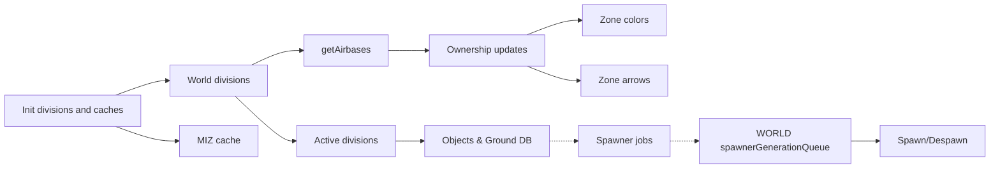
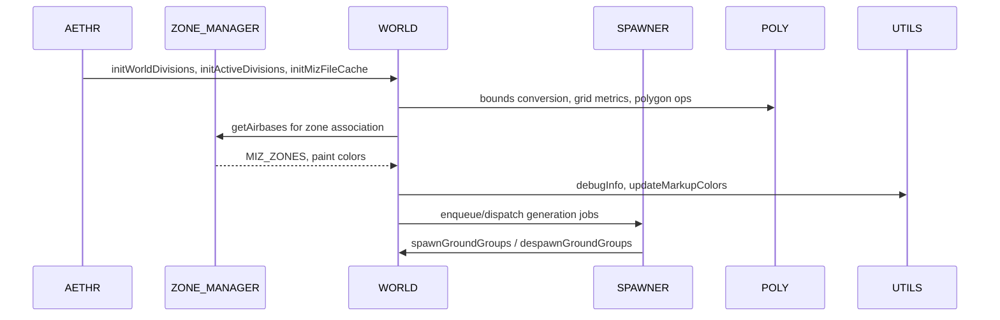

# AETHR WORLD diagrams index

Primary flows
- Initialization chain: [AETHR.WORLD:initWorldDivisions()](dev/WORLD.lua:1176) -> [AETHR.WORLD:initActiveDivisions()](dev/WORLD.lua:1083) -> [AETHR.WORLD:initMizFileCache()](dev/WORLD.lua:90) -> [AETHR.WORLD:getAirbases()](dev/WORLD.lua:428)
- Ownership propagation: [AETHR.WORLD:updateAirbaseOwnership()](dev/WORLD.lua:501) -> [AETHR.WORLD:updateZoneOwnership()](dev/WORLD.lua:633) -> [AETHR.WORLD:updateZoneColors()](dev/WORLD.lua:683) -> [AETHR.WORLD:updateZoneArrows()](dev/WORLD.lua:730)
- Division activation: [AETHR.WORLD:generateWorldDivisions()](dev/WORLD.lua:1156) -> [AETHR.WORLD:buildWorldDivAABBCache()](dev/WORLD.lua:1206) -> [AETHR.WORLD:checkDivisionsInZones()](dev/WORLD.lua:1328) -> [AETHR.WORLD:generateActiveDivisions()](dev/WORLD.lua:1067)
- Object DB: [AETHR.WORLD:updateGroundUnitsDB()](dev/WORLD.lua:860) and per-division caches via [AETHR.WORLD:_initObjectsInDivisions()](dev/WORLD.lua:1395)
- Spawner integration: [AETHR.WORLD:spawnerGenerationQueue()](dev/WORLD.lua:801) -> [AETHR.WORLD:spawnGroundGroups()](dev/WORLD.lua:538) -> [AETHR.WORLD:despawnGroundGroups()](dev/WORLD.lua:590)
- Town clustering: [AETHR.WORLD:determineTowns()](dev/WORLD.lua:1460) -> [AETHR.WORLD:initTowns()](dev/WORLD.lua:1513)

Documents
- Initialization: [docs/world/initialization.md](docs/world/initialization.md)
- Divisions: [docs/world/divisions.md](docs/world/divisions.md)
- MIZ cache: [docs/world/miz_cache.md](docs/world/miz_cache.md)
- Ownership: [docs/world/ownership.md](docs/world/ownership.md)
- Objects and DB: [docs/world/objects_and_db.md](docs/world/objects_and_db.md)
- Spawner integration: [docs/world/spawner_integration.md](docs/world/spawner_integration.md)
- Towns: [docs/world/towns.md](docs/world/towns.md)

End to end relationship

Module interactions during runtime

Key anchors
- Divisions and activation
  - [AETHR.WORLD:generateWorldDivisions()](dev/WORLD.lua:1156), [AETHR.WORLD:buildWorldDivAABBCache()](dev/WORLD.lua:1206), [AETHR.WORLD:checkDivisionsInZones()](dev/WORLD.lua:1328), [AETHR.WORLD:generateActiveDivisions()](dev/WORLD.lua:1067)
  - [AETHR.WORLD:initGrid()](dev/WORLD.lua:1236), [AETHR.WORLD:buildZoneCellIndex()](dev/WORLD.lua:1268), [AETHR.WORLD:markWorldDivisions()](dev/WORLD.lua:284)
- MIZ cache
  - [AETHR.WORLD:initMizFileCache()](dev/WORLD.lua:90), [AETHR.WORLD:getStoredMizFileCache()](dev/WORLD.lua:109), [AETHR.WORLD:generateMizFileCache()](dev/WORLD.lua:187), [AETHR.WORLD:saveMizFileCache()](dev/WORLD.lua:145)
- Ownership
  - [AETHR.WORLD:updateAirbaseOwnership()](dev/WORLD.lua:501), [AETHR.WORLD:updateZoneOwnership()](dev/WORLD.lua:633), [AETHR.WORLD:updateZoneColors()](dev/WORLD.lua:683), [AETHR.WORLD:updateZoneArrows()](dev/WORLD.lua:730)
  - [AETHR.WORLD.airbaseOwnershipChanged()](dev/WORLD.lua:970), [AETHR.WORLD.zoneOwnershipChanged()](dev/WORLD.lua:1006)
- Objects and DB
  - [AETHR.WORLD:searchObjectsBox()](dev/WORLD.lua:334), [AETHR.WORLD:searchObjectsSphere()](dev/WORLD.lua:384), [AETHR.WORLD:_initObjectsInDivisions()](dev/WORLD.lua:1395), [AETHR.WORLD:updateGroundUnitsDB()](dev/WORLD.lua:860)
- Spawner integration
  - [AETHR.WORLD:spawnerGenerationQueue()](dev/WORLD.lua:801), [AETHR.WORLD:spawnGroundGroups()](dev/WORLD.lua:538), [AETHR.WORLD:despawnGroundGroups()](dev/WORLD.lua:590)
- Town clustering
  - [AETHR.WORLD:determineTowns()](dev/WORLD.lua:1460), [AETHR.WORLD:initTowns()](dev/WORLD.lua:1513), [AETHR.WORLD:loadTowns()](dev/WORLD.lua:1528), [AETHR.WORLD:saveTowns()](dev/WORLD.lua:1541)

Cross-module indexes
- SPAWNER: [docs/spawner/README.md](docs/spawner/README.md)
- ZONE_MANAGER: [docs/zone_manager/README.md](docs/zone_manager/README.md)