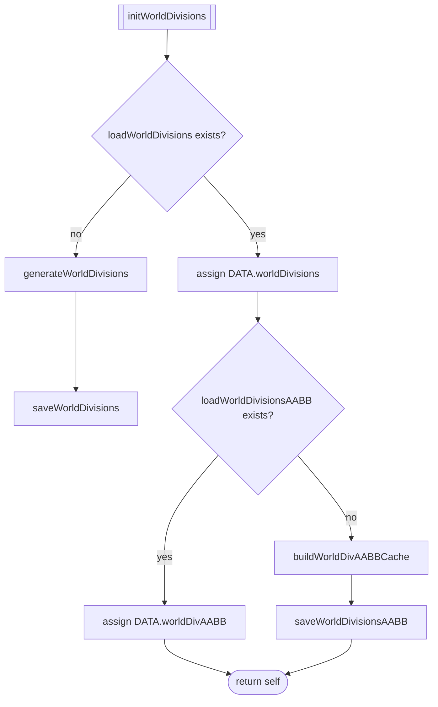
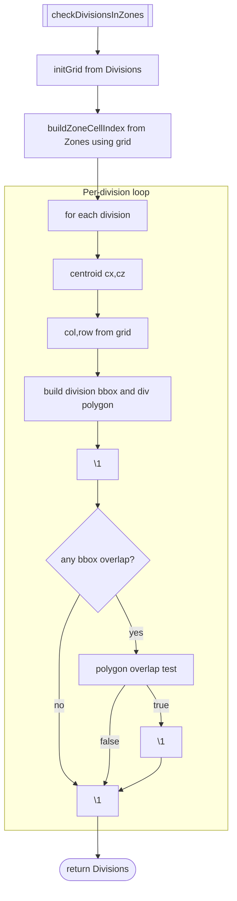
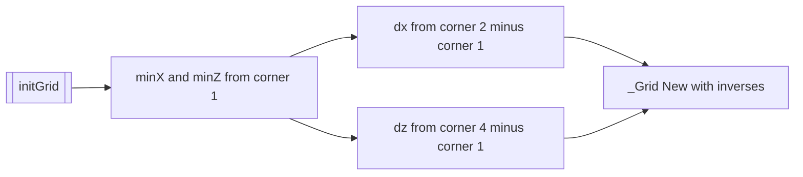
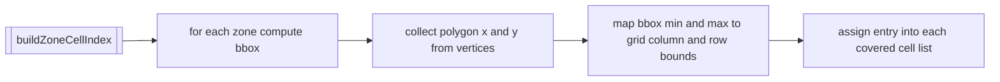
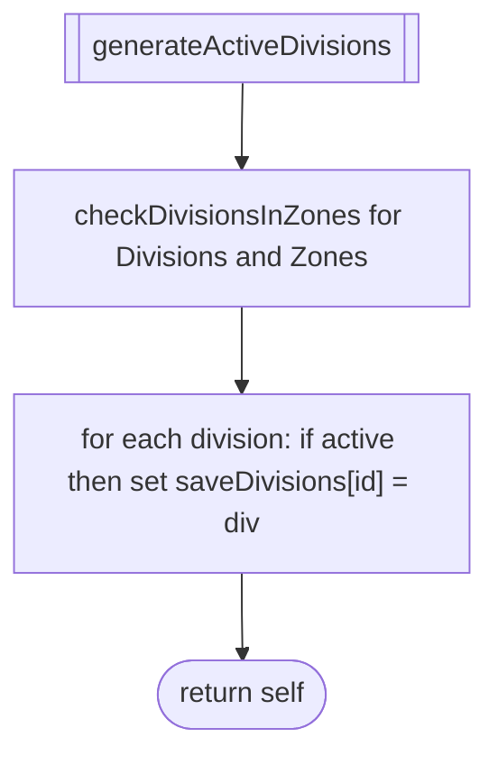
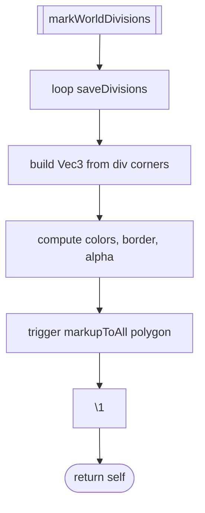

# WORLD divisions and activation

This document covers generation of world divisions, AABB caching, active division determination by zone overlap, and optional map marking.

Primary anchors
- Init orchestration: [AETHR.WORLD:initWorldDivisions()](https://github.com/Gh0st352/AETHR/blob/main/dev/WORLD.lua#L1176), [AETHR.WORLD:initActiveDivisions()](https://github.com/Gh0st352/AETHR/blob/main/dev/WORLD.lua#L1083)
- IO helpers: [AETHR.WORLD:loadWorldDivisions()](https://github.com/Gh0st352/AETHR/blob/main/dev/WORLD.lua#L1098), [AETHR.WORLD:saveWorldDivisions()](https://github.com/Gh0st352/AETHR/blob/main/dev/WORLD.lua#L1113), [AETHR.WORLD:loadWorldDivisionsAABB()](https://github.com/Gh0st352/AETHR/blob/main/dev/WORLD.lua#L1126), [AETHR.WORLD:saveWorldDivisionsAABB()](https://github.com/Gh0st352/AETHR/blob/main/dev/WORLD.lua#L1141), [AETHR.WORLD:loadActiveDivisions()](https://github.com/Gh0st352/AETHR/blob/main/dev/WORLD.lua#L1045), [AETHR.WORLD:saveActiveDivisions()](https://github.com/Gh0st352/AETHR/blob/main/dev/WORLD.lua#L1057)
- Generation and caches: [AETHR.WORLD:generateWorldDivisions()](https://github.com/Gh0st352/AETHR/blob/main/dev/WORLD.lua#L1156), [AETHR.WORLD:buildWorldDivAABBCache()](https://github.com/Gh0st352/AETHR/blob/main/dev/WORLD.lua#L1206)
- Active selection: [AETHR.WORLD:checkDivisionsInZones()](https://github.com/Gh0st352/AETHR/blob/main/dev/WORLD.lua#L1328), [AETHR.WORLD:generateActiveDivisions()](https://github.com/Gh0st352/AETHR/blob/main/dev/WORLD.lua#L1067)
- Grid helpers: [AETHR.WORLD:initGrid()](https://github.com/Gh0st352/AETHR/blob/main/dev/WORLD.lua#L1236), [AETHR.WORLD:buildZoneCellIndex()](https://github.com/Gh0st352/AETHR/blob/main/dev/WORLD.lua#L1268)
- Debug map paint: [AETHR.WORLD:markWorldDivisions()](https://github.com/Gh0st352/AETHR/blob/main/dev/WORLD.lua#L284)

# Initialization flows

## initWorldDivisions

## initActiveDivisions

# Active division determination

## checkDivisionsInZones performs a cell-accelerated overlap test between each division and nearby zones. It builds a grid from the first division’s corners and indexes zones into grid cell buckets to limit polygon tests to local candidates.

## Grid helpers

# Activation pipeline and optional markup

## generateActiveDivisions computes active flags via intersection and fills `DATA.saveDivisions`. markWorldDivisions can be used to visualize active divisions.

## Anchor index

- Orchestration
  - [AETHR.WORLD:initWorldDivisions()](https://github.com/Gh0st352/AETHR/blob/main/dev/WORLD.lua#L1176), [AETHR.WORLD:initActiveDivisions()](https://github.com/Gh0st352/AETHR/blob/main/dev/WORLD.lua#L1083)
- IO
  - [AETHR.WORLD:loadWorldDivisions()](https://github.com/Gh0st352/AETHR/blob/main/dev/WORLD.lua#L1098), [AETHR.WORLD:saveWorldDivisions()](https://github.com/Gh0st352/AETHR/blob/main/dev/WORLD.lua#L1113)
  - [AETHR.WORLD:loadWorldDivisionsAABB()](https://github.com/Gh0st352/AETHR/blob/main/dev/WORLD.lua#L1126), [AETHR.WORLD:saveWorldDivisionsAABB()](https://github.com/Gh0st352/AETHR/blob/main/dev/WORLD.lua#L1141)
  - [AETHR.WORLD:loadActiveDivisions()](https://github.com/Gh0st352/AETHR/blob/main/dev/WORLD.lua#L1045), [AETHR.WORLD:saveActiveDivisions()](https://github.com/Gh0st352/AETHR/blob/main/dev/WORLD.lua#L1057)
- Logic
  - [AETHR.WORLD:generateWorldDivisions()](https://github.com/Gh0st352/AETHR/blob/main/dev/WORLD.lua#L1156), [AETHR.WORLD:buildWorldDivAABBCache()](https://github.com/Gh0st352/AETHR/blob/main/dev/WORLD.lua#L1206)
  - [AETHR.WORLD:checkDivisionsInZones()](https://github.com/Gh0st352/AETHR/blob/main/dev/WORLD.lua#L1328), [AETHR.WORLD:generateActiveDivisions()](https://github.com/Gh0st352/AETHR/blob/main/dev/WORLD.lua#L1067)
  - [AETHR.WORLD:initGrid()](https://github.com/Gh0st352/AETHR/blob/main/dev/WORLD.lua#L1236), [AETHR.WORLD:buildZoneCellIndex()](https://github.com/Gh0st352/AETHR/blob/main/dev/WORLD.lua#L1268)
- Markup
  - [AETHR.WORLD:markWorldDivisions()](https://github.com/Gh0st352/AETHR/blob/main/dev/WORLD.lua#L284)