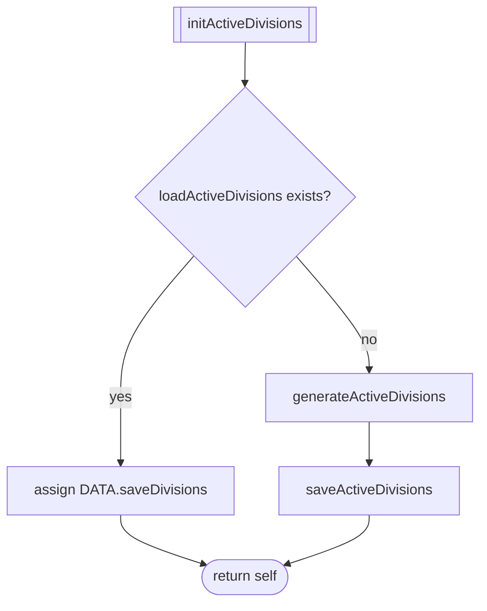
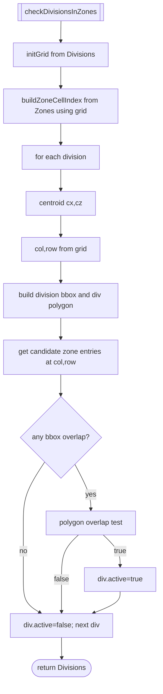
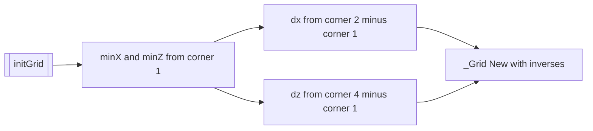
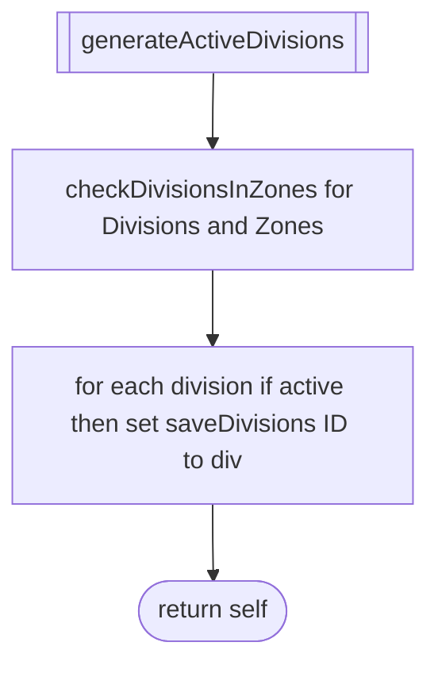
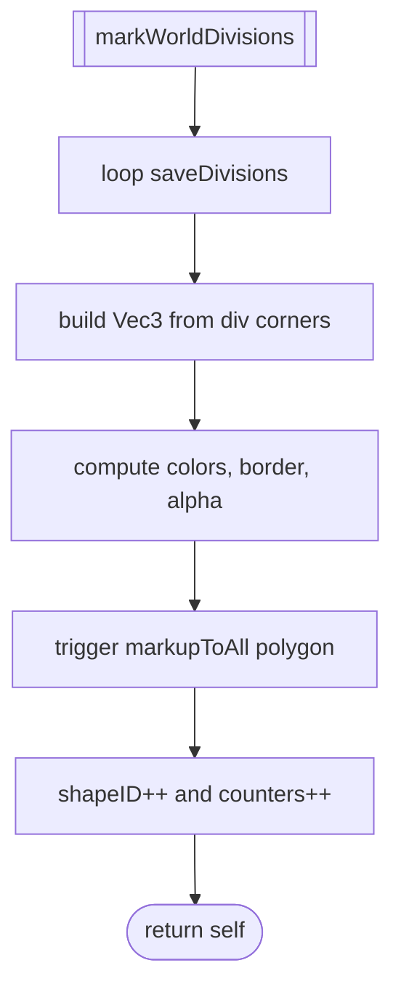

# WORLD divisions and activation

This document covers generation of world divisions, AABB caching, active division determination by zone overlap, and optional map marking.

Primary anchors
- Init orchestration: [AETHR.WORLD:initWorldDivisions()](dev/WORLD.lua:1176), [AETHR.WORLD:initActiveDivisions()](dev/WORLD.lua:1083)
- IO helpers: [AETHR.WORLD:loadWorldDivisions()](dev/WORLD.lua:1098), [AETHR.WORLD:saveWorldDivisions()](dev/WORLD.lua:1113), [AETHR.WORLD:loadWorldDivisionsAABB()](dev/WORLD.lua:1126), [AETHR.WORLD:saveWorldDivisionsAABB()](dev/WORLD.lua:1141), [AETHR.WORLD:loadActiveDivisions()](dev/WORLD.lua:1045), [AETHR.WORLD:saveActiveDivisions()](dev/WORLD.lua:1057)
- Generation and caches: [AETHR.WORLD:generateWorldDivisions()](dev/WORLD.lua:1156), [AETHR.WORLD:buildWorldDivAABBCache()](dev/WORLD.lua:1206)
- Active selection: [AETHR.WORLD:checkDivisionsInZones()](dev/WORLD.lua:1328), [AETHR.WORLD:generateActiveDivisions()](dev/WORLD.lua:1067)
- Grid helpers: [AETHR.WORLD:initGrid()](dev/WORLD.lua:1236), [AETHR.WORLD:buildZoneCellIndex()](dev/WORLD.lua:1268)
- Debug map paint: [AETHR.WORLD:markWorldDivisions()](dev/WORLD.lua:284)

## Initialization flows

initWorldDivisions

initActiveDivisions

## Active division determination

checkDivisionsInZones performs a cell-accelerated overlap test between each division and nearby zones. It builds a grid from the first division’s corners and indexes zones into grid cell buckets to limit polygon tests to local candidates.

Grid helpers

## Activation pipeline and optional markup

generateActiveDivisions computes active flags via intersection and fills `DATA.saveDivisions`. markWorldDivisions can be used to visualize active divisions.

## Anchor index

- Orchestration
  - [AETHR.WORLD:initWorldDivisions()](dev/WORLD.lua:1176), [AETHR.WORLD:initActiveDivisions()](dev/WORLD.lua:1083)
- IO
  - [AETHR.WORLD:loadWorldDivisions()](dev/WORLD.lua:1098), [AETHR.WORLD:saveWorldDivisions()](dev/WORLD.lua:1113)
  - [AETHR.WORLD:loadWorldDivisionsAABB()](dev/WORLD.lua:1126), [AETHR.WORLD:saveWorldDivisionsAABB()](dev/WORLD.lua:1141)
  - [AETHR.WORLD:loadActiveDivisions()](dev/WORLD.lua:1045), [AETHR.WORLD:saveActiveDivisions()](dev/WORLD.lua:1057)
- Logic
  - [AETHR.WORLD:generateWorldDivisions()](dev/WORLD.lua:1156), [AETHR.WORLD:buildWorldDivAABBCache()](dev/WORLD.lua:1206)
  - [AETHR.WORLD:checkDivisionsInZones()](dev/WORLD.lua:1328), [AETHR.WORLD:generateActiveDivisions()](dev/WORLD.lua:1067)
  - [AETHR.WORLD:initGrid()](dev/WORLD.lua:1236), [AETHR.WORLD:buildZoneCellIndex()](dev/WORLD.lua:1268)
- Markup
  - [AETHR.WORLD:markWorldDivisions()](dev/WORLD.lua:284)