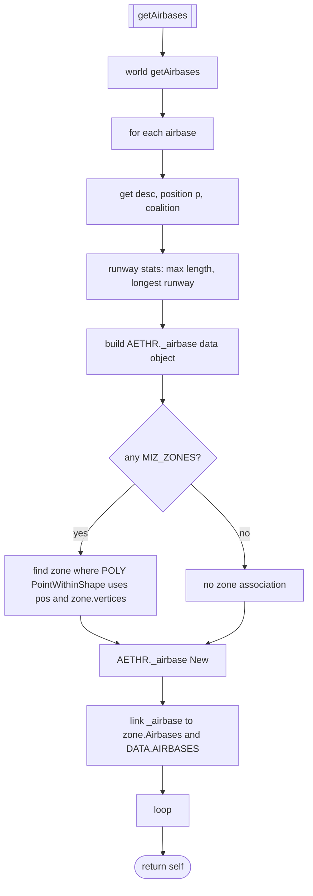
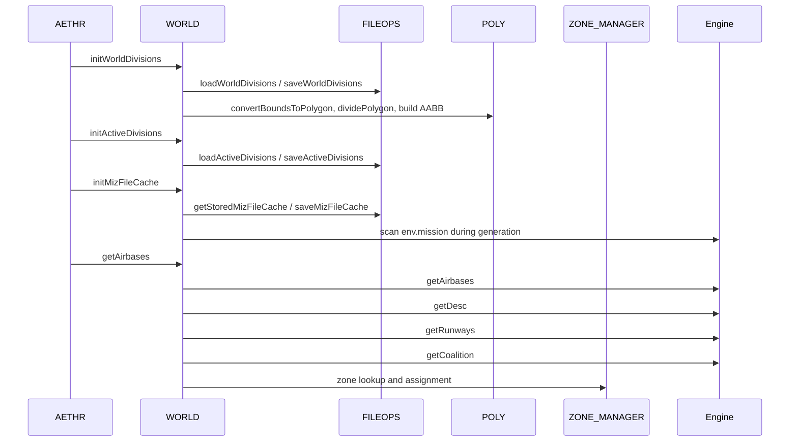

# WORLD initialization flows

Primary anchors
- [AETHR.WORLD:initWorldDivisions()](dev/WORLD.lua:1176)
- [AETHR.WORLD:initActiveDivisions()](dev/WORLD.lua:1083)
- [AETHR.WORLD:initMizFileCache()](dev/WORLD.lua:90)
- [AETHR.WORLD:getAirbases()](dev/WORLD.lua:428)

End-to-end initialization chain

## initWorldDivisions

Initializes and persists world division definitions and their AABB cache.

Anchors
- [AETHR.WORLD:generateWorldDivisions()](dev/WORLD.lua:1156)
- [AETHR.WORLD:saveWorldDivisions()](dev/WORLD.lua:1113)
- [AETHR.WORLD:loadWorldDivisionsAABB()](dev/WORLD.lua:1126)
- [AETHR.WORLD:buildWorldDivAABBCache()](dev/WORLD.lua:1206)
- [AETHR.WORLD:saveWorldDivisionsAABB()](dev/WORLD.lua:1141)

See also: [docs/world/divisions.md](docs/world/divisions.md)

## initActiveDivisions

Loads previously saved active divisions or computes by intersecting divisions with MIZ zones.

Anchors
- [AETHR.WORLD:loadActiveDivisions()](dev/WORLD.lua:1045)
- [AETHR.WORLD:generateActiveDivisions()](dev/WORLD.lua:1067)
- [AETHR.WORLD:saveActiveDivisions()](dev/WORLD.lua:1057)

See also: [docs/world/divisions.md](docs/world/divisions.md)

## initMizFileCache

Atomically loads all required caches or rebuilds from `env.mission` then saves.

Anchors
- [AETHR.WORLD:getStoredMizFileCache()](dev/WORLD.lua:109)
- [AETHR.WORLD:generateMizFileCache()](dev/WORLD.lua:187)
- [AETHR.WORLD:saveMizFileCache()](dev/WORLD.lua:145)

See also: [docs/world/miz_cache.md](docs/world/miz_cache.md)

## getAirbases

Queries engine airbases, normalizes descriptors, computes runway stats, and associates each airbase to a MIZ zone if its position lies inside the zone polygon.

Key details
- Zone inclusion test: [AETHR.POLY:PointWithinShape](dev/POLY.lua)
- Zone map: `ZONE_MANAGER.DATA.MIZ_ZONES[zoneName]`
- Airbase object stored under `DATA.AIRBASES[displayName]`

Anchor
- [AETHR.WORLD:getAirbases()](dev/WORLD.lua:428)

## Initialization sequence with modules

## Anchor index

- [AETHR.WORLD:initWorldDivisions()](dev/WORLD.lua:1176)
- [AETHR.WORLD:initActiveDivisions()](dev/WORLD.lua:1083)
- [AETHR.WORLD:initMizFileCache()](dev/WORLD.lua:90)
- [AETHR.WORLD:getAirbases()](dev/WORLD.lua:428)