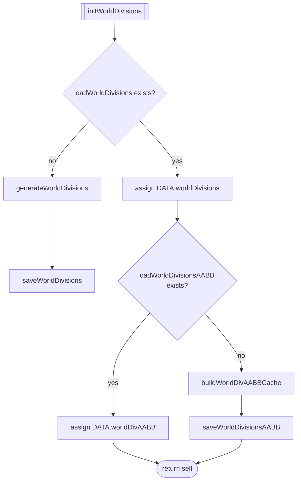
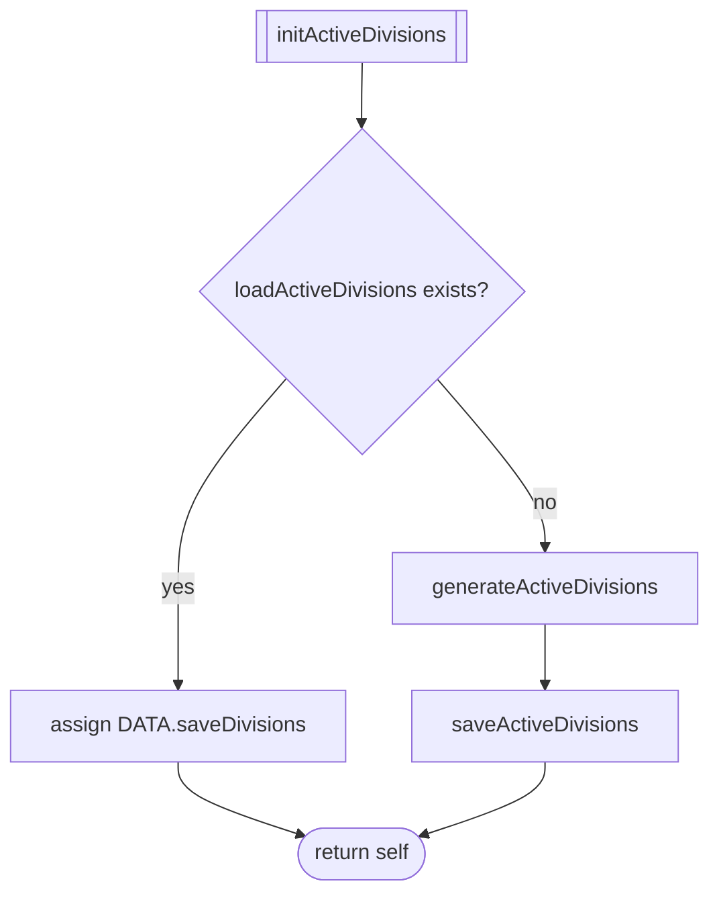
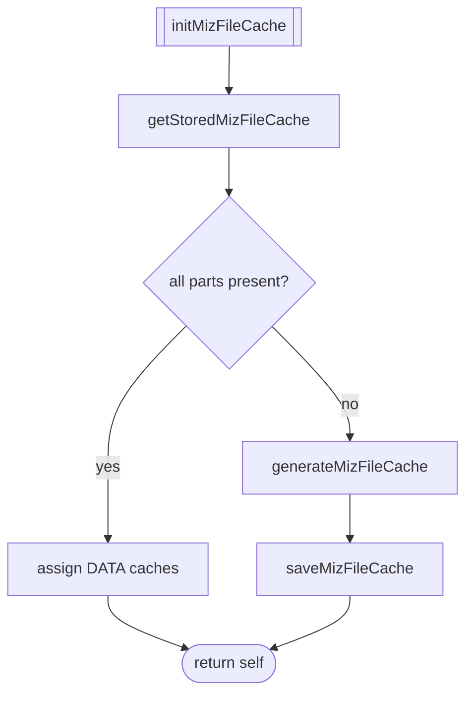
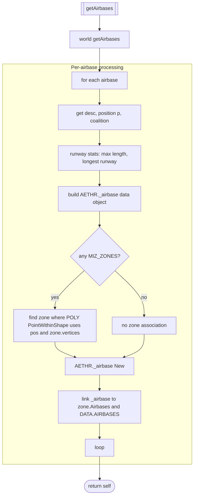
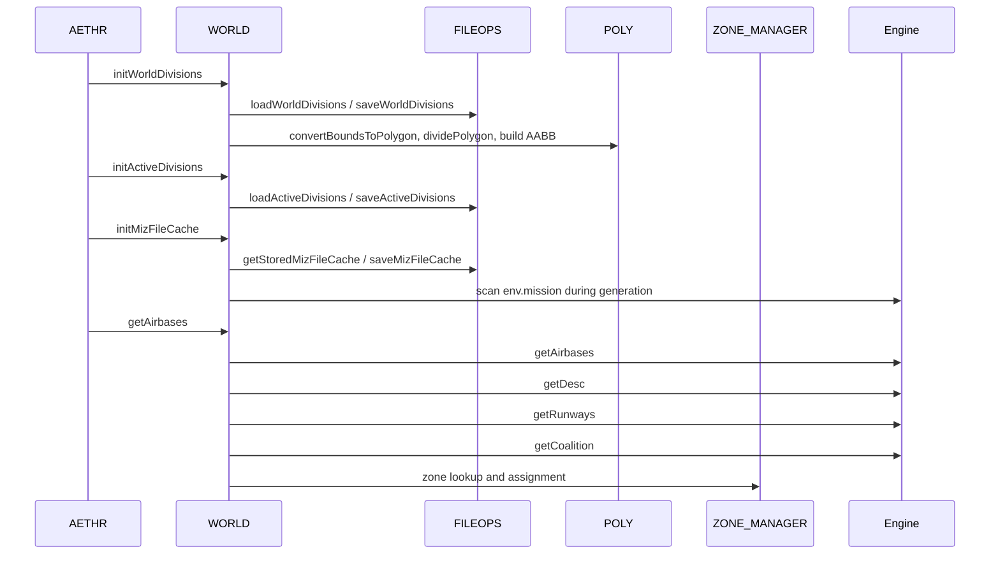

# WORLD initialization flows

Primary anchors
- [AETHR.WORLD:initWorldDivisions()](https://github.com/Gh0st352/AETHR/blob/main/dev/WORLD.lua#L1176)
- [AETHR.WORLD:initActiveDivisions()](https://github.com/Gh0st352/AETHR/blob/main/dev/WORLD.lua#L1083)
- [AETHR.WORLD:initMizFileCache()](https://github.com/Gh0st352/AETHR/blob/main/dev/WORLD.lua#L90)
- [AETHR.WORLD:getAirbases()](https://github.com/Gh0st352/AETHR/blob/main/dev/WORLD.lua#L428)

# End-to-end initialization chain

## initWorldDivisions

Initializes and persists world division definitions and their AABB cache.

### Anchors
- [AETHR.WORLD:generateWorldDivisions()](https://github.com/Gh0st352/AETHR/blob/main/dev/WORLD.lua#L1156)
- [AETHR.WORLD:saveWorldDivisions()](https://github.com/Gh0st352/AETHR/blob/main/dev/WORLD.lua#L1113)
- [AETHR.WORLD:loadWorldDivisionsAABB()](https://github.com/Gh0st352/AETHR/blob/main/dev/WORLD.lua#L1126)
- [AETHR.WORLD:buildWorldDivAABBCache()](https://github.com/Gh0st352/AETHR/blob/main/dev/WORLD.lua#L1206)
- [AETHR.WORLD:saveWorldDivisionsAABB()](https://github.com/Gh0st352/AETHR/blob/main/dev/WORLD.lua#L1141)

See also: [docs/world/divisions.md](docs/world/divisions.md)

## initActiveDivisions

Loads previously saved active divisions or computes by intersecting divisions with MIZ zones.

### Anchors
- [AETHR.WORLD:loadActiveDivisions()](https://github.com/Gh0st352/AETHR/blob/main/dev/WORLD.lua#L1045)
- [AETHR.WORLD:generateActiveDivisions()](https://github.com/Gh0st352/AETHR/blob/main/dev/WORLD.lua#L1067)
- [AETHR.WORLD:saveActiveDivisions()](https://github.com/Gh0st352/AETHR/blob/main/dev/WORLD.lua#L1057)

See also: [docs/world/divisions.md](docs/world/divisions.md)

## initMizFileCache

Atomically loads all required caches or rebuilds from `env.mission` then saves.

### Anchors
- [AETHR.WORLD:getStoredMizFileCache()](https://github.com/Gh0st352/AETHR/blob/main/dev/WORLD.lua#L109)
- [AETHR.WORLD:generateMizFileCache()](https://github.com/Gh0st352/AETHR/blob/main/dev/WORLD.lua#L187)
- [AETHR.WORLD:saveMizFileCache()](https://github.com/Gh0st352/AETHR/blob/main/dev/WORLD.lua#L145)

See also: [docs/world/miz_cache.md](docs/world/miz_cache.md)

## getAirbases

Queries engine airbases, normalizes descriptors, computes runway stats, and associates each airbase to a MIZ zone if its position lies inside the zone polygon.

### Key details
- Zone inclusion test: [AETHR.POLY:PointWithinShape](../../dev/POLY.lua)
- Zone map: `ZONE_MANAGER.DATA.MIZ_ZONES[zoneName]`
- Airbase object stored under `DATA.AIRBASES[displayName]`

### Anchor
- [AETHR.WORLD:getAirbases()](https://github.com/Gh0st352/AETHR/blob/main/dev/WORLD.lua#L428)

## Initialization sequence with modules

## Anchor index

- [AETHR.WORLD:initWorldDivisions()](https://github.com/Gh0st352/AETHR/blob/main/dev/WORLD.lua#L1176)
- [AETHR.WORLD:initActiveDivisions()](https://github.com/Gh0st352/AETHR/blob/main/dev/WORLD.lua#L1083)
- [AETHR.WORLD:initMizFileCache()](https://github.com/Gh0st352/AETHR/blob/main/dev/WORLD.lua#L90)
- [AETHR.WORLD:getAirbases()](https://github.com/Gh0st352/AETHR/blob/main/dev/WORLD.lua#L428)