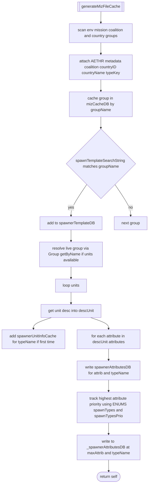

# WORLD MIZ cache pipeline

Primary anchors
- Init and storage orchestration:
  - [AETHR.WORLD:initMizFileCache()](../../dev/WORLD.lua:90)
  - [AETHR.WORLD:getStoredMizFileCache()](../../dev/WORLD.lua:109)
  - [AETHR.WORLD:saveMizFileCache()](../../dev/WORLD.lua:145)
- Generation logic:
  - [AETHR.WORLD:generateMizFileCache()](../../dev/WORLD.lua:187)

## Overview

initMizFileCache attempts to load previously persisted caches. If any required piece is missing, it generates fresh data from env.mission and saves.

Expected persisted keys (disk):
- MIZ_CACHE_DB
- SPAWNER_TEMPLATE_DB
- SPAWNER_ATTRIBUTE_DB
- _SPAWNER_ATTRIBUTE_DB
- SPAWNER_UNIT_CACHE_DB

Assignments (in-memory DATA):
- `mizCacheDB`, `spawnerTemplateDB`, `spawnerAttributesDB`, `_spawnerAttributesDB`, `spawnerUnitInfoCache`

## Generation details

generateMizFileCache scans env.mission grouped by coalition and country to build a normalized cache of groups and unit descriptors suitable for spawning logic.

Key behaviors
- Group metadata attached (per group):
  - `AETHR.coalition, AETHR.countryID, AETHR.countryName, AETHR.typeKey`
- Template selection:
  - Uses [AETHR.CONFIG.MAIN.spawnTemplateSearchString](../../dev/WORLD.lua:217) to filter group names into `spawnerTemplateDB`.
- Unit descriptor caching:
  - `spawnerUnitInfoCache[typeName] = descUnit` once per typeName.
- Attribute maps:
  - `spawnerAttributesDB[attrib][typeName] = descUnit` for all declared attributes.
  - `_spawnerAttributesDB[maxAttrib][typeName] = descUnit` using priority from `ENUMS.spawnTypes` and `ENUMS.spawnTypesPrio`.

## Persistence

saveMizFileCache writes each cache table to configured filenames under `CONFIG.MAIN.STORAGE.PATHS.LEARNING_FOLDER`. It logs failures via UTILS when DEBUG is enabled.

Storage anchors
- Path root: `CONFIG.MAIN.STORAGE.PATHS.LEARNING_FOLDER`
- Filenames:
  - `CONFIG.MAIN.STORAGE.FILENAMES.MIZ_CACHE_DB`
  - `CONFIG.MAIN.STORAGE.FILENAMES.SPAWNER_TEMPLATE_DB`
  - `CONFIG.MAIN.STORAGE.FILENAMES.SPAWNER_ATTRIBUTE_DB`
  - `CONFIG.MAIN.STORAGE.FILENAMES._SPAWNER_ATTRIBUTE_DB`
  - `CONFIG.MAIN.STORAGE.FILENAMES.SPAWNER_UNIT_CACHE_DB`

## Sequence (engine interactions during generation)

## Error handling

- getStoredMizFileCache returns nil unless all parts are present, enforcing atomic load.
- saveMizFileCache uses `UTILS:debugInfo` on per-file failure when DEBUG is enabled.
- generateMizFileCache uses safe pcall wrappers for engine calls (Group.getByName().getUnits()).

## Anchor index

- Orchestration
  - [AETHR.WORLD:initMizFileCache()](../../dev/WORLD.lua:90)
  - [AETHR.WORLD:getStoredMizFileCache()](../../dev/WORLD.lua:109)
  - [AETHR.WORLD:saveMizFileCache()](../../dev/WORLD.lua:145)
- Generation
  - [AETHR.WORLD:generateMizFileCache()](../../dev/WORLD.lua:187)
  - Search string usage: [AETHR.WORLD:generateMizFileCache()](../../dev/WORLD.lua:217)
- Related enums and text
  - Spawn attribute priorities: [AETHR.WORLD:generateMizFileCache()](../../dev/WORLD.lua:255)