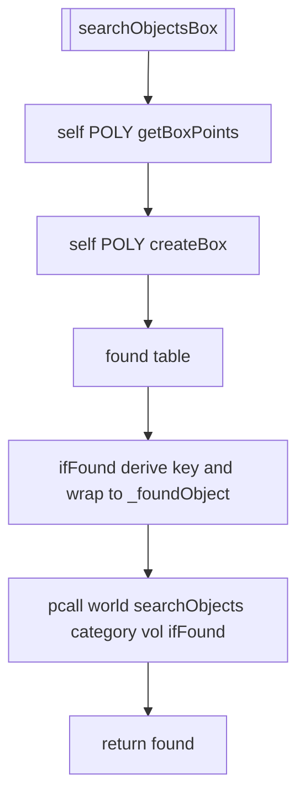
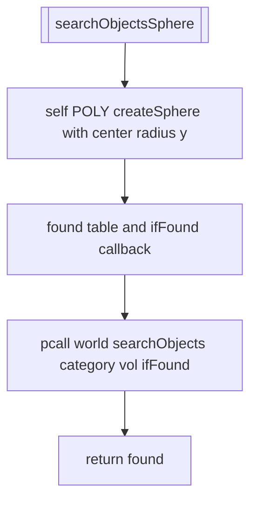
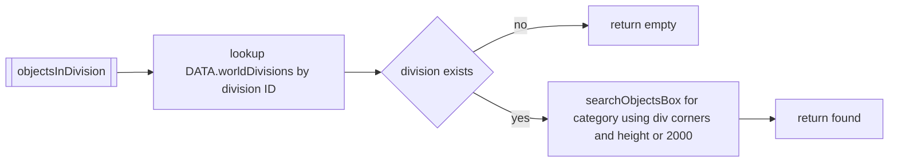
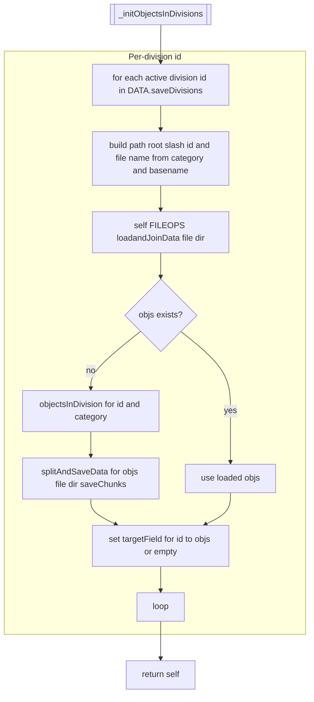
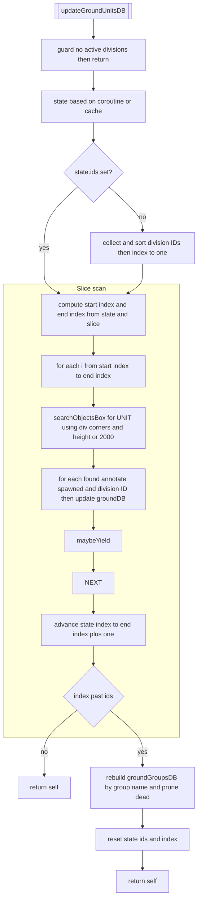
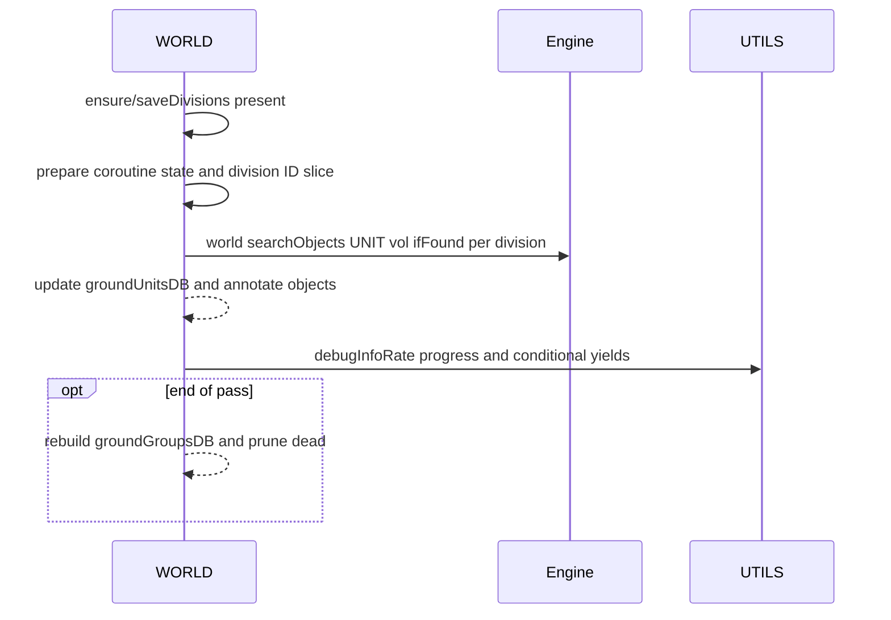

# WORLD object search and ground databases

### Primary anchors
- Search volumes:
  - [AETHR.WORLD:searchObjectsBox()](../../dev/WORLD.lua:334)
  - [AETHR.WORLD:searchObjectsSphere()](../../dev/WORLD.lua:384)
- Division retrieval and per-division caches:
  - [AETHR.WORLD:objectsInDivision()](../../dev/WORLD.lua:1382)
  - [AETHR.WORLD:_initObjectsInDivisions()](../../dev/WORLD.lua:1395)
  - [AETHR.WORLD:initSceneryInDivisions()](../../dev/WORLD.lua:1433)
  - [AETHR.WORLD:initBaseInDivisions()](../../dev/WORLD.lua:1442)
  - [AETHR.WORLD:initStaticInDivisions()](../../dev/WORLD.lua:1451)
- Ground DB rebuild:
  - [AETHR.WORLD:updateGroundUnitsDB()](../../dev/WORLD.lua:860)

### Related helpers
- Geometries: [dev/POLY.lua](../../dev/POLY.lua)
- Enums: [dev/ENUMS.lua](../../dev/ENUMS.lua)
- Storage: [dev/FILEOPS_.lua](../../dev/FILEOPS_.lua)
- Utils: [dev/UTILS.lua](../../dev/UTILS.lua)

# Search volumes

## searchObjectsBox computes a world volume from 2D corners and a height, then iterates engine objects via callback. Keys prefer unit name, then ID, then engine id_, else tostring fallback.

## searchObjectsSphere creates a spherical volume, same key semantics.

## Division retrieval

objectsInDivision convenience: build a box from a division’s corners and search for category.

## Per-division cache initialization

_initObjectsInDivisions hydrates per-division object maps from storage if present; otherwise computes and persists split chunks.

### Specializations
- Scenery: [AETHR.WORLD:initSceneryInDivisions()](../../dev/WORLD.lua:1433)
- Base: [AETHR.WORLD:initBaseInDivisions()](../../dev/WORLD.lua:1442)
- Static: [AETHR.WORLD:initStaticInDivisions()](../../dev/WORLD.lua:1451)

## Ground DB rebuild (incremental, coroutine-friendly)

updateGroundUnitsDB walks a slice of active divisions per invocation, searching UNITs, updating `groundUnitsDB`, and rebuilding `groundGroupsDB` at the end of a full pass. Progress is tracked in a persistent state (either coroutine-owned or module cache).

# Sequence and yields

## Anchor index

- Search
  - [AETHR.WORLD:searchObjectsBox()](../../dev/WORLD.lua:334)
  - [AETHR.WORLD:searchObjectsSphere()](../../dev/WORLD.lua:384)
- Division helpers
  - [AETHR.WORLD:objectsInDivision()](../../dev/WORLD.lua:1382)
  - [AETHR.WORLD:_initObjectsInDivisions()](../../dev/WORLD.lua:1395)
  - [AETHR.WORLD:initSceneryInDivisions()](../../dev/WORLD.lua:1433)
  - [AETHR.WORLD:initBaseInDivisions()](../../dev/WORLD.lua:1442)
  - [AETHR.WORLD:initStaticInDivisions()](../../dev/WORLD.lua:1451)
- Ground DB
  - [AETHR.WORLD:updateGroundUnitsDB()](../../dev/WORLD.lua:860)