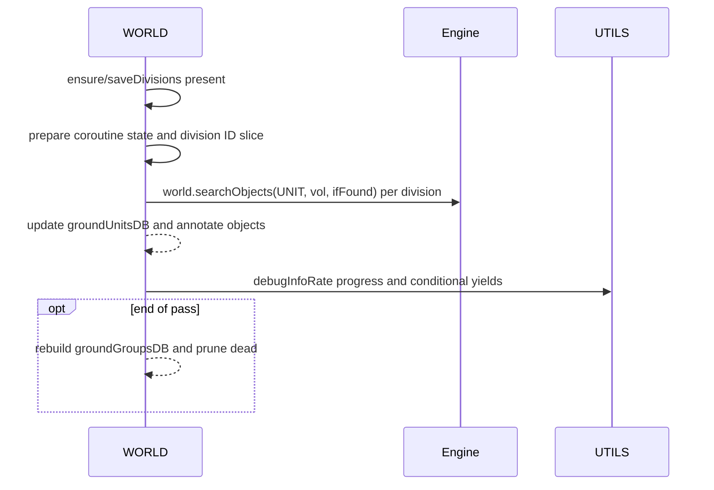

# WORLD object search and ground databases

Primary anchors
- Search volumes:
  - [AETHR.WORLD:searchObjectsBox()](dev/WORLD.lua:334)
  - [AETHR.WORLD:searchObjectsSphere()](dev/WORLD.lua:384)
- Division retrieval and per-division caches:
  - [AETHR.WORLD:objectsInDivision()](dev/WORLD.lua:1382)
  - [AETHR.WORLD:_initObjectsInDivisions()](dev/WORLD.lua:1395)
  - [AETHR.WORLD:initSceneryInDivisions()](dev/WORLD.lua:1433)
  - [AETHR.WORLD:initBaseInDivisions()](dev/WORLD.lua:1442)
  - [AETHR.WORLD:initStaticInDivisions()](dev/WORLD.lua:1451)
- Ground DB rebuild:
  - [AETHR.WORLD:updateGroundUnitsDB()](dev/WORLD.lua:860)

Related helpers
- Geometries: [dev/POLY.lua](dev/POLY.lua)
- Enums: [dev/ENUMS.lua](dev/ENUMS.lua)
- Storage: [dev/FILEOPS_.lua](dev/FILEOPS_.lua)
- Utils: [dev/UTILS.lua](dev/UTILS.lua)

## Search volumes

searchObjectsBox computes a world volume from 2D corners and a height, then iterates engine objects via callback. Keys prefer unit name, then ID, then engine id_, else tostring fallback.

```mermaid
flowchart TD
  SOB[[searchObjectsBox]] --> BX[self.POLY:getBoxPoints(corners,height)]
  BX --> VOL[self.POLY:createBox(min,max)]
  VOL --> FOUND[found = {}]
  FOUND --> CBK[ifFound(item): derive key and wrap to _foundObject]
  CBK --> WS[pcall world.searchObjects(category, vol, ifFound)]
  WS --> RET([return found])
```

searchObjectsSphere creates a spherical volume, same key semantics.

```mermaid
flowchart TD
  SOS[[searchObjectsSphere]] --> SV[self.POLY:createSphere(center,radius,y)]
  SV --> FOUND[found = {} and ifFound callback]
  FOUND --> WS[pcall world.searchObjects(category, vol, ifFound)]
  WS --> RET([return found])
```

## Division retrieval

objectsInDivision convenience: build a box from a division’s corners and search for category.

```mermaid
flowchart LR
  OID[[objectsInDivision]] --> G[lookup DATA.worldDivisions[divisionID]]
  G --> CHK{div exists?}
  CHK -- no --> RETX([return {}])
  CHK -- yes --> SB[searchObjectsBox(category, div.corners, div.height or 2000)] --> RET([return found])
```

## Per-division cache initialization

_initObjectsInDivisions hydrates per-division object maps from storage if present; otherwise computes and persists split chunks.

```mermaid
flowchart TD
  IOI[[_initObjectsInDivisions]] --> L[for each active division id in DATA.saveDivisions]
  L --> PATH[root/ & id; filename = category .. "_" .. basename]
  PATH --> TRY[self.FILEOPS:loadandJoinData(file, dir)]
  TRY --> C{objs exists?}
  C -- no --> SCAN[objectsInDivision(id, category)]
  SCAN --> SAVE[splitAndSaveData(objs,file,dir,saveChunks)]
  C -- yes --> USE[use loaded objs]
  SAVE --> SET[self.DATA[targetField][id] = objs or {}]
  USE --> SET
  SET --> NEXT[loop]
  NEXT --> RET([return self])
```

Specializations
- Scenery: [AETHR.WORLD:initSceneryInDivisions()](dev/WORLD.lua:1433)
- Base: [AETHR.WORLD:initBaseInDivisions()](dev/WORLD.lua:1442)
- Static: [AETHR.WORLD:initStaticInDivisions()](dev/WORLD.lua:1451)

## Ground DB rebuild (incremental, coroutine-friendly)

updateGroundUnitsDB walks a slice of active divisions per invocation, searching UNITs, updating `groundUnitsDB`, and rebuilding `groundGroupsDB` at the end of a full pass. Progress is tracked in a persistent state (either coroutine-owned or module cache).

```mermaid
flowchart TD
  GDB[[updateGroundUnitsDB]] --> PRE[guard: no active divisions? return]
  PRE --> ST[state = co_.state or _cache._groundUnitsDB_state]
  ST --> IDS{state.ids set?}
  IDS -- no --> BIDS[collect and sort division IDs; idx=1]
  IDS -- yes --> SIDX[startIdx=state.idx; endIdx=min(idx+slice-1)]
  BIDS --> SIDX
  SIDX --> LOOP[for i=startIdx..endIdx]
  LOOP --> SCAN[searchObjectsBox(UNIT, div.corners, div.height or 2000)]
  SCAN --> INS[for each found: annotate AETHR.spawned, divisionID; groundDB[key]=obj]
  INS --> YL1[maybeYield]
  YL1 --> NEXT
  NEXT --> ADV[advance state.idx = endIdx+1]
  ADV --> FULL{idx > #ids?}
  FULL -- no --> RET1([return self])
  FULL -- yes --> REBLD[rebuild groundGroupsDB by groupName; prune dead]
  REBLD --> RST[reset state.ids=nil; idx=1]
  RST --> RET2([return self])
```

Sequence and yields



## Anchor index

- Search
  - [AETHR.WORLD:searchObjectsBox()](dev/WORLD.lua:334)
  - [AETHR.WORLD:searchObjectsSphere()](dev/WORLD.lua:384)
- Division helpers
  - [AETHR.WORLD:objectsInDivision()](dev/WORLD.lua:1382)
  - [AETHR.WORLD:_initObjectsInDivisions()](dev/WORLD.lua:1395)
  - [AETHR.WORLD:initSceneryInDivisions()](dev/WORLD.lua:1433)
  - [AETHR.WORLD:initBaseInDivisions()](dev/WORLD.lua:1442)
  - [AETHR.WORLD:initStaticInDivisions()](dev/WORLD.lua:1451)
- Ground DB
  - [AETHR.WORLD:updateGroundUnitsDB()](dev/WORLD.lua:860)