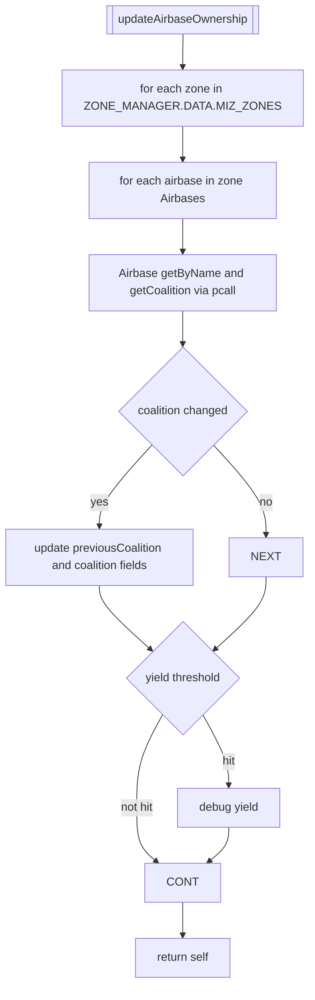
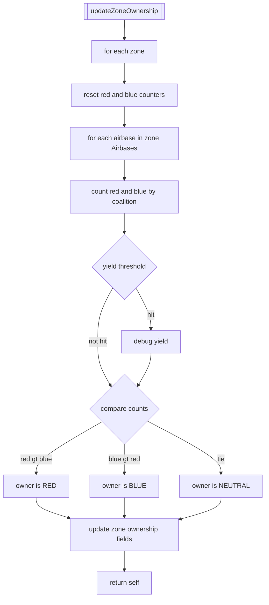
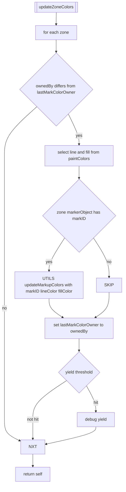
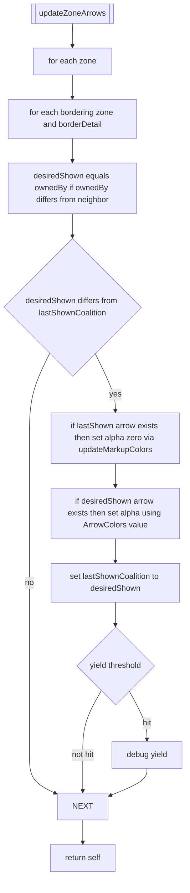
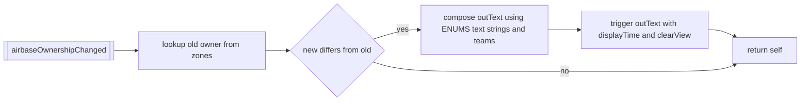
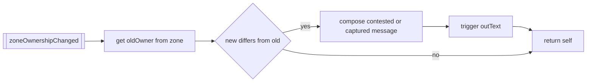
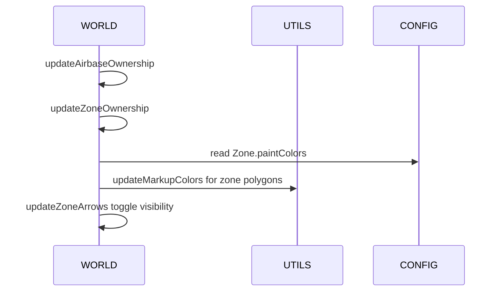

# WORLD ownership propagation, colors, and arrows

Primary anchors
- Airbase/zone ownership updates:
  - [AETHR.WORLD:updateAirbaseOwnership()](../../dev/WORLD.lua:501)
  - [AETHR.WORLD:updateZoneOwnership()](../../dev/WORLD.lua:633)
- Visual updates:
  - [AETHR.WORLD:updateZoneColors()](../../dev/WORLD.lua:683)
  - [AETHR.WORLD:updateZoneArrows()](../../dev/WORLD.lua:730)
- Notifications:
  - [AETHR.WORLD.airbaseOwnershipChanged()](../../dev/WORLD.lua:970)
  - [AETHR.WORLD.zoneOwnershipChanged()](../../dev/WORLD.lua:1006)

Related modules and config
- Colors and alphas: [dev/CONFIG_.lua](../../dev/CONFIG_.lua)
- Text strings and enums: [dev/ENUMS.lua](../../dev/ENUMS.lua)
- Marker color updates: [AETHR.UTILS:updateMarkupColors()](../../dev/UTILS.lua:188)

## Airbase ownership refresh

updateAirbaseOwnership iterates all MIZ zones and their airbases, querying the engine for current coalition and updating each airbase object. It optionally yields via configured coroutine thresholds.

## Zone ownership recompute

updateZoneOwnership tallies airbases per coalition within each zone, determines the winner (or neutral on tie), and records changes.

## Zone color updates

updateZoneColors changes the painted colors of zone polygons when ownership changes, using coalition-keyed paint colors.

## Border arrows visibility

updateZoneArrows toggles visibility of directional border arrows between neighboring zones depending on ownership differences. For each border segment, it hides the previously shown coalition arrow (if any) and shows the newly desired coalition arrow.

Arrow colors source
- [AETHR.CONFIG.MAIN.Zone.paintColors.ArrowColors](../../dev/CONFIG_.lua)
- Line style typically solid (see [dev/ENUMS.lua](../../dev/ENUMS.lua))

## Notifications

These callbacks are used by watchers or event systems to broadcast ownership changes.

Airbase

Zone

## Sequence overview (ownership to visuals)

## Anchor index

- Ownership updates
  - [AETHR.WORLD:updateAirbaseOwnership()](../../dev/WORLD.lua:501)
  - [AETHR.WORLD:updateZoneOwnership()](../../dev/WORLD.lua:633)
- Visual updates
  - [AETHR.WORLD:updateZoneColors()](../../dev/WORLD.lua:683)
  - [AETHR.WORLD:updateZoneArrows()](../../dev/WORLD.lua:730)
- Notifications
  - [AETHR.WORLD.airbaseOwnershipChanged()](../../dev/WORLD.lua:970)
  - [AETHR.WORLD.zoneOwnershipChanged()](../../dev/WORLD.lua:1006)