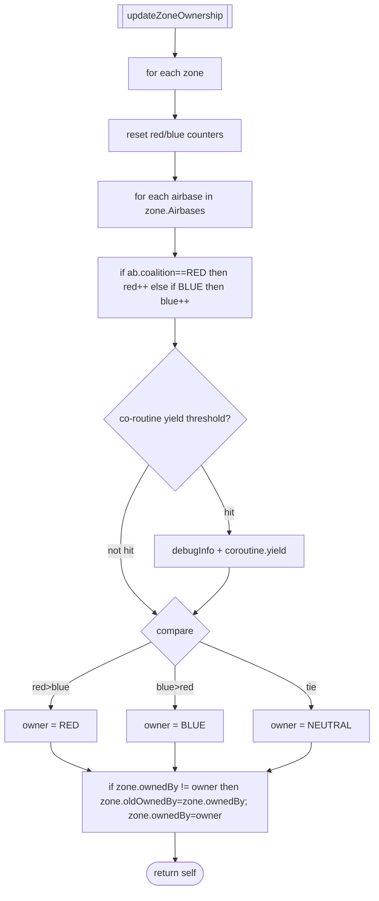
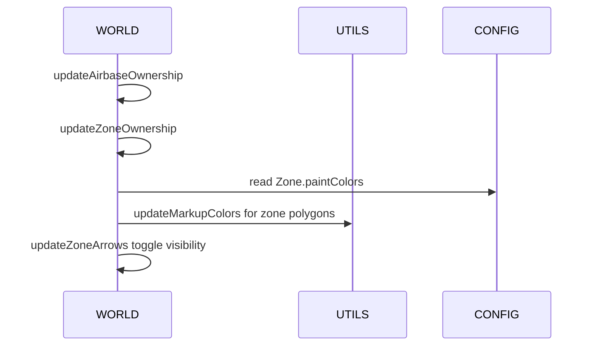

# WORLD ownership propagation, colors, and arrows

Primary anchors
- Airbase/zone ownership updates:
  - [AETHR.WORLD:updateAirbaseOwnership()](dev/WORLD.lua:501)
  - [AETHR.WORLD:updateZoneOwnership()](dev/WORLD.lua:633)
- Visual updates:
  - [AETHR.WORLD:updateZoneColors()](dev/WORLD.lua:683)
  - [AETHR.WORLD:updateZoneArrows()](dev/WORLD.lua:730)
- Notifications:
  - [AETHR.WORLD.airbaseOwnershipChanged()](dev/WORLD.lua:970)
  - [AETHR.WORLD.zoneOwnershipChanged()](dev/WORLD.lua:1006)

Related modules and config
- Colors and alphas: [dev/CONFIG_.lua](dev/CONFIG_.lua)
- Text strings and enums: [dev/ENUMS.lua](dev/ENUMS.lua)
- Marker color updates: [AETHR.UTILS:updateMarkupColors()](dev/UTILS.lua:188)

## Airbase ownership refresh

updateAirbaseOwnership iterates all MIZ zones and their airbases, querying the engine for current coalition and updating each airbase object. It optionally yields via configured coroutine thresholds.

```mermaid
flowchart TD
  UAO[[updateAirbaseOwnership]] --> ZL[for each zone in ZONE_MANAGER.DATA.MIZ_ZONES]
  ZL --> ABL[for each airbase in zone.Airbases]
  ABL --> GET[Airbase.getByName + getCoalition (pcall)]
  GET --> CHK{coalition changed?}
  CHK -- yes --> UPD[ab.previousCoalition = ab.coalition; ab.coalition = new]
  CHK -- no --> NEXT
  UPD --> YLD{co-routine yield threshold?}
  NEXT --> YLD
  YLD -- hit --> CY[UTILS.debugInfo 'YIELD' + coroutine.yield()]
  YLD -- not hit --> CONT
  CY --> CONT
  CONT --> DONE([return self])
```

## Zone ownership recompute

updateZoneOwnership tallies airbases per coalition within each zone, determines the winner (or neutral on tie), and records changes.



## Zone color updates

updateZoneColors changes the painted colors of zone polygons when ownership changes, using coalition-keyed paint colors.

```mermaid
flowchart TD
  UZC[[updateZoneColors]] --> ZL[for each zone]
  ZL --> COMP{ownedBy != lastMarkColorOwner?}
  COMP -- no --> NXT
  COMP -- yes --> CLR[select line/fill from CONFIG.MAIN.Zone.paintColors]
  CLR --> MRK{zone.markerObject has markID?}
  MRK -- yes --> CALL[UTILS.updateMarkupColors(markID, lineColor, fillColor)]
  MRK -- no --> SKIP
  CALL --> SAVE[zone.lastMarkColorOwner = ownedBy]
  SKIP --> SAVE
  SAVE --> YLD{yield threshold?}
  YLD -- hit --> CY[debugInfo + coroutine.yield]
  YLD -- not hit --> NXT
  CY --> NXT
  NXT --> DONE([return self])
```

## Border arrows visibility

updateZoneArrows toggles visibility of directional border arrows between neighboring zones depending on ownership differences. For each border segment, it hides the previously shown coalition arrow (if any) and shows the newly desired coalition arrow.

```mermaid
flowchart TD
  UZA[[updateZoneArrows]] --> ZL[for each zone]
  ZL --> BZL[for each bordering zone and borderDetail]
  BZL --> DES[desiredShown = ownedBy if ownedBy!=neighbor]
  DES --> CHG{desiredShown != lastShownCoalition?}
  CHG -- no --> NEXT
  CHG -- yes --> HIDE[if lastShown arrow exists: set alpha 0 via updateMarkupColors]
  HIDE --> SHOW[if desiredShown arrow exists: set alpha=ArrowColors[desiredShown].a or 1]
  SHOW --> SAVE[borderDetail.lastShownCoalition = desiredShown]
  SAVE --> YLD{yield threshold?}
  YLD -- hit --> CY[debugInfo + coroutine.yield]
  YLD -- not hit --> NEXT
  CY --> NEXT
  NEXT --> DONE([return self])
```

Arrow colors source
- [AETHR.CONFIG.MAIN.Zone.paintColors.ArrowColors](dev/CONFIG_.lua)
- Line style typically solid (see [dev/ENUMS.lua](dev/ENUMS.lua))

## Notifications

These callbacks are used by watchers or event systems to broadcast ownership changes.

Airbase

```mermaid
flowchart LR
  AOC[[airbaseOwnershipChanged]] --> GET[lookup old owner from ZONE_MANAGER.DATA]
  GET --> DIFF{new != old?}
  DIFF -- yes --> TEXT[compose outText using ENUMS.TextStrings and Teams]
  TEXT --> OUT[trigger.action.outText(displayTime, clearView)]
  OUT --> RET([return self])
  DIFF -- no --> RET
```

Zone

```mermaid
flowchart LR
  ZOC[[zoneOwnershipChanged]] --> GET[oldOwner from zone.oldOwnedBy]
  GET --> DIFF{new != old?}
  DIFF -- yes --> TEXT[compose contested/captured message]
  TEXT --> OUT[trigger.action.outText(...)]
  OUT --> RET([return self])
  DIFF -- no --> RET
```

## Sequence overview (ownership to visuals)



## Anchor index

- Ownership updates
  - [AETHR.WORLD:updateAirbaseOwnership()](dev/WORLD.lua:501)
  - [AETHR.WORLD:updateZoneOwnership()](dev/WORLD.lua:633)
- Visual updates
  - [AETHR.WORLD:updateZoneColors()](dev/WORLD.lua:683)
  - [AETHR.WORLD:updateZoneArrows()](dev/WORLD.lua:730)
- Notifications
  - [AETHR.WORLD.airbaseOwnershipChanged()](dev/WORLD.lua:970)
  - [AETHR.WORLD.zoneOwnershipChanged()](dev/WORLD.lua:1006)